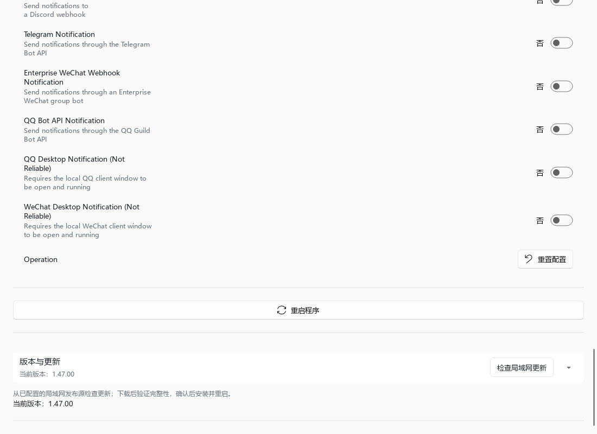
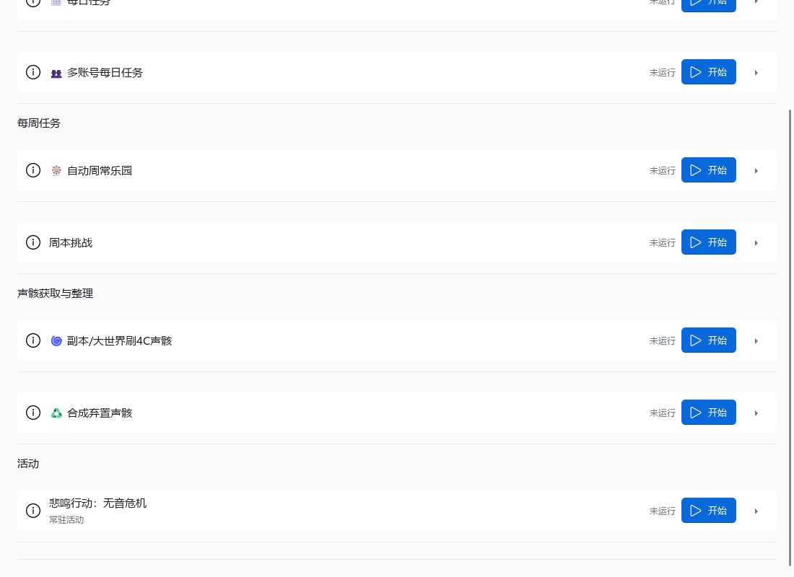

# 1.47.00 功能分类与按需展开界面说明

所有支持展开/折叠的区域首次创建时默认折叠，包括设置内的基础选项。用户手动展开后，普通刷新不强制收起；错误定位与主动跳转可展开目标区域。任务分类标题不折叠，空分类不显示。

## 当前交互约定

- 任务头部同排显示图标、名称、状态、开始/暂停/停止和箭头。点击标题、图标、状态或头部空白展开；右侧操作按钮独立执行，即使禁用也不触发展开。说明与参数在详情区，点击详情不会收起。
- 连接、快捷键、日志诊断、版本更新、账号识别信息、每日任务、清理体力、周本、其他账号选项、高级账号操作、序列顺序和维护条目共用头部。实时功能与其他全局配置按条目折叠，外层分类不再增加折叠。
- 连接摘要、诊断异常提示、更新结果、保存/丢弃与主要维护入口保持可见；完整诊断信息和技术说明展开查看。
- 每个区域独立展开，允许同时打开多个；只改变内容容器可见性，不销毁字段。账号表单重绘保留分组展开状态（当前页面生命周期内，不写入账号业务配置）。
- 周本选择和序列执行顺序使用现有控件数据生成摘要，不推断剩余次数或完成状态。周本真实完成记录放在周本详情中，服务不可用时明确提示。
- 格式错误展开并聚焦字段；“转到配置”先展开祖先分区。编辑文本滚轮保护、草稿确认保存和危险操作确认不变。
- 字段有可访问名称，折叠箭头有所属区域名称、检查状态和方向；Tab 聚焦后空格可展开。控件边界与装饰分隔线分开配色，保持可见键盘焦点。
- JSON、长文本及模板弹窗尺寸按屏幕逻辑像素约束；主窗口恢复位置限制在可用屏幕内。

设计参考：Frontend Design 用于克制的视觉层级；UI UX Pro Max 的焦点、表单反馈和渐进展示建议；Web Design Guidelines 已通过 GitHub 源码包取得并转译为 Qt 可适用规则。网页宣传布局、在线字体、移动安全区及 DOM/ARIA 专用实现不照搬。

模拟设备界面截图（不含真实账号）：

## 页面与操作

- 左侧上部为任务、账号、自动辅助；下部固定工具、设置。启动默认进入任务，不增加子标签页。
- 任务：每日执行、每周任务、声骸获取与整理、活动。限时/常驻活动保留类型摘要。参数默认收起；开始不改变展开状态，暂停、停止、首次运行确认仍走原回调。
- 账号：身份信息、日常与声骸、清理体力、周本、周常安排、收尾行为、高级账号操作和序列。保存、丢弃、草稿提示在选择器旁；周本记录在周本详情。任务的“编辑账号计划/序列”跳到此处，不刷新或丢弃草稿，需核对当前选中账号。
- 自动辅助：全局运行控制，以及战斗与拾取、剧情与移动、登录与输入。辅助开关与启停控制复用原实现，不因分类迁移自动启用。
- 工具：日志与诊断、数据备份、导入与恢复、完整性检查、实验功能、开发诊断。实验任务仍为实验状态，隐藏的账号切换测试和副本子任务不显示。危险操作仍需确认。
- 设置：游戏连接、运行与按键、程序偏好、版本与更新。连接与采集保持平铺单选，仍调用原设备管理器。通知、数据仓库和重启位于偏好，备份目录只在工具内编辑。
- 高级 JSON：点击“高级 JSON…”打开独立编辑窗口，确定仅应用到草稿，仍需确认保存；取消不应用编辑器内容。复杂文本通过“编辑内容…”进入独立窗口。
- 关于入口继续移除。旧活动/测试/实时入口自动转到任务/工具/自动辅助；“转到配置”按归属定位，不跳进已经拆除滚动容器的内嵌页面。

## 布局契约

只有顶层 `Tab` 拥有页面滚动。`SectionPanel`、`ConfigCard`、维护设置组都是普通 QWidget，内部不再使用 ExpandSettingCard 的滚动区。内容采用自然高度，不能通过隐藏有溢出的滚动条来裁切内容。

`FlatSettingRow` 和框架 `LabelAndWidget` 在可用宽度小于 600 逻辑像素时改为上下排布。鼠标滚轮经过原生下拉框、数字框时滚动最近的页面，不修改选项或数值。短列表采集方式使用 `FlatChoiceList`，隐藏列表模型仅为复用已有选项与回调，不参与显示。

长日志、JSON、文本和详细状态在独立对话框滚动；任务状态页显示前 8 项摘要，完整数据可从“详细状态”访问。序列列表按项目数撑开；输入框单行长路径通过光标移动查看，并非横向页面滚动。

颜色由 `CodexTheme.COLORS` 提供，强调色在所有页面构造完成后重新统一，防止框架加载旧偏好覆盖。状态浮窗沿用同组颜色，保留点击穿透、截图排除及安全定位。

## 开发与验证

框架覆盖源码在 `custom_ok/ok/gui`；启动同步至本机 ok 包。不能仅修改 `.venv`。`ConfigContentMixin` 的配置绑定、条件字段和顺序继续复用。`DisclosureHeader` 提供独立操作与折叠信号；`SectionPanel.set_summary` 是头部摘要，`set_description` 是详情说明。任务列表重新构建时保留同一个任务对象的展开状态。

使用本地 Python 执行 `scripts/render_flat_ui.py`，创建临时合成账号和无操作设备服务，构造真实 MainWindow 和五页。所有实际注册任务与辅助的元数据参与渲染，可见任务不重不漏，隐藏任务仍隐藏；使用真实全局选项定义和内存配置，不运行游戏任务，不注册系统热键或执行启动握手。Windows 离屏渲染显式载入系统字体，避免方框。

渲染覆盖 760×700、1100×800 逻辑像素；使用 `QT_SCALE_FACTOR=1/1.25/1.5/2` 分进程验证。输出位于忽略的 `tests/output`。项目主窗最低尺寸仍为 1200×800，测试的内容宽度覆盖扣除侧栏后的区域。截图仅为合成资料，不包含真实账号。

回归通过 `run_tests.ps1 -Group all` 逐文件隔离执行。不要将所有 Qt/图像测试放入同一个 unittest discover 进程：部分图像测试初始化自己的 QApplication。

本轮不包含真实游戏输入测试，也不将离屏页面渲染等同于安装器端到端验收。

历史 1.44.00 回归：2026-09-09，`test_out/test_runs/20260909-205544-811`，100 个文件、988 项用例，980 通过、8 跳过、0 失败、0 错误。

渲染通过 `OKWW_UI_EXPAND_ALL=1` 检查全部展开模式，未设置时检查默认收起模式；覆盖 100%、125%、150%、200% DPI 与两种页面宽度。1.47.00 输出在 `tests/output/ui-1.47`，包括新建账号和模板编辑窗。验收记录见 `docs/references/ui-disclosure-verification.md`。
