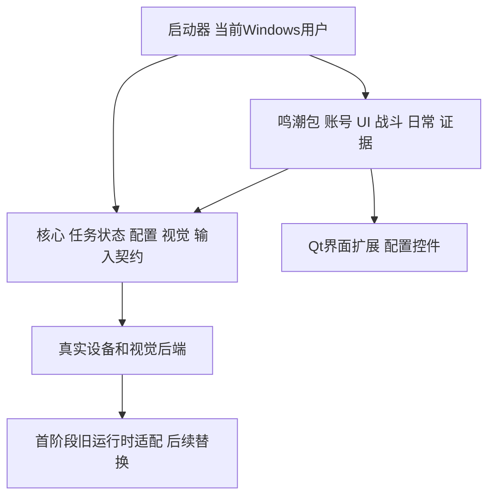

# 独立框架与鸣潮游戏包迁移盘点

盘点日期：2026-10-10，文档完成于2026-10-11。基线：`config.py` 1.97.61；Git HEAD `4c0a4ad853d98bdc4474d3b6f43dc9c5ae03fcca`。本报告记录迁移前源码，不代表迁移完成。

保住全部定制功能的最小边界是：保留现有鸣潮业务、账号数据语义、配置/界面和资源，提供可执行的核心契约，再逐项替换旧设备、视觉与Qt运行时。只复制任务名称、创建空接口或使import通过，不能证明迁移完成。根目录 `custom_ok/ok` 才是实际覆盖目录，`src/custom_ok`不存在。

## 范围与规模

盘点阶段只读产品源码、测试源码和本地研究报告；随后根因修复见审查报告。没有启动游戏/模拟器、调用抓图/输入/Win32窗口操作、读取真实账号配置、访问NAS或外网。只为核对API定点读取安装的 `ok/__init__.py`、`ok/task/task.py`、`ok/gui/tasks/TaskManger.py`。搜索排除 `.venv`（这些定点文件除外）、`test_out`、`logs`、`configs`、`build`、`dist`。

产品共307个Python文件、68,693行：src 278个、custom_ok 27个、入口/配置2个；顶层测试222个。合计529个Python文件完成AST解析，无语法错误。仅src+入口/配置有57种ok导入符号、89个ok耦合文件；含覆盖框架后153种ok导入符号。全量AST解析只证明语法和引用结构，人工审查集中于运行边界，不能称为每个业务分支已验收。

## 保留业务和UI的边界

| 范围 | 实质功能 | 最小迁移边界 |
|---|---|---|
| 任务/角色/战斗 | src/task 76文件、src/char 57文件、src/combat 3文件；页面导航、CombatCheck/BaseCombatTask轮转、BaseChar/CharFactory、专属/通用/solo角色、自定义代码 | 游戏包完整保留；核心提供真实帧、输入、计时、任务状态/调度 |
| 账号与配置 | repository/identity/profile_store/graph_store/slots、config_integrity、bundle/editor/publish/rebind、sequence、reminders/task_policy/task_state | 保留UUID、受保护主配置、事务、镜像和执行快照，不重建空账号模型 |
| 账号运行服务 | selection/verification/login_flow、bootstrap、sequence_snapshot、task_run_coordinator/status | 保留生产账号匹配、核验、切换、退出/登录链；接入新入口的启动拦截 |
| 材料与计划 | materials目录6文件、材料视觉/目录/仓库、forgery/world_boss/weekly/garden计划、配额、任务队列与进度 | 保留模型/账本/真实执行，适配帧/任务/路径服务 |
| 完成证据 | evidence目录6文件，项目/周期/每日运行、截图、账本/导出、daily_timing、account_switch_evidence | 核心提供帧hook，具体完成判断归游戏包；run返回不等同完成 |
| 诊断 | runtime目录35文件中的session/policy/collector/queue/status/archive/retention/runtime/uploader/lifecycle、diagnose/observability | 保留脱敏、独立进程、归档审核/过期语义；本次未实际操作NAS |
| 更新/启动/存储 | update目录8文件、包验证/manifest/transport/service/apply/dependency/worker；storage/bootstrap/handoff、backup/secure_backup、代理/上游检查 | 启动器拥有安装/进程生命周期；包保留产品版本、数据路径与升级内容 |
| 账号UI | AccountSettings/AccountConfig/SequenceManagement/Slot/Filter/Reminder/TaskOverview，完整性修复、每日确认 | 保留服务和控件双向绑定，不能只保留标题 |
| 任务/工具UI | TaskHub/AssistantHub/ToolsHub/CompletionCheck/GeneralSettings、材料/配额/队列、诊断详情/状态、状态窗、LanUpdateCard | src/gui 47文件及框架覆盖控件按现有行为迁移；保留信号与后台磁盘操作 |
| 代码扩展 | CharacterCodeTab/CustomCharLoader、框架TaskManager与Python脚本/编辑器/高亮/热加载 | 暂留真实Python扩展契约；import成功不代表角色已执行 |
| 资源 | coco_annotations.json、Labels/process_feature、模板图、echo.onnx、材料catalog、测试fixtures和翻译 | 游戏包持有；更换素材逐项核对标签、尺寸、区域、阈值与来源 |

实际主导航为任务、账号、完成检查、自动辅助、工具、设置6个区域。旧注释“五个”不代表当前导航。`HIDDEN_TASKS`隐藏EchoesRemainTask、PianoTeachingTask、SecondSolTask普通卡，但注册与实现仍在，不能误删。EnhanceEchoTask、ChangeEchoTask、KRLauncherSwitchTask、DiagnosisTask配置中被注释；MergeEchoTask、FarmMapTask、FiveToOneTask也不在29个注册入口。保留被当前业务调用的源码和现有状态，不重新启用已封存的KR序列切换。

### 明示三种迁移状态

**直接迁移**：已有账号、周期、材料/计划、配置事务、进度、纯视觉规则和业务实现保留；改import/路径或注入服务后用行为测试证明结果一致。没有直接ok导入的模块仍可能有传递依赖。

**核心真实实现**：BaseTask/OCR/FindFeature/TriggerTask初始化/生命周期、executor调度/暂停/停止/持久enabled、Config/ConfigOption/global config、Box/颜色函数、模板/OCR、capture/input窗口/设备契约、全局状态/Qt信号和task/config UI模型。必须有实质代码，不能无条件return False/[]/None或假报成功。

**旧运行时暂保留**：Win32 WGC/BitBlt/PostMessage/SendInput、旧OCR/FeatureSet、Qt控件/TaskManager、自定义脚本和角色代码加载。可通过真实adapter验证功能保留，但仍依赖旧ok，不能宣称完全独立。Child Session、MuMu/雷电未做设备验证，适配边界不等于支持完成。

## 框架覆盖不能直接变成无游戏知识的核心

基线`main._sync_custom_ok`按内容差异覆盖site-packages，不只“缺才补”。本轮已取消复制：新增纯stdlib的`src/runtime/framework_overlay.py`，生产入口与测试runner共用MetaPathFinder，只覆盖存在的custom_ok文件，未覆盖模块仍由requirements锁定的ok-script==1.0.190提供。安装在prepare_storage之前；首次安装发现ok已导入时明确失败，不能假装已加载模块会换源。同root幂等，不混用另一source root，不修改共享虚拟环境。此项仍为旧运行时适配，未变成完全独立框架。

| 覆盖范围 | 需要保留的行为 | 拆分 |
|---|---|---|
| TaskExecutor | 帧/OCR、capture节流、队列、trigger索引、condition唤醒、恢复、run/cleanup、持久自动战斗 | 核心调度；src.evidence.process_capture、runtime.ocr_backend/vision_metrics/game_runtime_errors成为明确hook/适配 |
| WGC/window | 实际捕获、尺寸/窗口工具、耗时统计 | Windows后端；观测回调可通用 |
| MainWindow/AboutTab | 窗口、导航、账号/完成检查/备份/更新/业务页面 | Qt shell保留通用生命周期，游戏包注册页面 |
| ConfigItemFactory/ConfigCard/Label* | 通用类型、账号选择、整数下拉、多选、account_sequence | 通用渲染归Qt；游戏具体widget注册归包 |
| TaskCard/TaskTab/OneTimeTaskTab/TriggerTaskTab | 任务操作、配置、分类、activity revision、证据/周期与计时 | 通用模型归Qt，业务分类/结果归包 |
| StartTab/StartCard/选择列表/Screenshot/SettingTab | 捕获与输入选择、调试截图、设置、worker生命周期 | 必须真实执行，不能仅搬界面 |
| 主题/布局/通知 | design_system/Card/FlowLayout/Tab/windows_messenger | 通用可入框架；SectionPanel等反向src.gui依赖通过注册/适配处理 |

覆盖文件反向导入具体src业务，因此不能原样剪贴成“通用核心”。保留一个输入owner：当前前台任务、后台战斗不能同时发键；保留帧时效、当前任务和停止异常。

## 行为验收

1. 每个注册任务有实际实现及停止/暂停结果；配置控件读写真实模型。清单发现只是第一步。
2. 多账号和切换测试共用生产selection/alias/verification/retry/logout/login。合成UUID/别名/掩码手机与冻结快照覆盖，不读真实账号。
3. 自动战斗意图在错误、抓图断开、恢复hook失败、其他任务故障后保留；只有显式UI stop/toggle能保存关闭。
4. fixture回放验证导航、战斗识别、资源提交/结算/返回；保留完成/周期/配额账本，真失败不转换空结果。
5. Qt offscreen覆盖6个主区域、账号/序列/材料配置、完成检查/诊断/更新卡/任务信号；包验证/apply用临时安装树。
6. 旧adapter离线检查后仍需获授权的设备实测：WGC、PostMessage/SendInput、Child Session以及推理耗时。本次未实测。

优先复用AccountRuntime/Repository/Config/Identity、RuntimeServices、AutoCombatRecovery/CombatTaskModes、UITransition/TriggerNavigation/BackgroundNavigation、Daily/Weekly/Abyss/SeaRuins图片回放、Material/Quota/FarmingTaskQueue、CompletionEvidence/Cycles、Diagnostic*/LanUpdate*/PackageSmoke、Qt UI和CustomCharLoader测试。执行前逐模块核对副作用；TestChar/TestCon/TestOCR等设备入口不能直接作为安全离线全套。

下方自动提取注册表、API与全部模块，包含嵌套ImportFrom，排除注释；字符串动态加载和所有属性读写不在153种导入符号中。方法名与安装ok/task/task.py相交63种，包含重写，未经MRO分析不能视为63种独立实现。需保留关键字/位置参数、Box坐标/name/confidence、BGR帧shape、OCR Box列表、异常类型、配置持久化/信号语义。业务还使用executor的_navigation_epoch/_navigation_owner、_background_combat_mode、_account_feature_run、_daily_reserve_policy等私有状态，必须明确替代或暂留。

## 参考

依据产品源码与本地安装框架定点API。沿用两份既有2026-10-10 research报告：Windows用户由人切换；框架管理当前身份账号组；素材暂时复用。来源/许可另见专门清单；AGPL旧代码adapter/迁移阶段不能改包名即认定闭源许可满足。本轮根因与隔离复现见framework-review-round1报告。

## 实际注册任务（29个）

| 类型 | 注册模块/类 | 必须保留的实际行为 |
|---|---|---|
| 一次 | `src.task.DailyTask.DailyTask` | 活跃度/体力、周本/聚落/材料、声骸整理、账号配置绑定及完成证据 |
| 一次 | `src.task.FarmEchoTask.FarmEchoTask` | 世界声骸循环、首领导航、战斗/拾取与循环结果 |
| 一次 | `src.task.WorldBossMaterialTask.WorldBossMaterialTask` | 按材料计划刷世界首领，进度/奖励，与每日任务共用 |
| 一次 | `src.task.NightmareNestTask.NightmareNestTask` | 聚落选择/导航/战斗/领取、断点和结果 |
| 一次 | `src.task.TacetTask.TacetTask` | 无音区目标、体力消耗、奖励与恢复 |
| 一次 | `src.task.ForgeryTask.ForgeryTask` | 凝素目标、配额计划/进度/队列、领域导航与奖励 |
| 一次 | `src.task.MaterialPlannerTask.MaterialPlannerTask` | 材料识别/仓库校准/养成规划；visible=False，独立run明确拒绝，需已验证每日账号调用 |
| 一次 | `src.task.SimulationTask.SimulationTask` | 模拟训练领域与奖励 |
| 一次 | `src.task.MultiAccountDailyTask.MultiAccountDailyTask` | 序列、身份/特征核验、退出/登录/重试、快照与每日断点 |
| 一次 | `src.task.MultiAccountWeeklyGardenTask.MultiAccountWeeklyGardenTask` | 生产账号切换与逐账号每周乐园 |
| 一次 | `src.task.GardenTask.GardenTask` | 乐园页面、战斗/选择、结果与每周计划 |
| 一次 | `src.task.EventTask.EventTask` | 常驻活动导航入口和分发 |
| 一次 | `src.task.TestAccountSwitchTask.TestAccountSwitchTask` | A1/A3/A4确切简称、替代登录名/掩码手机，复用生产选择/核验/登录链 |
| 一次 | `src.task.AutoAbyssTask.AutoAbyssTask` | 逆境队伍/层数分配、角色/能量核验、战斗/结算/退出恢复 |
| 一次 | `src.task.AutoSeaRuinsTask.AutoSeaRuinsTask` | 海墟阶段、预设/信物/配装、共享战斗和返回恢复 |
| 一次 | `src.task.WeeklyBossTask.WeeklyBossTask` | 周本目标/限额/计划、队伍/奖励和每日复用 |
| 一次 | `src.task.PianoTeachingTask.PianoTeachingTask` | 钢琴画面/和弦检测、状态机与按键；普通任务卡隐藏 |
| 一次 | `src.task.SecondSolTask.SecondSolTask` | 手动导航后前台短按F，切出等待；普通任务卡隐藏 |
| 一次 | `src.task.EchoesRemainTask.EchoesRemainTask` | 活动选择/连续战斗/结算/继续；普通任务卡隐藏 |
| 一次 | `src.task.ResonanceSimulationTask.ResonanceSimulationTask` | 群声共振模拟域技能条、E/Q/攻击、独立热键暂停/输入释放 |
| 一次 | `src.task.CharacterTrialTask.CharacterTrialTask` | 角色试用、试用队伍身份、共享战斗/完成返回 |
| 一次 | `src.task.TiangongTreasureTask.TiangongTreasureTask` | 天工寻宝队伍/进度/选关、共享战斗和结果 |
| 触发 | `src.task.AutoCombatTask.AutoCombatTask` | 持续开启意图、多人轮转、错误/抓图恢复、任务所属输入释放 |
| 触发 | `src.task.SoloCombatTask.SoloCombatTask` | 单角色轮转，继承相同持久自动战斗保护 |
| 触发 | `src.task.AutoPickTask.AutoPickTask` | 后台拾取 |
| 触发 | `src.task.AutoLoginTask.AutoLoginTask` | 后台登录tick、重启/窗口上下文、阶段期限与恢复 |
| 触发 | `src.task.SkipDialogTask.AutoDialogTask` | 剧情跳过、选项/警告、宽屏/转场 |
| 触发 | `src.task.FastTravelTask.FastTravelTask` | 后台快速传送 |
| 触发 | `src.task.MouseResetTask.MouseResetTask` | 鼠标重置/恢复及Win32输入 |

场景：`src.scene.WWScene.WWScene`。

## 核心方法名调用清单

| 方法 | 静态调用次数 |
|---|---:|
| `add_exit_after_config` | 2 |
| `add_text_fix` | 3 |
| `back` | 21 |
| `box_of_screen` | 30 |
| `box_of_screen_scaled` | 2 |
| `calculate_color_percentage` | 8 |
| `click` | 149 |
| `click_box` | 28 |
| `click_relative` | 78 |
| `draw_boxes` | 16 |
| `enable` | 1 |
| `ensure_capture` | 1 |
| `ensure_in_front` | 5 |
| `feature_exists` | 2 |
| `find_best_match_in_box` | 11 |
| `find_boxes` | 20 |
| `find_feature` | 12 |
| `find_one` | 94 |
| `get_box_by_name` | 29 |
| `get_feature_by_name` | 5 |
| `get_global_config` | 3 |
| `get_task_by_class` | 22 |
| `height` | 1 |
| `height_of_screen` | 24 |
| `info_get` | 10 |
| `info_incr` | 7 |
| `info_set` | 126 |
| `input_text` | 2 |
| `is_browser` | 5 |
| `log_debug` | 32 |
| `log_error` | 64 |
| `log_info` | 390 |
| `log_warning` | 156 |
| `middle_click` | 12 |
| `mouse_down` | 5 |
| `mouse_up` | 8 |
| `move` | 6 |
| `next_frame` | 105 |
| `ocr` | 188 |
| `pause` | 2 |
| `reset_scene` | 8 |
| `run` | 4 |
| `run_task_by_class` | 3 |
| `screenshot` | 110 |
| `scroll_relative` | 34 |
| `send_key` | 92 |
| `send_key_down` | 16 |
| `send_key_up` | 26 |
| `sleep` | 397 |
| `start_device` | 2 |
| `swipe` | 1 |
| `swipe_relative` | 1 |
| `tr` | 194 |
| `update_capture` | 1 |
| `validate_config` | 3 |
| `validate_key` | 6 |
| `wait_click_feature` | 14 |
| `wait_click_ocr` | 6 |
| `wait_feature` | 11 |
| `wait_ocr` | 21 |
| `wait_until` | 63 |
| `width` | 12 |
| `width_of_screen` | 22 |

## 框架对象直接调用链

- `og.`：`app.get_overlay_view`, `app.get_overlay_view().set_boxes_enabled`, `app.ok_config.get`, `app.ok_config.save_file`, `app.start_controller.start`, `app.tr`, `config.get`, `config.get('ocr').get`, `config.get('ocr').get('params').get`, `device_manager.config.get`, `device_manager.get_devices`, `device_manager.get_preferred_capture`, `device_manager.get_preferred_device`, `device_manager.refresh`, `device_manager.set_capture`, `device_manager.set_interaction`, `device_manager.set_preferred_device`, `device_manager.windows_capture_config.get`, `executor.active_trigger_task_count`, `executor.can_capture`, `executor.connected`, `executor.get_all_tasks`, `executor.get_all_tasks()[0].ocr`, `executor.get_task_by_class`, `executor.global_config.get_all_visible_configs`, `executor.global_config.get_config`, `executor.pause`, `executor.waiting_for_task`, `get_overlay_view`, `main_window.edit_task_tab.load_task`, `main_window.navigate_tab`, `main_window.switchTo`, `my_app.yolo_detect`, `ok.config.get`, `task_manager.delete_imported_script`, `task_manager.delete_task`, `task_manager.imported_scripts.items`, `task_manager.load_import_folder`。
- `self.executor.`：`_wake_executor`, `check_enabled`, `destroy`, `exit_event.wait`, `get_task_by_class`, `interaction.activate`, `interaction.capture.get_abs_cords`, `interaction.mouse_up`, `interaction.on_run`, `interaction.send_key_up`, `next_frame`, `nullable_frame`, `ocr_lib`, `reset_scene`, `sleep`, `start`。
- `self.hwnd.`：`get_capture_origin`。
- `self.interaction.`：`on_destroy`, `should_capture`。
- `self.scene.`：`in_combat`, `in_team`, `reset`, `set_in_combat`, `set_not_in_combat`。

## 平台/UI耦合（包含custom_ok）

- **PySide6**：64文件；`custom_ok/ok/gui/MainWindow.py`, `custom_ok/ok/gui/about/AboutTab.py`, `custom_ok/ok/gui/common/design_system.py`, `custom_ok/ok/gui/debug/Screenshot.py`, `custom_ok/ok/gui/settings/SettingTab.py`, `custom_ok/ok/gui/start/SelectCaptureListView.py`, `custom_ok/ok/gui/start/SelectInteractionListView.py`, `custom_ok/ok/gui/start/StartCard.py`, `custom_ok/ok/gui/start/StartTab.py`, `custom_ok/ok/gui/tasks/ConfigCard.py`, `custom_ok/ok/gui/tasks/LabelAndDropDown.py`, `custom_ok/ok/gui/tasks/LabelAndLabel.py`, `custom_ok/ok/gui/tasks/LabelAndMultiSelection.py`, `custom_ok/ok/gui/tasks/LabelAndTextEdit.py`, `custom_ok/ok/gui/tasks/LabelAndWidget.py`, `custom_ok/ok/gui/tasks/OneTimeTaskTab.py`, `custom_ok/ok/gui/tasks/TaskCard.py`, `custom_ok/ok/gui/tasks/TaskTab.py`, `custom_ok/ok/gui/widget/Card.py`, `custom_ok/ok/gui/widget/FlowLayout.py`, `custom_ok/ok/gui/widget/Tab.py`, `custom_ok/ok/task/TaskExecutor.py`, `src/gui/AccountChoice.py`, `src/gui/AccountConfigTab.py`, `src/gui/AccountFilterBar.py`, `src/gui/AccountReminderPanel.py`, `src/gui/AccountSettingsTab.py`, `src/gui/AccountSlotEditor.py`, `src/gui/AccountTaskOverview.py`, `src/gui/BackgroundOperation.py`, `src/gui/CharacterCodeTab.py`, `src/gui/ChoiceControls.py`, `src/gui/CodexTheme.py`, `src/gui/CompletionCheckTab.py`, `src/gui/ConfigIntegrityDialog.py`, `src/gui/DailyProfileDialog.py`, `src/gui/DailyRunConfirmation.py`, `src/gui/DailyTimingDialog.py`, `src/gui/DiagnosticDetails.py`, `src/gui/DiagnosticStatusCard.py`, `src/gui/DisclosureHeader.py`, `src/gui/FarmingTaskQueueWidget.py`, `src/gui/FlatChoiceList.py`, `src/gui/FlatSettingGroup.py`, `src/gui/FlatSettingRow.py`, `src/gui/ForgeryQuotaWidget.py`, `src/gui/GeneralSettingsTab.py`, `src/gui/LabelAndAccountSequence.py`, `src/gui/LabelAndDropDownMultiSelect.py`, `src/gui/LabelAndIntegerDropDown.py`, `src/gui/LanUpdateCard.py`, `src/gui/PermanentEventTab.py`, `src/gui/SectionPanel.py`, `src/gui/SequenceManagementTab.py`, `src/gui/SequenceSlotDelegate.py`, `src/gui/TaskHubTab.py`, `src/gui/TaskOverviewRow.py`, `src/gui/TaskStatusWindow.py`, `src/gui/WeeklyBossPlanWidget.py`, `src/gui/WorldBossMaterialPlanWidget.py`, `src/gui/compact_settings.py`, `src/runtime/storage_startup_ui.py`, `src/task/DailyTask.py`, `src/task/MultiAccountDailyTask.py`。
- **ctypes**：12文件；`custom_ok/ok/device/capture_methods/windows_graphics.py`, `custom_ok/ok/gui/MainWindow.py`, `custom_ok/ok/gui/start/StartCard.py`, `custom_ok/ok/notification/windows_messenger.py`, `custom_ok/ok/util/window.py`, `main.py`, `src/gui/TaskStatusWindow.py`, `src/secure_backup.py`, `src/task/KRLauncherSwitchTask.py`, `src/task/ResonanceSimulationTask.py`, `src/update/lan_apply.py`, `src/win32_login_input.py`。
- **ok**：113文件；`config.py`, `custom_ok/ok/device/capture_methods/windows_graphics.py`, `custom_ok/ok/gui/MainWindow.py`, `custom_ok/ok/gui/about/AboutTab.py`, `custom_ok/ok/gui/debug/Screenshot.py`, `custom_ok/ok/gui/settings/SettingTab.py`, `custom_ok/ok/gui/start/SelectCaptureListView.py`, `custom_ok/ok/gui/start/SelectInteractionListView.py`, `custom_ok/ok/gui/start/StartCard.py`, `custom_ok/ok/gui/start/StartTab.py`, `custom_ok/ok/gui/tasks/ConfigCard.py`, `custom_ok/ok/gui/tasks/ConfigItemFactory.py`, `custom_ok/ok/gui/tasks/LabelAndDropDown.py`, `custom_ok/ok/gui/tasks/LabelAndLabel.py`, `custom_ok/ok/gui/tasks/LabelAndMultiSelection.py`, `custom_ok/ok/gui/tasks/LabelAndTextEdit.py`, `custom_ok/ok/gui/tasks/LabelAndWidget.py`, `custom_ok/ok/gui/tasks/OneTimeTaskTab.py`, `custom_ok/ok/gui/tasks/TaskCard.py`, `custom_ok/ok/gui/tasks/TaskTab.py`, `custom_ok/ok/gui/tasks/TriggerTaskTab.py`, `custom_ok/ok/gui/widget/Tab.py`, `custom_ok/ok/notification/windows_messenger.py`, `custom_ok/ok/task/TaskExecutor.py`, `custom_ok/ok/util/window.py`, `main.py`, `src/OnnxYolo8Detect.py`, `src/OpenVinoYolo8Detect.py`, `src/account_switch_evidence.py`, `src/char/BaseChar.py`, `src/char/Camellya.py`, `src/char/Carlotta.py`, `src/char/Changli.py`, `src/char/Ciaccona.py`, `src/char/CustomCharLoader.py`, `src/char/HavocRover.py`, `src/char/Lupa.py`, `src/char/Phoebe.py`, `src/char/YangYangSp.py`, `src/char/Zani.py`, `src/char/Zhezhi.py`, `src/combat/CombatCheck.py`, `src/config_integrity.py`, `src/daily_timing.py`, `src/globals.py`, `src/gui/AccountChoice.py`, `src/gui/AccountConfigTab.py`, `src/gui/AccountSettingsTab.py`, `src/gui/ActivityHubTab.py`, `src/gui/AssistantHubTab.py`, `src/gui/CharacterCodeTab.py`, `src/gui/DailyProfileDialog.py`, `src/gui/FarmingTaskQueueWidget.py`, `src/gui/FlatSettingRow.py`, `src/gui/ForgeryQuotaWidget.py`, `src/gui/GeneralSettingsTab.py`, `src/gui/LabelAndAccountSequence.py`, `src/gui/LabelAndDropDownMultiSelect.py`, `src/gui/LabelAndIntegerDropDown.py`, `src/gui/PermanentEventTab.py`, `src/gui/SequenceManagementTab.py`, `src/gui/TaskHubTab.py`, `src/gui/TaskStatusWindow.py`, `src/gui/TestHubTab.py`, `src/gui/ToolsHubTab.py`, `src/gui/WeeklyBossPlanWidget.py`, `src/gui/WorldBossMaterialPlanWidget.py`, `src/gui/activity_catalog.py`, `src/gui/compact_settings.py`, `src/logout_capture.py`, `src/runtime/account_runtime_bootstrap.py`, `src/runtime/diagnostic_lifecycle.py`, `src/runtime/login_flow_service.py`, `src/scene/WWScene.py`, `src/storage.py`, `src/task/AutoCombatTask.py`, `src/task/AutoLoginTask.py`, `src/task/AutoPickTask.py`, `src/task/AutoSeaRuinsTask.py`, `src/task/BaseCombatTask.py`, `src/task/BaseWWTask.py`, `src/task/ChangeEchoTask.py`, `src/task/CharacterTrialTask.py`, `src/task/DailyTask.py`, `src/task/DomainTask.py`, `src/task/EchoesRemainTask.py`, `src/task/EnhanceEchoTask.py`, `src/task/EventTask.py`, `src/task/FarmEchoTask.py`, `src/task/FarmMapTask.py`, `src/task/FastTravelTask.py`, `src/task/FiveToOneTask.py`, `src/task/ForgeryTask.py`, `src/task/GardenTask.py`, `src/task/KRLauncherSwitchTask.py`, `src/task/MouseResetTask.py`, `src/task/MultiAccountDailyTask.py`, `src/task/MultiAccountWeeklyGardenTask.py`, `src/task/NightmareNestTask.py`, `src/task/PianoTeachingTask.py`, `src/task/ResonanceSimulationTask.py`, `src/task/SecondSolTask.py`, `src/task/SimulationTask.py`, `src/task/SkipBaseTask.py`, `src/task/SkipDialogTask.py`, `src/task/TacetTask.py`, `src/task/TestAccountSwitchTask.py`, `src/task/TiangongTreasureTask.py`, `src/task/WWOneTimeTask.py`, `src/task/WeeklyBossTask.py`, `src/task/WorldBossMaterialTask.py`, `src/task/sea_ruins_recovery.py`, `src/task/story_skip.py`。
- **qfluentwidgets**：35文件；`config.py`, `custom_ok/ok/gui/MainWindow.py`, `custom_ok/ok/gui/about/AboutTab.py`, `custom_ok/ok/gui/settings/SettingTab.py`, `custom_ok/ok/gui/start/StartCard.py`, `custom_ok/ok/gui/start/StartTab.py`, `custom_ok/ok/gui/tasks/ConfigCard.py`, `custom_ok/ok/gui/tasks/LabelAndMultiSelection.py`, `custom_ok/ok/gui/tasks/OneTimeTaskTab.py`, `custom_ok/ok/gui/tasks/TaskCard.py`, `custom_ok/ok/gui/tasks/TaskTab.py`, `custom_ok/ok/gui/widget/Tab.py`, `src/gui/AccountConfigTab.py`, `src/gui/AccountSettingsTab.py`, `src/gui/ActivityHubTab.py`, `src/gui/AssistantHubTab.py`, `src/gui/CharacterCodeTab.py`, `src/gui/ChoiceControls.py`, `src/gui/CodexTheme.py`, `src/gui/CompletionCheckTab.py`, `src/gui/DailyProfileDialog.py`, `src/gui/DisclosureHeader.py`, `src/gui/FarmingTaskQueueWidget.py`, `src/gui/FlatSettingRow.py`, `src/gui/GeneralSettingsTab.py`, `src/gui/LabelAndDropDownMultiSelect.py`, `src/gui/PermanentEventTab.py`, `src/gui/SequenceManagementTab.py`, `src/gui/TaskHubTab.py`, `src/gui/TaskOverviewRow.py`, `src/gui/TestHubTab.py`, `src/gui/ToolsHubTab.py`, `src/gui/activity_catalog.py`, `src/task/EventTask.py`, `src/task/TestAccountSwitchTask.py`。
- **win32**：14文件；`custom_ok/ok/device/capture_methods/windows_graphics.py`, `custom_ok/ok/gui/MainWindow.py`, `custom_ok/ok/notification/windows_messenger.py`, `custom_ok/ok/util/window.py`, `src/account_change_lock.py`, `src/combat/CombatCheck.py`, `src/logout_capture.py`, `src/runtime/diagnostic_policy.py`, `src/runtime/diagnostic_session.py`, `src/task/BaseWWTask.py`, `src/task/MouseResetTask.py`, `src/task/MultiAccountDailyTask.py`, `src/task/ResonanceSimulationTask.py`, `src/task/SecondSolTask.py`。

## 完整ok导入符号

| 符号 | 引用文件数 | 位置 |
|---|---:|---|
| `ok.BaseScene` | 1 | `src/scene/WWScene.py` |
| `ok.BaseTask` | 3 | `custom_ok/ok/gui/tasks/TaskCard.py`, `src/task/BaseWWTask.py`, `src/task/SecondSolTask.py` |
| `ok.Box` | 8 | `config.py`, `custom_ok/ok/gui/debug/Screenshot.py`, `src/OnnxYolo8Detect.py`, `src/OpenVinoYolo8Detect.py`, `src/task/BaseWWTask.py`, `src/task/FarmMapTask.py`, `src/task/MultiAccountDailyTask.py`, `src/task/story_skip.py` |
| `ok.CannotFindException` | 1 | `src/task/BaseWWTask.py` |
| `ok.Config` | 3 | `src/char/BaseChar.py`, `src/globals.py`, `src/task/BaseCombatTask.py` |
| `ok.ConfigOption` | 1 | `config.py` |
| `ok.FindFeature` | 3 | `src/task/AutoPickTask.py`, `src/task/ChangeEchoTask.py`, `src/task/EnhanceEchoTask.py` |
| `ok.Handler` | 1 | `custom_ok/ok/gui/start/StartCard.py` |
| `ok.Icon` | 1 | `config.py` |
| `ok.Logger` | 39 | `custom_ok/ok/gui/debug/Screenshot.py`, `custom_ok/ok/gui/start/StartCard.py`, `custom_ok/ok/gui/start/StartTab.py`, `custom_ok/ok/gui/tasks/OneTimeTaskTab.py`, `custom_ok/ok/gui/tasks/TaskCard.py`, `custom_ok/ok/gui/tasks/TaskTab.py`, `src/OnnxYolo8Detect.py`, `src/OpenVinoYolo8Detect.py`, `src/char/BaseChar.py`, `src/char/CustomCharLoader.py`, `src/char/HavocRover.py`, `src/char/YangYangSp.py`, `src/combat/CombatCheck.py`, `src/globals.py`, `src/scene/WWScene.py`, `src/task/AutoCombatTask.py`, `src/task/AutoLoginTask.py`, `src/task/AutoPickTask.py`, `src/task/BaseCombatTask.py`, `src/task/BaseWWTask.py`, `src/task/ChangeEchoTask.py`, `src/task/DailyTask.py`, `src/task/DomainTask.py`, `src/task/EnhanceEchoTask.py`, `src/task/EventTask.py`, `src/task/FarmEchoTask.py`, `src/task/FarmMapTask.py`, `src/task/FastTravelTask.py`, `src/task/FiveToOneTask.py`, `src/task/ForgeryTask.py`, `src/task/GardenTask.py`, `src/task/KRLauncherSwitchTask.py`, `src/task/MouseResetTask.py`, `src/task/MultiAccountDailyTask.py`, `src/task/NightmareNestTask.py`, `src/task/SimulationTask.py`, `src/task/SkipBaseTask.py`, `src/task/SkipDialogTask.py`, `src/task/TacetTask.py` |
| `ok.OK` | 1 | `main.py` |
| `ok.PostMessageInteraction` | 3 | `src/task/BaseWWTask.py`, `src/task/ResonanceSimulationTask.py`, `src/task/WWOneTimeTask.py` |
| `ok.TaskDisabledException` | 21 | `src/combat/CombatCheck.py`, `src/daily_timing.py`, `src/runtime/login_flow_service.py`, `src/task/BaseCombatTask.py`, `src/task/BaseWWTask.py`, `src/task/CharacterTrialTask.py`, `src/task/DailyTask.py`, `src/task/DomainTask.py`, `src/task/EchoesRemainTask.py`, `src/task/EventTask.py`, `src/task/FarmEchoTask.py`, `src/task/MultiAccountDailyTask.py`, `src/task/MultiAccountWeeklyGardenTask.py`, `src/task/NightmareNestTask.py`, `src/task/PianoTeachingTask.py`, `src/task/SkipDialogTask.py`, `src/task/TestAccountSwitchTask.py`, `src/task/TiangongTreasureTask.py`, `src/task/WeeklyBossTask.py`, `src/task/WorldBossMaterialTask.py`, `src/task/sea_ruins_recovery.py` |
| `ok.TriggerTask` | 6 | `src/task/AutoCombatTask.py`, `src/task/AutoLoginTask.py`, `src/task/AutoPickTask.py`, `src/task/FastTravelTask.py`, `src/task/MouseResetTask.py`, `src/task/SkipDialogTask.py` |
| `ok.WaitFailedException` | 2 | `src/task/DomainTask.py`, `src/task/NightmareNestTask.py` |
| `ok.alas.emulator_windows.Emulator` | 1 | `custom_ok/ok/gui/start/SelectCaptureListView.py` |
| `ok.calculate_color_percentage` | 2 | `src/combat/CombatCheck.py`, `src/task/BaseWWTask.py` |
| `ok.capture.windows.d3d11` | 1 | `custom_ok/ok/device/capture_methods/windows_graphics.py` |
| `ok.color_range_to_bound` | 10 | `src/char/Camellya.py`, `src/char/Carlotta.py`, `src/char/Changli.py`, `src/char/Ciaccona.py`, `src/char/Lupa.py`, `src/char/Phoebe.py`, `src/char/Zani.py`, `src/char/Zhezhi.py`, `src/task/BaseCombatTask.py`, `src/task/FarmEchoTask.py` |
| `ok.device.capture_methods.base.BaseWindowsCaptureMethod` | 1 | `custom_ok/ok/device/capture_methods/windows_graphics.py` |
| `ok.device.capture_methods.bitblt` | 1 | `custom_ok/ok/device/capture_methods/windows_graphics.py` |
| `ok.device.capture_methods.bitblt_utils.PBYTE` | 1 | `custom_ok/ok/device/capture_methods/windows_graphics.py` |
| `ok.device.capture_methods.bitblt_utils.composite_hwnds` | 1 | `custom_ok/ok/device/capture_methods/windows_graphics.py` |
| `ok.device.capture_methods.bitblt_utils.get_crop_point` | 1 | `custom_ok/ok/device/capture_methods/windows_graphics.py` |
| `ok.feature.Box.get_bounding_box` | 1 | `src/task/EnhanceEchoTask.py` |
| `ok.feature.FeatureSet.FeatureSet` | 1 | `src/task/AutoSeaRuinsTask.py` |
| `ok.find_boxes_by_name` | 4 | `src/combat/CombatCheck.py`, `src/task/BaseWWTask.py`, `src/task/FarmEchoTask.py`, `src/task/FiveToOneTask.py` |
| `ok.find_boxes_within_boundary` | 1 | `src/task/FiveToOneTask.py` |
| `ok.find_color_rectangles` | 3 | `src/combat/CombatCheck.py`, `src/task/BaseWWTask.py`, `src/task/ForgeryTask.py` |
| `ok.get_bounding_box` | 1 | `src/task/FarmMapTask.py` |
| `ok.get_mask_in_color_range` | 1 | `src/combat/CombatCheck.py` |
| `ok.get_path_relative_to_exe` | 1 | `src/globals.py` |
| `ok.gui.Communicate.communicate` | 15 | `custom_ok/ok/gui/MainWindow.py`, `custom_ok/ok/gui/debug/Screenshot.py`, `custom_ok/ok/gui/start/StartCard.py`, `custom_ok/ok/gui/start/StartTab.py`, `custom_ok/ok/gui/tasks/LabelAndLabel.py`, `custom_ok/ok/gui/tasks/OneTimeTaskTab.py`, `custom_ok/ok/gui/tasks/TaskCard.py`, `custom_ok/ok/gui/tasks/TriggerTaskTab.py`, `custom_ok/ok/notification/windows_messenger.py`, `custom_ok/ok/task/TaskExecutor.py`, `src/config_integrity.py`, `src/gui/TaskHubTab.py`, `src/gui/TaskStatusWindow.py`, `src/task/AutoCombatTask.py`, `src/task/DailyTask.py` |
| `ok.gui.StartController.StartController` | 1 | `src/runtime/account_runtime_bootstrap.py` |
| `ok.gui.about.VersionCard.VersionCard` | 1 | `custom_ok/ok/gui/about/AboutTab.py` |
| `ok.gui.common.OKIcon.OKIcon` | 1 | `custom_ok/ok/gui/tasks/TaskCard.py` |
| `ok.gui.common.accent_color.qfluent_theme_source_color` | 1 | `custom_ok/ok/gui/MainWindow.py` |
| `ok.gui.common.config.cfg` | 2 | `custom_ok/ok/gui/settings/SettingTab.py`, `custom_ok/ok/task/TaskExecutor.py` |
| `ok.gui.common.design_system.DesignToken` | 2 | `custom_ok/ok/gui/start/StartTab.py`, `custom_ok/ok/gui/tasks/ConfigCard.py` |
| `ok.gui.common.design_system.configure_page_layout` | 1 | `custom_ok/ok/gui/widget/Tab.py` |
| `ok.gui.common.design_system.configure_row` | 1 | `custom_ok/ok/gui/tasks/LabelAndWidget.py` |
| `ok.gui.common.design_system.control_width` | 2 | `custom_ok/ok/gui/tasks/LabelAndDropDown.py`, `src/gui/LabelAndIntegerDropDown.py` |
| `ok.gui.common.style_sheet.StyleSheet` | 1 | `custom_ok/ok/gui/widget/Tab.py` |
| `ok.gui.debug.DebugTab.DebugTab` | 1 | `custom_ok/ok/gui/MainWindow.py` |
| `ok.gui.debug.DebugTab.capture` | 1 | `custom_ok/ok/gui/start/StartTab.py` |
| `ok.gui.debug.RunCodeTab.RunCodeTab` | 1 | `custom_ok/ok/gui/MainWindow.py` |
| `ok.gui.debug.Screenshot.Screenshot` | 2 | `src/runtime/diagnostic_lifecycle.py`, `src/task/EchoesRemainTask.py` |
| `ok.gui.i18n.GettextTranslator.get_ocr_translations` | 1 | `custom_ok/ok/task/TaskExecutor.py` |
| `ok.gui.settings.GlobalConfigCard.GlobalConfigCard` | 2 | `custom_ok/ok/gui/settings/SettingTab.py`, `src/gui/GeneralSettingsTab.py` |
| `ok.gui.settings.GlobalConfigTab.GlobalConfigTab` | 1 | `src/gui/GeneralSettingsTab.py` |
| `ok.gui.settings.SettingTab.SettingTab` | 2 | `src/gui/GeneralSettingsTab.py`, `src/gui/ToolsHubTab.py` |
| `ok.gui.start.LogWindow.LogWindow` | 1 | `custom_ok/ok/gui/start/StartTab.py` |
| `ok.gui.start.SelectCaptureListView.SelectCaptureListView` | 1 | `custom_ok/ok/gui/start/StartTab.py` |
| `ok.gui.start.SelectInteractionListView.SelectInteractionListView` | 1 | `custom_ok/ok/gui/start/StartTab.py` |
| `ok.gui.start.StartCard.StartCard` | 1 | `custom_ok/ok/gui/start/StartTab.py` |
| `ok.gui.start.StartTab.StartTab` | 1 | `src/gui/GeneralSettingsTab.py` |
| `ok.gui.tasks.ConfigCard.ConfigCard` | 2 | `custom_ok/ok/gui/tasks/TaskCard.py`, `src/gui/compact_settings.py` |
| `ok.gui.tasks.ConfigItemFactory.config_widget` | 1 | `custom_ok/ok/gui/tasks/ConfigCard.py` |
| `ok.gui.tasks.ConfigLabelAndWidget.ConfigLabelAndWidget` | 8 | `custom_ok/ok/gui/tasks/LabelAndDropDown.py`, `custom_ok/ok/gui/tasks/LabelAndLabel.py`, `custom_ok/ok/gui/tasks/LabelAndMultiSelection.py`, `custom_ok/ok/gui/tasks/LabelAndTextEdit.py`, `src/gui/AccountChoice.py`, `src/gui/LabelAndAccountSequence.py`, `src/gui/LabelAndDropDownMultiSelect.py`, `src/gui/LabelAndIntegerDropDown.py` |
| `ok.gui.tasks.EditTaskTab.CodeEditor` | 1 | `src/gui/CharacterCodeTab.py` |
| `ok.gui.tasks.LabelAndButtons.LabelAndButtons` | 1 | `custom_ok/ok/gui/tasks/ConfigItemFactory.py` |
| `ok.gui.tasks.LabelAndDoubleSpinBox.LabelAndDoubleSpinBox` | 1 | `custom_ok/ok/gui/tasks/ConfigItemFactory.py` |
| `ok.gui.tasks.LabelAndDropDown.LabelAndDropDown` | 1 | `custom_ok/ok/gui/tasks/ConfigItemFactory.py` |
| `ok.gui.tasks.LabelAndFileSelector.LabelAndFileSelector` | 1 | `custom_ok/ok/gui/tasks/ConfigItemFactory.py` |
| `ok.gui.tasks.LabelAndGlobal.LabelAndGlobal` | 1 | `custom_ok/ok/gui/tasks/ConfigItemFactory.py` |
| `ok.gui.tasks.LabelAndLabel.LabelAndLabel` | 1 | `custom_ok/ok/gui/tasks/ConfigItemFactory.py` |
| `ok.gui.tasks.LabelAndLineEdit.LabelAndLineEdit` | 1 | `custom_ok/ok/gui/tasks/ConfigItemFactory.py` |
| `ok.gui.tasks.LabelAndMultiSelection.LabelAndMultiSelection` | 1 | `custom_ok/ok/gui/tasks/ConfigItemFactory.py` |
| `ok.gui.tasks.LabelAndSpinBox.LabelAndSpinBox` | 1 | `custom_ok/ok/gui/tasks/ConfigItemFactory.py` |
| `ok.gui.tasks.LabelAndSwitchButton.LabelAndSwitchButton` | 1 | `custom_ok/ok/gui/tasks/ConfigItemFactory.py` |
| `ok.gui.tasks.LabelAndTextEdit.LabelAndTextEdit` | 1 | `custom_ok/ok/gui/tasks/ConfigItemFactory.py` |
| `ok.gui.tasks.LabelAndWidget.LabelAndWidget` | 1 | `custom_ok/ok/gui/tasks/ConfigCard.py` |
| `ok.gui.tasks.ModifyListDialog.AddTextMessageBox` | 1 | `src/gui/DailyProfileDialog.py` |
| `ok.gui.tasks.ModifyListItem.ModifyListItem` | 1 | `custom_ok/ok/gui/tasks/ConfigItemFactory.py` |
| `ok.gui.tasks.OneTimeTaskTab.OneTimeTaskTab` | 5 | `custom_ok/ok/gui/MainWindow.py`, `src/gui/ActivityHubTab.py`, `src/gui/TaskHubTab.py`, `src/gui/TestHubTab.py`, `src/gui/ToolsHubTab.py` |
| `ok.gui.tasks.PythonHighlighter.PythonHighlighter` | 1 | `src/gui/CharacterCodeTab.py` |
| `ok.gui.tasks.ScriptPackager.import_script` | 1 | `custom_ok/ok/gui/MainWindow.py` |
| `ok.gui.tasks.TaskCard.TaskCard` | 2 | `custom_ok/ok/gui/tasks/OneTimeTaskTab.py`, `custom_ok/ok/gui/tasks/TriggerTaskTab.py` |
| `ok.gui.tasks.TaskTab.TaskTab` | 2 | `custom_ok/ok/gui/tasks/OneTimeTaskTab.py`, `custom_ok/ok/gui/tasks/TriggerTaskTab.py` |
| `ok.gui.tasks.TooltipTableWidget.TooltipTableWidget` | 1 | `custom_ok/ok/gui/tasks/TaskTab.py` |
| `ok.gui.tasks.TriggerTaskTab.TriggerTaskTab` | 1 | `src/gui/AssistantHubTab.py` |
| `ok.gui.util.Alert.alert_error` | 2 | `custom_ok/ok/gui/MainWindow.py`, `custom_ok/ok/gui/start/StartTab.py` |
| `ok.gui.util.Alert.alert_info` | 2 | `custom_ok/ok/gui/start/StartTab.py`, `custom_ok/ok/task/TaskExecutor.py` |
| `ok.gui.util.app.show_info_bar` | 3 | `custom_ok/ok/gui/MainWindow.py`, `src/gui/CharacterCodeTab.py`, `src/gui/DailyProfileDialog.py` |
| `ok.gui.util.download.download_models` | 1 | `custom_ok/ok/task/TaskExecutor.py` |
| `ok.gui.util.pyappify_startup.get_startup_version_change` | 2 | `custom_ok/ok/gui/MainWindow.py`, `custom_ok/ok/gui/about/AboutTab.py` |
| `ok.gui.util.touch_scroll.enable_touch_scrolling` | 2 | `custom_ok/ok/gui/MainWindow.py`, `custom_ok/ok/gui/widget/Tab.py` |
| `ok.gui.widget.Card.Card` | 2 | `custom_ok/ok/gui/start/StartTab.py`, `custom_ok/ok/gui/widget/Tab.py` |
| `ok.gui.widget.CustomTab.CustomTab` | 11 | `src/gui/AccountConfigTab.py`, `src/gui/AccountSettingsTab.py`, `src/gui/ActivityHubTab.py`, `src/gui/AssistantHubTab.py`, `src/gui/CharacterCodeTab.py`, `src/gui/GeneralSettingsTab.py`, `src/gui/PermanentEventTab.py`, `src/gui/SequenceManagementTab.py`, `src/gui/TaskHubTab.py`, `src/gui/TestHubTab.py`, `src/gui/ToolsHubTab.py` |
| `ok.gui.widget.ExpandCardLayout.ExpandCardLayout` | 1 | `custom_ok/ok/gui/tasks/TaskTab.py` |
| `ok.gui.widget.FlowLayout.FlowLayout` | 1 | `custom_ok/ok/gui/tasks/LabelAndMultiSelection.py` |
| `ok.gui.widget.StartLoadingDialog.StartLoadingDialog` | 2 | `custom_ok/ok/gui/MainWindow.py`, `custom_ok/ok/gui/widget/Tab.py` |
| `ok.gui.widget.StatusBar.StatusBar` | 1 | `custom_ok/ok/gui/start/StartCard.py` |
| `ok.gui.widget.Tab.Tab` | 4 | `custom_ok/ok/gui/about/AboutTab.py`, `custom_ok/ok/gui/settings/SettingTab.py`, `custom_ok/ok/gui/start/StartTab.py`, `custom_ok/ok/gui/tasks/TaskTab.py` |
| `ok.gui.widget.UpdateConfigWidgetItem.value_to_string` | 1 | `custom_ok/ok/gui/tasks/TaskTab.py` |
| `ok.is_pure_black` | 1 | `src/combat/CombatCheck.py` |
| `ok.mask_white` | 1 | `src/task/BaseWWTask.py` |
| `ok.notification.NotificationManager` | 1 | `custom_ok/ok/gui/MainWindow.py` |
| `ok.notification.messenger_images.insert_messenger_image` | 1 | `custom_ok/ok/notification/windows_messenger.py` |
| `ok.og` | 40 | `custom_ok/ok/gui/MainWindow.py`, `custom_ok/ok/gui/debug/Screenshot.py`, `custom_ok/ok/gui/settings/SettingTab.py`, `custom_ok/ok/gui/start/SelectCaptureListView.py`, `custom_ok/ok/gui/start/SelectInteractionListView.py`, `custom_ok/ok/gui/start/StartCard.py`, `custom_ok/ok/gui/start/StartTab.py`, `custom_ok/ok/gui/tasks/ConfigCard.py`, `custom_ok/ok/gui/tasks/LabelAndDropDown.py`, `custom_ok/ok/gui/tasks/LabelAndLabel.py`, `custom_ok/ok/gui/tasks/LabelAndMultiSelection.py`, `custom_ok/ok/gui/tasks/LabelAndWidget.py`, `custom_ok/ok/gui/tasks/OneTimeTaskTab.py`, `custom_ok/ok/gui/tasks/TaskCard.py`, `custom_ok/ok/gui/tasks/TaskTab.py`, `custom_ok/ok/gui/tasks/TriggerTaskTab.py`, `custom_ok/ok/gui/widget/Tab.py`, `custom_ok/ok/task/TaskExecutor.py`, `src/OnnxYolo8Detect.py`, `src/account_switch_evidence.py`, `src/globals.py`, `src/gui/AccountConfigTab.py`, `src/gui/DailyProfileDialog.py`, `src/gui/FarmingTaskQueueWidget.py`, `src/gui/FlatSettingRow.py`, `src/gui/ForgeryQuotaWidget.py`, `src/gui/LabelAndAccountSequence.py`, `src/gui/LabelAndDropDownMultiSelect.py`, `src/gui/LabelAndIntegerDropDown.py`, `src/gui/SequenceManagementTab.py`, `src/gui/TaskHubTab.py`, `src/gui/WeeklyBossPlanWidget.py`, `src/gui/WorldBossMaterialPlanWidget.py`, `src/gui/activity_catalog.py`, `src/runtime/diagnostic_lifecycle.py`, `src/storage.py`, `src/task/BaseWWTask.py`, `src/task/DailyTask.py`, `src/task/MultiAccountDailyTask.py`, `src/task/TestAccountSwitchTask.py` |
| `ok.rotypes.IInspectable` | 1 | `custom_ok/ok/device/capture_methods/windows_graphics.py` |
| `ok.rotypes.Windows.Foundation.TypedEventHandler` | 1 | `custom_ok/ok/device/capture_methods/windows_graphics.py` |
| `ok.rotypes.Windows.Graphics.Capture.Direct3D11CaptureFramePool` | 1 | `custom_ok/ok/device/capture_methods/windows_graphics.py` |
| `ok.rotypes.Windows.Graphics.Capture.GraphicsCaptureItem` | 1 | `custom_ok/ok/device/capture_methods/windows_graphics.py` |
| `ok.rotypes.Windows.Graphics.Capture.IGraphicsCaptureItem` | 1 | `custom_ok/ok/device/capture_methods/windows_graphics.py` |
| `ok.rotypes.Windows.Graphics.Capture.IGraphicsCaptureItemInterop` | 2 | `custom_ok/ok/device/capture_methods/windows_graphics.py`, `custom_ok/ok/util/window.py` |
| `ok.rotypes.Windows.Graphics.DirectX.Direct3D11.CreateDirect3D11DeviceFromDXGIDevice` | 1 | `custom_ok/ok/device/capture_methods/windows_graphics.py` |
| `ok.rotypes.Windows.Graphics.DirectX.Direct3D11.IDirect3DDevice` | 1 | `custom_ok/ok/device/capture_methods/windows_graphics.py` |
| `ok.rotypes.Windows.Graphics.DirectX.Direct3D11.IDirect3DDxgiInterfaceAccess` | 1 | `custom_ok/ok/device/capture_methods/windows_graphics.py` |
| `ok.rotypes.Windows.Graphics.DirectX.DirectXPixelFormat` | 1 | `custom_ok/ok/device/capture_methods/windows_graphics.py` |
| `ok.rotypes.Windows.UI.ViewManagement.UIColorType` | 1 | `custom_ok/ok/gui/MainWindow.py` |
| `ok.rotypes.Windows.UI.ViewManagement.get_color_value` | 1 | `custom_ok/ok/gui/MainWindow.py` |
| `ok.rotypes.idldsl` | 1 | `custom_ok/ok/util/window.py` |
| `ok.rotypes.roapi.GetActivationFactory` | 2 | `custom_ok/ok/device/capture_methods/windows_graphics.py`, `custom_ok/ok/util/window.py` |
| `ok.run_task` | 7 | `src/task/AutoCombatTask.py`, `src/task/DailyTask.py`, `src/task/FarmEchoTask.py`, `src/task/GardenTask.py`, `src/task/KRLauncherSwitchTask.py`, `src/task/MultiAccountDailyTask.py`, `src/task/NightmareNestTask.py` |
| `ok.safe_get` | 1 | `src/task/BaseCombatTask.py` |
| `ok.sort_boxes` | 2 | `src/OnnxYolo8Detect.py`, `src/OpenVinoYolo8Detect.py` |
| `ok.task.exceptions.CaptureException` | 3 | `custom_ok/ok/task/TaskExecutor.py`, `src/task/AutoCombatTask.py`, `src/task/BaseCombatTask.py` |
| `ok.task.exceptions.FinishedException` | 5 | `custom_ok/ok/task/TaskExecutor.py`, `src/task/BaseCombatTask.py`, `src/task/DailyTask.py`, `src/task/MultiAccountWeeklyGardenTask.py`, `src/task/WorldBossMaterialTask.py` |
| `ok.task.exceptions.HotkeyConfigException` | 1 | `custom_ok/ok/task/TaskExecutor.py` |
| `ok.task.exceptions.TaskDisabledException` | 1 | `custom_ok/ok/task/TaskExecutor.py` |
| `ok.task.exceptions.WaitFailedException` | 1 | `custom_ok/ok/task/TaskExecutor.py` |
| `ok.util.GlobalConfig.APP_LAUNCHER_OPTION_NAME` | 1 | `custom_ok/ok/gui/settings/SettingTab.py` |
| `ok.util.GlobalConfig.KILL_LAUNCHER_AFTER_START` | 1 | `custom_ok/ok/gui/MainWindow.py` |
| `ok.util.GlobalConfig.NOTIFICATION_OPTION_NAME` | 1 | `custom_ok/ok/gui/MainWindow.py` |
| `ok.util.GlobalConfig.basic_options` | 2 | `custom_ok/ok/gui/MainWindow.py`, `custom_ok/ok/task/TaskExecutor.py` |
| `ok.util.blur.BlurOverlayProcessor` | 1 | `custom_ok/ok/task/TaskExecutor.py` |
| `ok.util.blur.DEFAULT_BLUR_ALGORITHM` | 1 | `custom_ok/ok/task/TaskExecutor.py` |
| `ok.util.blur.apply_blur_areas` | 2 | `custom_ok/ok/gui/debug/Screenshot.py`, `src/account_switch_evidence.py` |
| `ok.util.blur.get_blur_algorithm` | 2 | `custom_ok/ok/gui/debug/Screenshot.py`, `src/account_switch_evidence.py` |
| `ok.util.clazz.init_class_by_name` | 1 | `custom_ok/ok/gui/MainWindow.py` |
| `ok.util.collection.find_index_in_list` | 1 | `custom_ok/ok/gui/tasks/LabelAndDropDown.py` |
| `ok.util.color.is_close_to_pure_color` | 1 | `src/logout_capture.py` |
| `ok.util.config.Config` | 2 | `custom_ok/ok/gui/MainWindow.py`, `src/char/CustomCharLoader.py` |
| `ok.util.explorer.open_explorer_folder` | 1 | `custom_ok/ok/gui/start/StartTab.py` |
| `ok.util.explorer.reveal_in_explorer` | 1 | `custom_ok/ok/gui/start/StartTab.py` |
| `ok.util.file.clear_folder` | 2 | `custom_ok/ok/gui/debug/Screenshot.py`, `src/task/EnhanceEchoTask.py` |
| `ok.util.file.find_first_existing_file` | 1 | `custom_ok/ok/gui/debug/Screenshot.py` |
| `ok.util.file.get_downloads_folder` | 1 | `custom_ok/ok/gui/start/StartTab.py` |
| `ok.util.file.get_path_relative_to_exe` | 1 | `custom_ok/ok/gui/about/AboutTab.py` |
| `ok.util.file.get_relative_path` | 5 | `custom_ok/ok/gui/debug/Screenshot.py`, `src/task/DailyTask.py`, `src/task/MultiAccountDailyTask.py`, `src/task/MultiAccountWeeklyGardenTask.py`, `src/task/TestAccountSwitchTask.py` |
| `ok.util.file.read_json_file` | 3 | `src/task/DailyTask.py`, `src/task/MultiAccountDailyTask.py`, `src/task/TestAccountSwitchTask.py` |
| `ok.util.file.sanitize_filename` | 1 | `custom_ok/ok/gui/debug/Screenshot.py` |
| `ok.util.file.write_json_file` | 2 | `src/task/DailyTask.py`, `src/task/MultiAccountDailyTask.py` |
| `ok.util.logger.Logger` | 7 | `custom_ok/ok/device/capture_methods/windows_graphics.py`, `custom_ok/ok/gui/MainWindow.py`, `custom_ok/ok/gui/start/StartTab.py`, `custom_ok/ok/gui/tasks/ConfigItemFactory.py`, `custom_ok/ok/notification/windows_messenger.py`, `custom_ok/ok/task/TaskExecutor.py`, `custom_ok/ok/util/window.py` |
| `ok.util.logger.config_logger` | 1 | `custom_ok/ok/task/TaskExecutor.py` |
| `ok.util.process.is_cuda_12_or_above` | 1 | `custom_ok/ok/task/TaskExecutor.py` |
| `ok.util.process.parse_arguments_to_map` | 1 | `custom_ok/ok/gui/MainWindow.py` |
| `ok.util.process.prevent_sleeping` | 1 | `custom_ok/ok/task/TaskExecutor.py` |
| `ok.util.process.restart_as_admin` | 1 | `custom_ok/ok/gui/MainWindow.py` |
| `ok.util.window.WGC_NO_BORDER_MIN_BUILD` | 1 | `custom_ok/ok/device/capture_methods/windows_graphics.py` |
| `ok.util.window.WINDOWS_BUILD_NUMBER` | 1 | `custom_ok/ok/device/capture_methods/windows_graphics.py` |
| `ok.util.window.ratio_text_to_number` | 1 | `custom_ok/ok/task/TaskExecutor.py` |

## 完整产品模块

### config.py（1）

`config.py`

### custom_ok/ok（27）

`custom_ok/ok/device/capture_methods/windows_graphics.py`, `custom_ok/ok/gui/MainWindow.py`, `custom_ok/ok/gui/about/AboutTab.py`, `custom_ok/ok/gui/common/design_system.py`, `custom_ok/ok/gui/debug/Screenshot.py`, `custom_ok/ok/gui/settings/SettingTab.py`, `custom_ok/ok/gui/start/SelectCaptureListView.py`, `custom_ok/ok/gui/start/SelectInteractionListView.py`, `custom_ok/ok/gui/start/StartCard.py`, `custom_ok/ok/gui/start/StartTab.py`, `custom_ok/ok/gui/tasks/ConfigCard.py`, `custom_ok/ok/gui/tasks/ConfigItemFactory.py`, `custom_ok/ok/gui/tasks/LabelAndDropDown.py`, `custom_ok/ok/gui/tasks/LabelAndLabel.py`, `custom_ok/ok/gui/tasks/LabelAndMultiSelection.py`, `custom_ok/ok/gui/tasks/LabelAndTextEdit.py`, `custom_ok/ok/gui/tasks/LabelAndWidget.py`, `custom_ok/ok/gui/tasks/OneTimeTaskTab.py`, `custom_ok/ok/gui/tasks/TaskCard.py`, `custom_ok/ok/gui/tasks/TaskTab.py`, `custom_ok/ok/gui/tasks/TriggerTaskTab.py`, `custom_ok/ok/gui/widget/Card.py`, `custom_ok/ok/gui/widget/FlowLayout.py`, `custom_ok/ok/gui/widget/Tab.py`, `custom_ok/ok/notification/windows_messenger.py`, `custom_ok/ok/task/TaskExecutor.py`, `custom_ok/ok/util/window.py`

### main.py（1）

`main.py`

### src（39）

`src/Labels.py`, `src/OnnxYolo8Detect.py`, `src/OpenVinoYolo8Detect.py`, `src/__init__.py`, `src/account_change_lock.py`, `src/account_config_bundle.py`, `src/account_config_editor.py`, `src/account_directory_assessment.py`, `src/account_display.py`, `src/account_field_metadata.py`, `src/account_graph_store.py`, `src/account_identity.py`, `src/account_label_cleanup.py`, `src/account_profile_store.py`, `src/account_publish_service.py`, `src/account_rebind_service.py`, `src/account_reminders.py`, `src/account_repository.py`, `src/account_slots.py`, `src/account_switch_evidence.py`, `src/account_task_policy.py`, `src/account_task_state.py`, `src/activity_catalog.py`, `src/config_backup.py`, `src/config_integrity.py`, `src/daily_timing.py`, `src/diagnose.py`, `src/game_period.py`, `src/globals.py`, `src/logout_capture.py`, `src/nightmare_nests.py`, `src/observability.py`, `src/recording_policy.py`, `src/secure_backup.py`, `src/sequence_repository.py`, `src/storage.py`, `src/task_status.py`, `src/upstream_check.py`, `src/win32_login_input.py`

### src/char（57）

`src/char/Aemeath.py`, `src/char/Augusta.py`, `src/char/Baizhi.py`, `src/char/BaseChar.py`, `src/char/Brant.py`, `src/char/Calcharo.py`, `src/char/Camellya.py`, `src/char/Cantarella.py`, `src/char/Carlotta.py`, `src/char/Cartethyia.py`, `src/char/Changli.py`, `src/char/CharFactory.py`, `src/char/Chisa.py`, `src/char/Chixia.py`, `src/char/Ciaccona.py`, `src/char/CustomCharLoader.py`, `src/char/Danjin.py`, `src/char/Denia.py`, `src/char/Douling.py`, `src/char/Encore.py`, `src/char/Galbrena.py`, `src/char/HavocRover.py`, `src/char/Hiyuki.py`, `src/char/Hsin.py`, `src/char/Iuno.py`, `src/char/Jianxin.py`, `src/char/JingRan.py`, `src/char/Jinhsi.py`, `src/char/Jiyan.py`, `src/char/Linnai.py`, `src/char/Lucilla.py`, `src/char/Lucy.py`, `src/char/Luhesi.py`, `src/char/Lupa.py`, `src/char/Mornye.py`, `src/char/Mortefi.py`, `src/char/Phoebe.py`, `src/char/Phrolova.py`, `src/char/Qingxiao.py`, `src/char/Qiuyuan.py`, `src/char/Rebecca.py`, `src/char/Roccia.py`, `src/char/Sanhua.py`, `src/char/ShoreKeeper.py`, `src/char/Suisui.py`, `src/char/Taoqi.py`, `src/char/TrialGenericChar.py`, `src/char/Verina.py`, `src/char/Xiangliyao.py`, `src/char/Xigelika.py`, `src/char/YangYangSp.py`, `src/char/Yinlin.py`, `src/char/Youhu.py`, `src/char/Yuanwu.py`, `src/char/Zani.py`, `src/char/Zhezhi.py`, `src/char/character_names.py`

### src/combat（3）

`src/combat/CombatCheck.py`, `src/combat/roster_context.py`, `src/combat/rotation_state.py`

### src/evidence（6）

`src/evidence/__init__.py`, `src/evidence/cycles.py`, `src/evidence/export.py`, `src/evidence/model.py`, `src/evidence/repository.py`, `src/evidence/service.py`

### src/gui（47）

`src/gui/AccountChangeEvent.py`, `src/gui/AccountChoice.py`, `src/gui/AccountConfigTab.py`, `src/gui/AccountFilterBar.py`, `src/gui/AccountReminderPanel.py`, `src/gui/AccountSettingsTab.py`, `src/gui/AccountSlotEditor.py`, `src/gui/AccountTaskOverview.py`, `src/gui/ActivityHubTab.py`, `src/gui/AssistantHubTab.py`, `src/gui/BackgroundOperation.py`, `src/gui/CharacterCodeTab.py`, `src/gui/ChoiceControls.py`, `src/gui/CodexTheme.py`, `src/gui/CompletionCheckTab.py`, `src/gui/ConfigIntegrityDialog.py`, `src/gui/DailyProfileDialog.py`, `src/gui/DailyRunConfirmation.py`, `src/gui/DailyTimingDialog.py`, `src/gui/DiagnosticDetails.py`, `src/gui/DiagnosticStatusCard.py`, `src/gui/DisclosureHeader.py`, `src/gui/FarmingTaskQueueWidget.py`, `src/gui/FlatChoiceList.py`, `src/gui/FlatSettingGroup.py`, `src/gui/FlatSettingRow.py`, `src/gui/ForgeryQuotaWidget.py`, `src/gui/GeneralSettingsTab.py`, `src/gui/LabelAndAccountSequence.py`, `src/gui/LabelAndDropDownMultiSelect.py`, `src/gui/LabelAndIntegerDropDown.py`, `src/gui/LanUpdateCard.py`, `src/gui/PermanentEventTab.py`, `src/gui/SectionPanel.py`, `src/gui/SequenceManagementTab.py`, `src/gui/SequenceSlotDelegate.py`, `src/gui/TaskHubTab.py`, `src/gui/TaskOverviewRow.py`, `src/gui/TaskStatusWindow.py`, `src/gui/TestHubTab.py`, `src/gui/ToolsHubTab.py`, `src/gui/WeeklyBossPlanWidget.py`, `src/gui/WorldBossMaterialPlanWidget.py`, `src/gui/__init__.py`, `src/gui/activity_catalog.py`, `src/gui/compact_settings.py`, `src/gui/navigation_sections.py`

### src/materials（6）

`src/materials/__init__.py`, `src/materials/__main__.py`, `src/materials/catalog.py`, `src/materials/model.py`, `src/materials/repository.py`, `src/materials/vision.py`

### src/runtime（35）

`src/runtime/__init__.py`, `src/runtime/account_runtime_bootstrap.py`, `src/runtime/account_selection_service.py`, `src/runtime/account_verification_service.py`, `src/runtime/diagnostic_archive.py`, `src/runtime/diagnostic_archive_retention.py`, `src/runtime/diagnostic_collector.py`, `src/runtime/diagnostic_evidence.py`, `src/runtime/diagnostic_export.py`, `src/runtime/diagnostic_incidents.py`, `src/runtime/diagnostic_lifecycle.py`, `src/runtime/diagnostic_performance.py`, `src/runtime/diagnostic_policy.py`, `src/runtime/diagnostic_queue.py`, `src/runtime/diagnostic_reader.py`, `src/runtime/diagnostic_retention.py`, `src/runtime/diagnostic_runtime.py`, `src/runtime/diagnostic_session.py`, `src/runtime/diagnostic_status.py`, `src/runtime/diagnostic_storage.py`, `src/runtime/diagnostic_uploader.py`, `src/runtime/game_runtime_errors.py`, `src/runtime/login_flow_service.py`, `src/runtime/nas_location.py`, `src/runtime/navigation_status.py`, `src/runtime/ocr_backend.py`, `src/runtime/ocr_reuse.py`, `src/runtime/post_message_drag.py`, `src/runtime/sequence_snapshot_service.py`, `src/runtime/storage_bootstrap.py`, `src/runtime/storage_handoff.py`, `src/runtime/storage_startup_ui.py`, `src/runtime/task_run_coordinator.py`, `src/runtime/task_status_model.py`, `src/runtime/vision_metrics.py`

### src/scene（1）

`src/scene/WWScene.py`

### src/task（76）

`src/task/AutoAbyssTask.py`, `src/task/AutoCombatTask.py`, `src/task/AutoLoginTask.py`, `src/task/AutoPickTask.py`, `src/task/AutoSeaRuinsTask.py`, `src/task/BaseCombatTask.py`, `src/task/BaseWWTask.py`, `src/task/ChangeEchoTask.py`, `src/task/CharacterTrialTask.py`, `src/task/DailyTask.py`, `src/task/DiagnosisTask.py`, `src/task/DomainTask.py`, `src/task/EchoesRemainTask.py`, `src/task/EnhanceEchoTask.py`, `src/task/EventTask.py`, `src/task/FarmEchoTask.py`, `src/task/FarmMapTask.py`, `src/task/FastTravelTask.py`, `src/task/FiveToOneTask.py`, `src/task/ForgeryTask.py`, `src/task/GardenTask.py`, `src/task/KRLauncherSwitchTask.py`, `src/task/MaterialPlannerTask.py`, `src/task/MergeEchoTask.py`, `src/task/MouseResetTask.py`, `src/task/MultiAccountDailyTask.py`, `src/task/MultiAccountWeeklyGardenTask.py`, `src/task/NightmareNestTask.py`, `src/task/PianoTeachingTask.py`, `src/task/ResonanceSimulationTask.py`, `src/task/SecondSolTask.py`, `src/task/SimulationTask.py`, `src/task/SkipBaseTask.py`, `src/task/SkipDialogTask.py`, `src/task/SoloCombatTask.py`, `src/task/TacetTask.py`, `src/task/TestAccountSwitchTask.py`, `src/task/TiangongTreasureTask.py`, `src/task/WWOneTimeTask.py`, `src/task/WeeklyBossTask.py`, `src/task/WorldBossMaterialTask.py`, `src/task/abyss_allocation.py`, `src/task/abyss_cycle_progress.py`, `src/task/abyss_energy.py`, `src/task/abyss_team_planner.py`, `src/task/account_feature_verification.py`, `src/task/character_trial.py`, `src/task/daily_observation.py`, `src/task/daily_reserve_policy.py`, `src/task/echoes_continuation.py`, `src/task/echoes_remain.py`, `src/task/echoes_support.py`, `src/task/farming_task_queue.py`, `src/task/farming_task_scheduler.py`, `src/task/forgery_quota_plan.py`, `src/task/forgery_quota_progress.py`, `src/task/forgery_targets.py`, `src/task/piano.py`, `src/task/process_feature.py`, `src/task/resonance_simulation.py`, `src/task/sea_ruins.py`, `src/task/sea_ruins_recovery.py`, `src/task/sea_ruins_tokens.py`, `src/task/sea_ruins_vision.py`, `src/task/story_skip.py`, `src/task/tacet_targets.py`, `src/task/tiangong_treasure.py`, `src/task/trigger_navigation.py`, `src/task/ui_transition.py`, `src/task/weekly_boss.py`, `src/task/weekly_boss_plan.py`, `src/task/weekly_boss_progress.py`, `src/task/weekly_garden.py`, `src/task/world_boss_material_plan.py`, `src/task/world_boss_material_progress.py`, `src/task/world_boss_materials.py`

### src/update（8）

`src/update/__init__.py`, `src/update/dependency_compatibility.py`, `src/update/lan_apply.py`, `src/update/lan_manifest.py`, `src/update/lan_service.py`, `src/update/lan_transport.py`, `src/update/package_validation.py`, `src/update/worker_process.py`

## 当前进程的受控退出（2026-10-11补充）

run_application(task=None, stop_event=None)仍共用生产初始化。预先set的控制器Event在任何初始化前返回；构造期间收到stop也不启动任务。运行时桥调用真实OK.quit，设置旧exit_event并走App/HeadlessApp退出，在返回前等待executor线程的输入与身份清理。未调用task.disable去取消自动战斗意图。

旧OK没有stop方法；TaskExecutor.stop和OK.quit共享exit_event。frame/sleep原sys.exit(0)抛SystemExit会绕过execute之后的destroy，本轮改为已有FinishedException契约，让执行器break并完成finally/destroy。旧run_onetime_task在wait_task结束后恒返回True，wait_task在任务disabled且不再current时结束并设置exit_event，因此这个True不能区分完成、失败或停止；trigger服务等exit_event后也返回True。包装入口返回原值，不推断业务成功。
