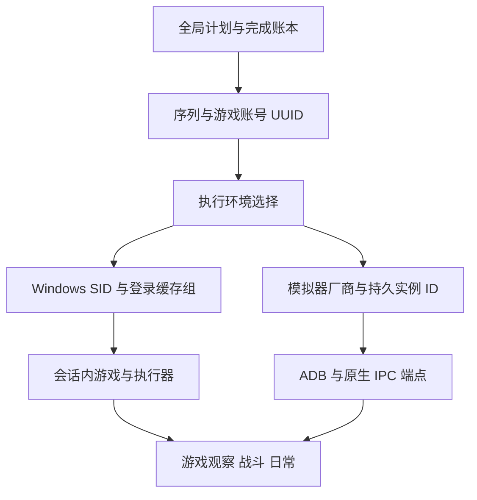
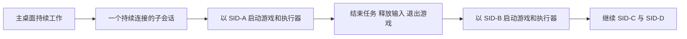
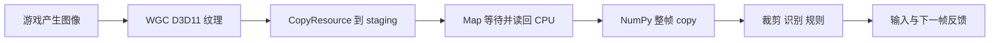

# 多 Windows 用户、多账号、模拟器与动作游戏低延迟调研

调研日期：2026-10-10。本文补充[完整架构与功能调研](<E:/AI work/ok-wuthering-waves-master/docs/research/2026-10-10-okww-framework-and-background-feasibility.md>)，沿用其中的源码基线和战斗、日常、导航、许可证调查。

**最适合长期目标的架构是：框架启动器＋游戏包＋执行环境适配器。** 用户最新明确 Windows 用户切换由人手动完成，框架只需在当前身份下管理对应账号组。对 PC 游戏，优先验证“当前用户的 Child Session＋会话内游戏与执行器”；对 Android 游戏，优先验证 MuMu 原生截图与多触点输入，雷电原生截图与 MaaTouch 输入。两条路径共享任务与账号语义，分别实现键鼠和触控。

BetterGI 已提供当前 Windows 身份下的原神桌面隔离实现；鸣潮兼容性仍需验证。下文第 4 节保留早期自动跨身份研究作为参考，**自动切换 Windows 用户已从当前需求移除，不是首版前置条件**。四组序列之间由用户完成系统身份交接，组内仍可自动切换游戏账号。

素材复用仅为过渡，之后逐项换成自有素材。第 8.1 节补充游戏包边界与渐进替换方式；过渡期间的素材授权仍按第 7 节处理。

本次只读取源码和公开文档，新增研究文档。没有启动游戏或模拟器、读取实际账号资料、操作 Windows 用户、创建会话、安装驱动或测量性能。

## 1. 已明确的需求与证据边界

| 需求 | 本报告采用的约束 |
|---|---|
| PC 系统 | Windows 11；Home／Pro 等版次、构建号尚未确定 |
| Windows 虚拟机 | 不接受 |
| Android 模拟器 | 未来需要支持 MuMu、雷电；鸣潮仍以 PC 原生端为目标 |
| Windows 用户 | 约四个，串行执行；用户手动切换，程序不负责自动跨用户启动 |
| 十个账号 | 用户确认：每个 Windows 用户下，游戏登录界面只显示十条已保存记录，更多记录隐藏；不是账号登录总数限制 |
| 前台使用 | 同一台电脑继续工作，自动化不抢占主桌面键鼠 |
| 游戏能力 | 以鸣潮、原神等动作大世界游戏为主，规则战斗与日常；绝区零作为规则、反应与移动端对照 |
| 发布方式 | 希望公开发布，并保留闭源或商业化空间 |

十条登录记录是用户提供的实际行为，本次没有独立复现。设计保留各 Windows 用户的账号组，不要求删除记录、修改游戏缓存或绕过显示限制。

“不抢键鼠”与“没有性能影响”要分别判断。独立会话和模拟器设备输入可以隔离操作；游戏仍与前台任务共享 CPU、GPU、显存、内存带宽和磁盘。串行只运行一个游戏可降低资源竞争，但不能消除它。

本文使用三种证据：**源码确认**说明已读实现；**官方契约**说明 API 支持什么；**待验证候选**说明架构具备依据，但目标游戏是否可用仍未知。项目宣传的 FPS 或延迟均不视作本机测量。

## 2. 账号身份、Windows 身份和桌面会话必须分别建模

一个账号可能换设备继续任务；一个 Windows 用户可以保存十个可见游戏账号；一个桌面会话也可能运行不同 Windows 身份的进程。框架需要保留这三种关系。

| 身份／标识 | 作用 | 是否适合长期绑定 |
|---|---|---|
| 框架账号 UUID | 配置、计划、进度、证据的内部业务主键，不是游戏 UID | 是；另带游戏、账号渠道／区服；同一互通账号跨设备保持同一身份 |
| A1／B1、昵称、序列名 | 人可读的展示与顺序 | 不单独作为唯一主键 |
| Windows SID | 目标用户的 profile、权限与登录资料范围 | 是；用户名可以改名 |
| Windows session ID | 当次桌面会话 | 否；重登／重启后重新解析 |
| 模拟器持久实例 ID | 厂商与安装范围内的实例 | 是；须带机器、Windows SID、厂商／安装范围 |
| ADB serial／端口、PID、HWND、display ID | 本次连接和进程端点 | 否；运行时发现并核对 |

建议最小关系为：`游戏账号 → 序列 → 环境绑定`。环境绑定可以是 `Windows SID＋该用户的登录缓存组`，也可以是 `模拟器类型＋持久实例 ID`。游戏账号进度不因换环境而重新开始。

四组 PC 账号的计划可以表达为：序列一绑定 SID-A，序列二绑定 SID-B，序列三绑定 SID-C，序列四绑定 SID-D。每组至多安排十条当前可见缓存记录。Windows 用户由人手动切换；框架识别当前 SID，显示对应账号组，组内游戏账号切换由游戏适配器负责。无需为当前需求建立常驻的自动跨 SID 控制服务。

## 3. 本地多账号实现已有成熟语义，但没有跨 Windows 用户编排

### 3.1 应保留哪些现有行为

| 已有能力 | 实现依据 | 对新框架的价值 |
|---|---|---|
| 稳定账号 ID、版本化配置 | `account_profile_store.py`、`account_repository.py` | 改昵称或槽位不应改变进度身份 |
| 精确身份匹配 | `account_identity.py` | 掩码手机号、别名冲突应报歧义；不能模糊猜账号 |
| 冻结运行快照 | `sequence_repository.py` | 一轮任务中的身份与任务配置保持一致 |
| 统一生产切号流程 | `runtime/login_flow_service.py` | 退出世界、到登录页、选号、核对、登录、确认主界面 |
| 登录后游戏内身份核验 | `task/account_feature_verification.py` | 列表选择正确仍需确认最终游戏身份 |
| 按游戏日记录成功和失败 | `MultiAccountDailyTask.py`、`game_period.py` | 断点续跑与跨日重建 |
| 资源消费确认账本 | `weekly_boss_progress.py`、`forgery_quota_progress.py` | 未确认领取不能直接算完成或重复消费 |
| 账号／项目／周期证据 | `evidence/repository.py` | 支持核对与失败定位 |

当前快照字段为 `sequence_id/revision/profile_ids/profiles/run_id/identity_profiles`，没有 Windows SID、session、登录资料环境或模拟器实例。[L03] `account_slots.py` 的序列一 A1–A10、序列二 B1–B10 只是槽位约定，不包含系统用户切换。[L04]

登录身份匹配优先使用配置中的精确掩码手机号，再匹配归一化别名；有冲突时明确失败。[L02] 登录流程有有限尝试：选号默认最多五轮，目标前置核对最多三轮；正常轮结束后，标记为可重试且本轮尝试数尚未达到二次的失败账号最多补跑一次。配置完整性错误、用户停止及不可重试失败不属于该补跑承诺。实际选号存在“连续稳定确认超时，但最后一次识别精确命中目标即可成功”的路径，并非所有成功都要求两帧确认。[L05]

登录列表确认与游戏内确认是两层：`LoginFlowService` 确认进世界，日常执行再读取特征码，要求三个不同图像哈希的帧连续识别同一码、单项 OCR 置信度至少 0.8，并精确匹配绑定账号。[L06] 原神应由对应适配器核验 UID 等可见身份，不能硬编码鸣潮特征码规则。

### 3.2 跨用户需要增加哪一层

保留现有组内切号语义时，还需增加环境编排，并明确跨进程数据、凭据和执行交接的边界，职责分为：

1. **全局协调器**选择游戏、序列、账号和配置版本，持有完成账本写权。
2. **环境控制器**确认当前 Windows SID／解析模拟器实例，启动或连接该身份下的执行环境；当前不代替用户切换 Windows 身份。
3. **环境内执行器**负责截图、输入、组内登录、游戏身份核验、战斗和日常。
4. 手动用户交接前，旧执行器释放其持有的键鼠／触点、保存完成或未确认状态；用户切换后，在新身份启动框架并继续该组序列。

业务状态按 `游戏＋账号渠道／区服＋账号 UUID＋任务` 归属；每日／每周完成记录再加对应游戏周期，材料额度和累计目标按 `goal_id/target` 维持跨周期累计。PC／Android 等运行平台记录在环境中，不拆分已确认互通的同一账号。环境 ID、run ID、配置版本和事件 ID 用于追踪执行来源。重置时间由各游戏适配器给出，不能将鸣潮的北京时间 04:00 固定为所有游戏契约。[L07][L08]

现有领奖／资源消耗流程使用 `pending/confirmed/cancelled` 等状态；环境切换不能抹去待确认事件。恢复时先核对实际现场，再决定继续还是等待处理。这是现有任务账本已经处理的真实边界。[L08] 新游戏适配器若加入购买，也应按该消费边界设计。

### 3.3 不能直接让四个用户共写同一份现有资料目录

现有账号写锁名为 `Local\OKWW-AccountWrite-{目录哈希}`，属于 Windows 会话命名空间。[L09] 跨会话直接共享文件时不能依靠它协调写入。即使计划串行，旧执行器未结束或 UI 保存配置仍可能与下一执行器重叠。推荐一个协调器维护账本，执行器回传业务事件；需要结构化存储时可使用单写者 SQLite。

敏感备份使用 DPAPI current-user 保护。[L10] 其他 SID 获得目录访问权限，也不因此获得解密能力。可共享非敏感账号 UUID、任务配置、状态摘要；游戏／启动器缓存、凭据和各用户的加密备份留在对应身份范围内。研究不要求搬迁实际登录数据。

## 4. Child Session 对四用户串行执行的真实能力

按最新需求，直接采用“每个当前 Windows 用户运行自己的框架与子会话”即可进入验证，不要求一次子会话覆盖四个 SID。序列完成后退出游戏与执行器、关闭子会话，再由用户切换 Windows 用户。下面的跨身份 API 研究是较复杂的可选路线。

### 4.1 已确认的是桌面隔离

微软 Child Session 是绑定现有父会话的本机 loopback RDP 子会话；全系统同时最多一个 **active and connected** 子会话；只能从已有会话创建，父会话终止则子会话也终止。[W01]

BetterGI 的固定源码设置 `Server=localhost`、`ConnectToChildSession=true`，没有指定另一 Windows 用户；子会话启动任务使用 `WindowsIdentity.GetCurrent().Name`。[W02] 其文档要求当前用户凭据。LibreAutomate 文档明确说明子会话使用同一个 Windows 用户、同一份用户文件和设置。[W03]

因此，直接使用 BetterGI 当前实现能提供当前身份的另一个桌面，不能直接使序列二访问 SID-B 的登录记录。微软 Child Sessions 文档没有直接写出“任意传入不同 UserName 都绝对无效”的完整断言，本次也没找到用它改变会话 owner 的受支持方法，故不把修改一项用户名视作解决方案。

### 4.2 可选自动跨用户路线：固定子会话，切换进程身份

子会话的所属身份可以保持不变，内部游戏与执行器的进程身份按 A、B、C、D 串行变化。若游戏的十条记录确实取自进程用户的 profile，这条路线可能保留四组缓存，同时保持主桌面持续工作。**这是有 API 基础的理论候选，不是已证实的游戏功能。**

微软公开契约提供这些基础：[W04]

- `CreateProcessWithLogonW` 以指定用户创建进程，需要有效凭据与相应本地登录权限；`LOGON_WITH_PROFILE` 加载该用户注册表 profile，以便访问对应 HKCU。
- 对于 `CreateProcessWithLogonW`，`lpEnvironment=null` 时由指定用户 profile 生成新进程环境；传入自建环境块时必须自己确保正确。
- `lpDesktop` 为空时继承调用者桌面和 window station，但目标身份仍须获得相应桌面访问权。
- `CreateProcessWithTokenW` 明确在调用者会话运行；若必须按 token 指定的会话运行，文档指向 `CreateProcessAsUser`。前者有 `SE_IMPERSONATE_NAME` 等权限前提，不能当成任意普通进程均可调用。

若改走 `CreateProcessAsUser`，不能套用上述 null 环境的行为：它本身不加载目标用户 hive，需按其契约加载 profile、生成目标环境。`CreateEnvironmentBlock` 的用户变量依赖 profile 已加载，继承调用者环境也可能混入主用户配置；相关权限与生命周期须分别处理。[W04]

游戏和执行器应同在子会话，并使用匹配的目标身份与权限。随后核对实际游戏进程 token 中的 SID、session ID 和完整性级别。只核对启动器用户名不够，因为启动器可能转交给常驻进程或系统服务。

这条路线至少要验证六项：

| 条件 | 为什么决定成败 |
|---|---|
| 目标用户 HKCU、AppData、环境正确 | 游戏可能据此选择登录列表与配置 |
| 原登录状态可读取 | 同 SID／profile 不保证所有原 logon session 的凭据可见 |
| 启动器到游戏的完整进程链保留身份 | 单实例复用、服务启动、提权可能改变实际身份或桌面 |
| 游戏在子会话正常 GPU 渲染 | API 能启动程序不等于游戏支持该会话 |
| 截图和输入在子会话可用 | 必须有新帧、键鼠与相对镜头动作反馈 |
| 前一组进程与输入已正常退出 | 全局单实例、残留启动器可能阻止下一用户 |

官方有一个反例说明“加载 profile”不足以证明完整登录环境恢复：`CredReadW` 读取当前 token 所属 logon session 的 credential set，`CRED_PERSIST_SESSION` 凭据不会被同一用户的其他 logon sessions 看到。[W05] 这不表示目标游戏一定使用 Credential Manager，而是说明 API 条件尚不足。DPAPI 也需要匹配登录凭据，并通常受机器范围约束；加载 HKCU 不代表任意缓存都能解密。

`runas /netonly` 保留本地身份，只改变网络凭据，不适合选取另一用户的本地游戏缓存。普通跨用户启动也不自动解决 UAC／管理员权限要求；执行器完整性级别低于游戏时，`SendInput` 会受 UIPI 限制。[W10]

Task Scheduler `RunEx` 有 `sessionID` 与 `user` 参数，允许尝试在指定会话以指定用户交互运行；它不是天然只能同用户的 API。[W06] 但 `TASK_LOGON_INTERACTIVE_TOKEN` 要求用户已登录，任务凭据、权限和会话启动条件仍需验证。BetterGI 现有使用方式不能直接证明其跨 SID 行为。

### 4.3 所有非 Windows VM 路线的比较

| 路线 | 四组用户资料 | 主桌面键鼠 | 成熟证据与主要边界 | 建议 |
|---|---|---|---|---|
| 当前用户的 Child Session＋手动用户交接 | 每组直接使用当前身份资料 | 组内可隔离；人工系统切换有交接中断 | 原神有公开实现，鸣潮待验证 | **当前 PC 优先验证方向** |
| 固定 Child Session＋串行跨身份进程 | 有 API 基础，游戏缓存待验证 | 会话内输入具有隔离基础 | 原神子会话有公开实现；多 SID 链和鸣潮未证实 | 自动跨用户需求出现时再评估 |
| 同会话 WGC＋PostMessage | 可尝试跨身份启动，另需权限与资料验证 | 兼容的消息输入可不动主光标 | 本地鸣潮普通战斗可参考；登录、部分挑战会置前，镜头输入更难 | 保留游戏特定轻量模式 |
| Windows 快速用户切换 | 完整原用户环境最直接 | 切走主桌面 | 串行可用，但不满足持续前台工作 | 仅作功能对照 |
| 各父用户分别创建子会话 | 每组环境有基础 | 整体无干扰未证实 | 仅一个 active connected child；父会话断开与重连图形行为需核实 | 优先级低 |
| Windows 11 普通 RDP 切到其他用户 | 有真实身份 | 不能默认保持主桌面活动 | 普通客户端 Windows 不应被当成正式并发多用户桌面产品 | 不作为默认方案 |
| Windows Server 正式 RDS | 正式多用户交互环境 | 可隔离会话 | 需系统与 CAL、GPU／驱动、目标游戏兼容性 | 较重对照 |
| RDP Wrapper／Duo | 多会话路线较直接 | 有会话边界 | 系统修改、构建与更新依赖、Windows 使用许可；Duo源码许可不明 | 不作商业产品默认前提 |
| 别的 Win32 Desktop／虚拟显示器／串流 | 不自动切换 SID | 不自动建立独立输入会话 | 提供桌面或输出，不单独解决游戏输入隔离 | 作为显示组件 |
| MuMu／雷电原生设备接口 | 账号绑实例，视游戏规则 | 绕开主桌面键鼠 | 仅适用能在 Android 端运行的游戏 | **移动端独立路线** |

Windows Enterprise multi-session 不是普通 Enterprise；微软 FAQ 明确不允许在 Azure Virtual Desktop 之外生产使用该版次。[W07] 不能将它写成在普通 Windows 11 上本地安装即可使用的合规替代。

### 4.4 隐藏、最小化、断开不能混用

执行器应在子会话内采集原始游戏窗口，并在当地发输入；主桌面只保留控制与可选预览。RDP 预览无需进入战斗反馈闭环。

预览被遮挡、宿主窗口隐藏、宿主最小化、RDP 断开、父会话锁定、注销都是不同状态。LibreAutomate 文档指出关闭 PiP 窗口会断开并进入 no-UI 状态，UI 脚本无法运行。[W03] DXGI `DuplicateOutput` 在 disconnected session 可返回 `DXGI_ERROR_SESSION_DISCONNECTED`；这是 DXGI 的明确边界，不能据此断言所有 WGC 必然失败。[W08]

微软 Windows 11 24H2 的 `AllowRelativeMouseMode` 可作为 RDP 相对鼠标候选；BetterGI 固定实现尚未使用它。[W09] 自动化仍应优先在子会话当地发送相对动作，预览鼠标转发只用于人工接管。

## 5. 模拟器的截图与输入应分别选后端

### 5.1 MuMu 优先用新原生多触点接口

| 能力 | 本地 ok 实现 | MaaFramework 固定源码 | 判断 |
|---|---|---|---|
| 实例发现与 ADB | 已保存安装路径、player ID、实例名、serial | 官方 CLI／自动发现均可提供端点 | 保留发现接口，端点动态解析 |
| 原生截图 | Nemu IPC，原始像素 | `nemu_capture_display` | 可免 ADB PNG／视频编码，值得比较 |
| 输入 | `down(x,y)/up()` 单触点 | `nemu_input_event_finger_touch_down/up` | 必须升级接口，不能复用单触点假定 |
| 多触点标识 | 无 contact 参数 | 使用 `contact+1`；SDK finger ID 1–10 | 可分别持有摇杆、攻击和镜头 |
| 多应用 display | 本地路径以固定 display 等条件为主 | 按包名与应用分身索引查询 display ID | 应用重启后重新解析 |
| 版本前提 | 旧路径不能推出新能力 | MuMuManager ≥6.3.2.0 才启用增强输入 | 发现时读实际能力 |

Maa 移动触点时继续调用同一手指的 down，up 只释放指定手指。[A01] 理论上触点 0 可以持续持有摇杆，触点 1 发攻击，触点 2 拖镜头。是否能在目标游戏达到稳定频率仍需实测。

本地 `ADBInteraction.send_key()` 使用 Android `input keyevent`，不等于给模拟器窗口发送电脑 W 键，也不保证触发其键位映射；基类 `send_key_down/up` 没有相应有效实现。[L12] 所以 PC 角色脚本中的“按住 W，同时点击攻击”无法仅靠换截图后端迁移。

本地 Nemu 每次截图还有分辨率查询、像素缓冲分配、颜色转换和翻转。[L13] IPC 是有利基础，不能单凭名字认定整个闭环已优化。

### 5.2 雷电原生截图与触控输入分开

Maa 已读实现使用 `ldopengl64.dll`，创建截图实例并调用 `cap()`，依赖实例 index 与当前 VBox PID。[A03] 该 Extras 没有等价输入实现，可另配 MaaTouch 的持续触控连接。

雷电官方当前命令行文档同时列雷电 9／14，并提供 `list2`、应用启动与 ADB 等操作；固定 Maa 提交的原生截图代码只证明雷电 9 路径。[A04] 不预先假定雷电 14 DLL 二进制兼容。PID、窗口句柄、ADB 端口在重启后重新发现，持久绑定使用环境与实例 ID。

### 5.3 通用 Android 路线

| 组件 | 截图／数据流 | 输入 | 动作游戏用途与限制 |
|---|---|---|---|
| ADB `screencap` | PNG 或原始像素，通常单次请求 | `input tap/swipe/keyevent` | 设备管理、登录与菜单基线；高层命令不足以表达持续并发多触点 |
| scrcpy 自定义客户端 | MediaCodec 编码→ADB socket→PC 解码，持续视频 | 持久控制 socket；服务端最多 10 个 pointer | 通用候选；要自行正确发 pointer ID，普通窗口鼠标不自动变成多触点战斗 |
| MaaTouch | 不负责截图 | `d/m/u id`，`c` 提交；持续连接 | 雷电／通用 Android 触控候选；按 Android 与游戏验证 |
| minitouch | 不负责截图 | socket 多触点 | Android 10+ 默认受安全策略限制，需要 STFService 等路径 |
| minicap | JPEG 流 | 不负责输入 | 上游明确不支持模拟器；不作 MuMu／雷电首选 |

scrcpy 作者宣称 30–120 FPS、35–70 ms，属于设备相关的公开结果；本次没有本机测量。[A05] 默认不增加视频缓冲，`--video-buffer=50` 会主动增加 50 ms；文档认为 H264 应比 H265 更低延迟，具体编码器仍需比较。其内部协议可能随版本改变，自定义客户端应固定对应服务端版本。

MaaTouch、scrcpy 多触点的源码证据只证明表达能力，不证明任意游戏会接受、不会丢动作或能满足闪避时限。minicap 的上游兼容声明与 minitouch 的新 Android 限制，应在选型时直接排除错误假设。[A06][A07]

### 5.4 预留哪些接口足够

| 接口范围 | 最小职责 |
|---|---|
| 环境生命周期 | discover、start／stop、start_app／stop_app、连接状态 |
| 帧源 | 连续获取最新帧，frame ID、原始时刻或时刻来源、尺寸／旋转、像素格式 |
| PC 输入 | key_down／up、button_down／up、相对视角动作、必要的绝对点击 |
| Android 输入 | touch_down／move／up(contact)、批量描述触点更新、Android 按键；是否支持原子提交由后端声明 |
| 所有权与释放 | 每次只一个执行器控制游戏，释放其持有的键／按钮／触点 |
| 能力声明 | 持续多触点上限、能否长按、是否依赖前台、原生截图／编码流、支持的版本 |

上层战斗表达移动方向、攻击、闪避、技能、切人、镜头转动；PC 适配器映射键鼠，Android 适配器映射虚拟摇杆与技能位置。连续量与离散动作都要保留。通用核心不假定一个技能必然对应一个键，也不把所有输入压成单次 `click()`。

PC 和移动端 HUD、技能位置、镜头与交互逻辑可能不同。同一游戏也需要不同的平台配置；可以共享角色决策语义，截图坐标和动作执行仍由各平台适配。

## 6. 低延迟要优化完整反馈闭环

### 6.1 当前 WGC 并不是端到端 GPU 零拷贝

本地 `windows_graphics.py` 的实际路径是 `CopyResource`、`Map(...D3D11_MAP_READ, 0)`、整帧 NumPy `.copy()`，随后供裁剪与识别使用；已有 `capture_gpu_readback` 和 `capture_pixel_copy` 计时点。[L14] `TaskExecutor` 收到 CPU 图像后才记录 `_last_frame_time`，不是游戏图像生成时间。[L15]

1080p BGRA 一帧约 8.29 MB，60 FPS 的一次整帧复制约 0.498 GB/s；4K 对应约 1.99 GB/s。这只是数据量计算，并非本机复制速度或延迟。实际代价还包括同步、显存回读、缓存与图像转换。

### 6.2 按收益与成本比较的优化顺序

| 优先级 | 方案 | 对当前问题的作用 | 证据／限制 |
|---|---|---|---|
| 1 | 同一帧统一观察与复用 | 多个角色／规则无需各取新图，减少重复识别 | 需明确帧 ID 与状态有效期 |
| 1 | 最新帧模式，丢弃积压旧帧 | 不让决策处理过时画面 | 独立的新帧时刻；不能用重复旧帧补 FPS |
| 1 | 战斗 HUD 小区域识别、按需 OCR | 技能、队伍、血条用模板／颜色等轻处理 | 登录与菜单 OCR 可保持较低频率 |
| 1 | 输入与采集持久连接 | 减少 ADB 进程、握手与缓冲分配开销 | MuMu IPC、MaaTouch／scrcpy socket 均有基础 |
| 2 | GPU 裁剪后仅回读小 ROI | 减少全帧 staging 与 CPU 数据量 | D3D11 `CopySubresourceRegion` 有官方 API |
| 2 | 复用 staging／像素缓冲、减少颜色转换 | 降低每帧内存开销 | 必须管理 buffer 生命周期，避免被下一帧覆盖 |
| 2 | 原生 C++／Rust 采集模块＋规则层 | 更直接控制纹理、同步与时间戳 | 改语言本身不保证降低游戏响应延迟 |
| 3 | GPU 预处理＋GPU 推理 | 较大检测模型可能减少 CPU 往返 | 图形互操作与模型布局成本高，小模板未必更快 |

`CopySubresourceRegion` 可把纹理指定区域复制到小 staging，并异步入队；随后 CPU `Map` 仍可能等待 GPU。[P01] `D3D11_MAP_FLAG_DO_NOT_WAIT` 可以返回尚未就绪，需显式处理为没有可读新图，不能算采集成功。GPU 裁剪后回读小图是明确候选，收益需对比多个分散 ROI 的调用与同步成本。

### 6.3 DXcam、windows-capture 与推理后端

**DXcam** 当前文档提供 DXGI／WinRT 双后端、区域截图、新帧判断和时间戳。`copy=False`／`get_latest_frame_view()` 是 CPU 缓冲视图，后续采集会覆盖它；这不等于 GPU 图像直接送入模型。[P02] `video_mode=True` 可以重复旧帧填满目标 FPS，战斗不得把这些帧计作游戏新帧。其 240 FPS benchmark 使用 5900X＋3090 与 UFO 测试，不是鸣潮实测。

**windows-capture** Rust 的 `Frame` 保留 D3D11 texture 和 `SystemRelativeTime`。当前 `buffer()` 仍创建 staging、全帧复制；`buffer_crop()` 则用 `CopySubresourceRegion` 读取小区域。[P03] 它是研究原生 ROI 与时间戳的良好参考，不能仅因为 Rust 实现就称默认无回读。

**ONNX Runtime I/O Binding** 可控制张量所在设备；CPU 输入仍可能上传，默认 CPU 输出也可能下载。[P04] 它不会自动将 WGC 的 D3D11 texture 转成模型 tensor。DirectML 的 DML1 接口使用 D3D12 device／queue，要求相同 parent device；还需处理 D3D11↔D3D12 互操作、像素格式、布局与同步。[P05]

当前 DirectML 文档要求关闭 memory pattern、使用 `ORT_SEQUENTIAL`，同一 inference session 不可由多个线程同时调用 `Run`。多线程增加排队与 GPU 竞争时反而可能损害尾延迟。初期规则与小 ROI 模板可以先用 CPU，只有实测显示模型推理占主要时间时才进一步优化 GPU 全链。

### 6.4 应测哪些指标

`输入反馈总延迟 = 等待／采集延迟＋读回与预处理＋识别＋决策／排队＋输入提交＋游戏采样与下一帧反馈`。

| 指标 | 测量目的 |
|---|---|
| 决策使用帧的年龄 | 识别很快但图像过时仍会错过动作 |
| 独立新帧频率与丢帧 | 区分游戏渲染、捕获节流和重复旧图 |
| GPU 回读、CPU copy、识别时长 | 定位真实瓶颈，而非按语言猜测 |
| 观察→输入提交、提交→可见反馈 | 区分自动化与游戏自身时延 |
| P50／P95／P99、最长停顿 | 动作游戏尤其需要尾延迟稳定 |
| 持续触点／按键成功率 | 防止有 FPS 却不能稳定移动与攻击 |
| 主桌面操作是否受扰、前台帧率 | 验证用户真正要求的隔离与资源影响 |

原始时刻必须注明来源。WGC／DXGI 时刻可用于采集帧年龄，但仍不是游戏模拟逻辑的精确时刻。模拟器 SDK 若无原始时间戳，只能记录调用与返回时刻并明确测量界限。各时钟须转换到可比较的单调时间基准。

60 FPS 的帧周期约 16.7 ms，不等于总延迟 16.7 ms。三个帧周期的排队就接近 50 ms，尚未计入识别与输入。120／240 FPS 也无法弥补对旧图做决策。

规则轮转、日常菜单与精确闪避／弹反的时限不同。当前 okww 的核心是 HUD 驱动与角色手写规则，完整复刻不要求先实现通用敌人招式理解。若扩展即时反应，需要另外定义各游戏提示、检测时刻、动作窗口和可取消规则；已有完整报告对 OneDragon 的视觉／音频反应提供了源码对照。

## 7. 与闭源和商业化空间相关的新增许可边界

| 组件 | 本次许可依据 | 建议 |
|---|---|---|
| 本地 okww／旧 ok-script | AGPL；本地包含 Alas 派生实现 | 用作功能／设计证据；闭源核心独立实现或取得相应许可 |
| 新上游 ok-script | Apache 2.0＋Commons Clause＋附加限制 | 不标为无限制 Apache；通用竞争框架需专门核查 |
| BetterGI／OneDragon | GPL | 研究公开行为与架构；复制源码需要履行相应义务 |
| MaaFramework | LGPL | 可考虑符合其许可的独立上层与动态库边界，核对打包、修改和替换条件 |
| MaaTouch／scrcpy／minitouch／minicap | Apache 2.0 正文 | 适合独立组件候选，保留 notices，仍核对具体依赖 |
| MuMu／雷电 EmulatorExtras | README 明确 No License，厂商保留所有权利 | 不因 Maa 的 LGPL 而复制分发 SDK 文件／DLL |
| DXcam／windows-capture | MIT 项目 | 适合基础采集参考，使用时核对固定版本依赖 |
| 游戏图像、角色模板、模型 | 无统一宽松授权 | 素材包逐项记录来源、分发权与适用版本 |

EmulatorExtras 子模块基线为 `54d3a3ad448f0541df3759ae91b571a6762daaf1`，其 README 明确没有授予统一许可。[A08] 优先考虑动态加载用户已经安装的厂商组件，避免随产品附带未知重分发权的 DLL；动态加载仍不代表已取得商业 SDK 使用授权，需核对厂商条款。

只重写 Python／C# 代码、复用旧图片，不会清除图片、标注、权重及衍生代码的原有许可。独立采集／制作素材能减少复制原项目资产的依赖，但游戏内容的商业分发权仍需确认。

## 8. 推荐的组成与验证顺序

对于公开发布并保留闭源空间的框架，优先评估 **C#／.NET 的主控与 Windows 会话宿主＋环境内执行器＋必要时独立原生采集模块＋OpenCV／ONNX Runtime**。Android 使用独立设备后端；任务数据和规则可以保持平台无关。Python 可以保留为规则／研发层，无需为了速度先重写所有业务。

| 层 | 核心职责 | 游戏适配包提供的内容 |
|---|---|---|
| 账号与调度 | UUID、序列、环境绑定、周期账本、断点与交接 | 身份可见字段、重置规则、任务项目 |
| 环境 | Windows 身份／会话、模拟器实例与生命周期 | 启动参数、目标程序／包名 |
| 帧与输入 | 时间戳、最新帧、输入所有权、键鼠／触点能力 | HUD ROI、移动端控件位置 |
| 观察 | 模板／颜色／OCR／模型输出、状态有效期 | 页面与战斗状态解释 |
| 战斗 | 规则条件、动作执行、取消、切人、暂停／恢复 | 角色机制、技能、队伍、镜头、敌人提示 |
| 日常与导航 | 流程执行、完成验证、消费事件 | 任务路线、地图与交互语义 |

服务或主控可以负责启动和账本，但截图与游戏输入必须由正确交互会话内的执行器完成，不能把 Windows Session 0 服务当成可直接操作所有桌面的游戏执行器。完整画面无需每帧传回主控；只传摘要、证据或低频预览，以免主控通信进入战斗关键路径。

### 8.1 框架启动器＋游戏包是合适的产品组织方式

启动器同时承担通用运行框架职责：安装／选择游戏包、连接执行环境、管理账号序列、配置与证据，并启动执行器。游戏包提供具体游戏的语义。添加第二个游戏时增加对应游戏包；具备框架通用能力但未安装游戏包时，不能执行该游戏的业务。

| 放在框架中 | 放在游戏包中 |
|---|---|
| WGC／原生采集、ADB、MuMu、雷电等设备后端 | 游戏进程／包名与启动配置，支持的平台及环境要求 |
| 帧缓存、时间戳、模板／颜色／OCR／模型推理服务 | 图像与模型、HUD ROI、识别阈值、页面解释 |
| 规则执行、动作取消、输入所有权与暂停／恢复 | 角色机制、轮转、技能、切人、镜头与触控映射 |
| 账号 UUID、序列、进度与消费事件存储 | 登录页面流程、身份核验字段、游戏日／周规则 |
| 日常流程运行器、日志、界面与包管理 | 日常任务、领奖验证、地图／路线与脱困规则 |

游戏包建议采用“素材＋声明式配置／规则＋必要的游戏专用代码”。多数技能条件和菜单流程可数据化，复杂角色机制、导航或特殊界面允许专用模块；不承诺所有业务都能只填 JSON，也不要求每个游戏复制一套框架。

一个包的最小清单包含：game ID、包版本、兼容的框架 API 版本、PC／Android 支持范围、所需设备能力、可用任务及入口。MuMu DLL 与 MaaTouch 属于设备后端，不分别塞进每个游戏包。PC／Android 适配配置可以放在同一个游戏包的不同平台子目录，只有账号互通得到确认时才共用业务身份。

界面和执行器分进程：界面管理选择与状态，执行器加载当前游戏包，在对应会话或模拟器上本地运行完整识别→决策→输入链。首版只加载当前选择的一个游戏包，不必引入每游戏常驻微服务。包更新在任务停止后生效，避免战斗中途替换规则和坐标。

素材通过稳定的语义 ID 引用，例如某游戏的“技能可用”“当前角色”“登录确认”，具体文件路径由游戏包素材目录解析。逐项替换图片时保留语义 ID，并按新素材重新核对裁剪、缩放与阈值；模型和标注也要记录来源。包可单独更新，框架不依赖旧素材文件名。这样适合过渡素材逐渐换成自有资产，但不意味着每次更换都无需验证。

对当前目标的模拟器选择，**建议 MuMu 作为第一个 Android 后端，雷电作为第二后端**。依据是已核实的 MuMu 同一原生路径兼具原始像素截图和持续多触点，接口整合成本较低；雷电已确认原生截图，触控需另配 MaaTouch。该排名针对自动化开发接口，不代表 MuMu 在所有游戏上更快、更省资源或兼容性更好，实际游戏表现和厂商授权仍需验证。[A01][A03][A08]

### 8.2 当前需求下的验证顺序

后续若获准实施验证，应按下面顺序收敛。以下是验证计划，本次没有执行：

1. **验证当前用户与游戏包**：框架识别当前 SID、加载对应游戏包和账号组；核对十条可见记录、组内切号与进游戏身份。先完成鸣潮一个包，明确与框架的边界。
2. **验证桌面隔离**：原神已有路线优先对照，鸣潮独立验证；主桌面持续使用，测试键盘、光标、相对镜头、登录、日常、结果页及人工接管。
3. **验证人工交接与续跑**：上一组释放输入并保存状态，用户切换系统身份后启动下一组；覆盖残留启动器、未确认消费、跨游戏日、用户停止和断点续跑。
4. **验证采集闭环**：对比现有 WGC、原生 ROI、必要时 DXcam；在同一分辨率／帧率下报告帧年龄与总延迟分位数。
5. **验证 MuMu／雷电多触点**：持续移动时攻击、转镜头与释放触点；随后覆盖应用／实例重启，重新解析端点。
6. **最后比较 GPU 推理或更重的系统方案**：只有前述测量显示必要时才引入；Child Session 无法兼容目标游戏时，再对照正式 RDS、消息输入等路线。

自动战斗应继续遵循本地产品的核心要求：启用意图与可执行状态分开；暂时失去截图／输入不清除启用偏好；日常战斗和后台战斗共享执行服务与单一输入所有权。环境切换暂停实际执行，只有用户明确停止／关闭自动战斗才改变其长期启用意图；停止某次日常任务、全局暂停或退出程序本身不应清除自动战斗偏好。角色轮转、登录和日常的普通失败仍应如实记录，不能由“持续服务”把失败计作完成。

## 9. 本地证据索引

- [L01] [账号 profile 与版本](<E:/AI work/ok-wuthering-waves-master/src/account_profile_store.py:3>)。
- [L02] [账号身份及精确匹配](<E:/AI work/ok-wuthering-waves-master/src/account_identity.py:26>)；普通登录匹配从 164 行开始。
- [L03] [序列运行快照](<E:/AI work/ok-wuthering-waves-master/src/sequence_repository.py:56>)。
- [L04] [序列槽位约定](<E:/AI work/ok-wuthering-waves-master/src/account_slots.py:8>)。
- [L05] [统一登录服务](<E:/AI work/ok-wuthering-waves-master/src/runtime/login_flow_service.py:18>)；[选号与确认](<E:/AI work/ok-wuthering-waves-master/src/task/MultiAccountDailyTask.py:3381>)；[每日补跑](<E:/AI work/ok-wuthering-waves-master/src/task/MultiAccountDailyTask.py:2990>)；[现场恢复与切号边界](<E:/AI work/ok-wuthering-waves-master/src/task/MultiAccountDailyTask.py:2266>)。
- [L06] [游戏内身份核验入口](<E:/AI work/ok-wuthering-waves-master/src/task/account_feature_verification.py:207>)；[OCR 置信度](<E:/AI work/ok-wuthering-waves-master/src/task/account_feature_verification.py:40>)；[三帧核验](<E:/AI work/ok-wuthering-waves-master/src/task/account_feature_verification.py:82>)；[身份精确匹配](<E:/AI work/ok-wuthering-waves-master/src/task/account_feature_verification.py:115>)；[日常任务绑定](<E:/AI work/ok-wuthering-waves-master/src/task/MultiAccountDailyTask.py:3042>)。
- [L07] [游戏日边界](<E:/AI work/ok-wuthering-waves-master/src/game_period.py:23>)。
- [L08] [周本消费事件](<E:/AI work/ok-wuthering-waves-master/src/task/weekly_boss_progress.py:46>)；[凝素额度事件](<E:/AI work/ok-wuthering-waves-master/src/task/forgery_quota_progress.py:58>)；[凝素累计确认量](<E:/AI work/ok-wuthering-waves-master/src/task/forgery_quota_progress.py:42>)；[世界首领累计目标](<E:/AI work/ok-wuthering-waves-master/src/task/world_boss_material_progress.py:33>)；[证据存储](<E:/AI work/ok-wuthering-waves-master/src/evidence/repository.py:239>)。
- [L09] [会话范围的账号写锁](<E:/AI work/ok-wuthering-waves-master/src/account_change_lock.py:19>)。
- [L10] [DPAPI current-user 封装](<E:/AI work/ok-wuthering-waves-master/src/secure_backup.py:60>)；[敏感备份调用](<E:/AI work/ok-wuthering-waves-master/src/account_repository.py:657>)。
- [L11] [安装框架 DeviceManager](<E:/AI work/ok-wuthering-waves-master/.venv/Lib/site-packages/ok/device/DeviceManager.py:348>)。
- [L12] [安装框架 ADB 输入](<E:/AI work/ok-wuthering-waves-master/.venv/Lib/site-packages/ok/device/interaction_methods/adb.py:22>)；[基类按键持有接口](<E:/AI work/ok-wuthering-waves-master/.venv/Lib/site-packages/ok/device/interaction_methods/base.py:25>)。
- [L13] [Nemu 截图查询与缓冲分配](<E:/AI work/ok-wuthering-waves-master/.venv/Lib/site-packages/ok/capture/adb/nemu_ipc.py:351>)；[颜色转换与翻转](<E:/AI work/ok-wuthering-waves-master/.venv/Lib/site-packages/ok/capture/adb/nemu_ipc.py:519>)；[单触点输入](<E:/AI work/ok-wuthering-waves-master/.venv/Lib/site-packages/ok/capture/adb/nemu_ipc.py:403>)。
- [L14] [本地 WGC 回读与 copy](<E:/AI work/ok-wuthering-waves-master/custom_ok/ok/device/capture_methods/windows_graphics.py:108>)。
- [L15] [本地 Executor CPU 收图时刻](<E:/AI work/ok-wuthering-waves-master/custom_ok/ok/task/TaskExecutor.py:270>)。

## 10. GitHub 与官方资料索引

### Windows 会话与身份

- [W01] Microsoft [Child Sessions](https://learn.microsoft.com/en-us/windows/win32/termserv/child-sessions)、[WTSGetChildSessionId](https://learn.microsoft.com/en-us/windows/win32/api/wtsapi32/nf-wtsapi32-wtsgetchildsessionid)。
- [W02] BetterGI 固定提交 `8a4db294362c682ca709ebeef205f77fca4d575e`：[RdpActiveXHost](https://github.com/babalae/better-genshin-impact/blob/8a4db294362c682ca709ebeef205f77fca4d575e/BetterGenshinImpact/View/Controls/ChildSession/RdpActiveXHost.cs)、[ChildSessionProcessLauncher](https://github.com/babalae/better-genshin-impact/blob/8a4db294362c682ca709ebeef205f77fca4d575e/BetterGenshinImpact/Service/ChildSession/ChildSessionProcessLauncher.cs)、[桌面分身说明](https://www.bettergi.com/feats/command/session.html)。
- [W03] [LibreAutomate PiP session 文档](https://www.libreautomate.com/editor/PiP%20session.html)；宿主对照 [LibreAutomate/Au](https://github.com/LibreAutomate/Au)、[charles-cty/LocalRDP](https://github.com/charles-cty/LocalRDP)、[sinpoce/ParaDesk](https://github.com/sinpoce/ParaDesk)。后两者用于机制对照，未据此确认商业复制许可。
- [W04] Microsoft [CreateProcessWithLogonW](https://learn.microsoft.com/en-us/windows/win32/api/winbase/nf-winbase-createprocesswithlogonw)、[CreateProcessWithTokenW](https://learn.microsoft.com/en-us/windows/win32/api/winbase/nf-winbase-createprocesswithtokenw)、[CreateProcessAsUserW](https://learn.microsoft.com/en-us/windows/win32/api/processthreadsapi/nf-processthreadsapi-createprocessasuserw)、[CreateEnvironmentBlock](https://learn.microsoft.com/en-us/windows/win32/api/userenv/nf-userenv-createenvironmentblock)、[LoadUserProfile](https://learn.microsoft.com/en-us/windows/win32/api/userenv/nf-userenv-loaduserprofilew)。
- [W05] Microsoft [CredReadW](https://learn.microsoft.com/en-us/windows/win32/api/wincred/nf-wincred-credreadw)、[CREDENTIALW](https://learn.microsoft.com/en-us/windows/win32/api/wincred/ns-wincred-credentialw)、[CryptProtectData](https://learn.microsoft.com/en-us/windows/win32/api/dpapi/nf-dpapi-cryptprotectdata)、[CryptUnprotectData](https://learn.microsoft.com/en-us/windows/win32/api/dpapi/nf-dpapi-cryptunprotectdata)。
- [W06] Microsoft [Task Scheduler RunEx](https://learn.microsoft.com/en-us/windows/win32/api/taskschd/nf-taskschd-iregisteredtask-runex)、[TASK_LOGON_TYPE](https://learn.microsoft.com/en-us/windows/win32/api/taskschd/ne-taskschd-task_logon_type)。
- [W07] Microsoft [Enterprise multi-session FAQ](https://learn.microsoft.com/en-us/azure/virtual-desktop/windows-multisession-faq)；[无人值守桌面流](https://learn.microsoft.com/en-us/power-automate/desktop-flows/run-unattended-desktop-flows)说明该产品在 Windows 10／11 存在活动用户会话时的限制，不能直接推广成所有 Child Session API 的限制。
- [W08] Microsoft [DXGI DuplicateOutput](https://learn.microsoft.com/en-us/windows/win32/api/dxgi1_2/nf-dxgi1_2-idxgioutput1-duplicateoutput)。
- [W09] Microsoft [IMsRdpExtendedSettings.Property](https://learn.microsoft.com/en-us/windows/win32/termserv/imsrdpextendedsettings-property)。
- [W10] Microsoft [UAC 架构](https://learn.microsoft.com/en-us/windows/security/application-security/application-control/user-account-control/architecture)、[SendInput 与 UIPI](https://learn.microsoft.com/en-us/windows/win32/api/winuser/nf-winuser-sendinput)。

### Android 与模拟器

- [A01] MaaFramework 固定提交 `8963191215ca49d6b037802acd07d20a4213160a`：[MuMu 多触点](https://github.com/MaaXYZ/MaaFramework/blob/8963191215ca49d6b037802acd07d20a4213160a/source/MaaAdbControlUnit/EmulatorExtras/MuMuPlayerExtras.cpp#L125)、[display ID](https://github.com/MaaXYZ/MaaFramework/blob/8963191215ca49d6b037802acd07d20a4213160a/source/MaaAdbControlUnit/EmulatorExtras/MuMuPlayerExtras.cpp#L551)；[SDK finger ID 范围](https://github.com/MaaXYZ/EmulatorExtras/blob/54d3a3ad448f0541df3759ae91b571a6762daaf1/Mumu/external_renderer_ipc/external_renderer_ipc.h#L83)。
- [A02] MaaFramework [MuMu 版本检测](https://github.com/MaaXYZ/MaaFramework/blob/8963191215ca49d6b037802acd07d20a4213160a/source/MaaToolkit/AdbDevice/AdbDeviceWin32Finder.cpp#L81)；[MuMuManager 官方 CLI](https://mumu.163.com/help/20240807/40912_1170006.html)。
- [A03] MaaFramework [雷电原生截图](https://github.com/MaaXYZ/MaaFramework/blob/8963191215ca49d6b037802acd07d20a4213160a/source/MaaAdbControlUnit/EmulatorExtras/LDPlayerExtras.cpp#L47)。
- [A04] [雷电 9／14 官方 CLI](https://help.ldmnq.com/docs/LDPlayer-ming-ling-hang-kai-fa-zhe-shi-yong-shuo-ming)。
- [A05] [scrcpy README](https://github.com/Genymobile/scrcpy)、[视频参数](https://github.com/Genymobile/scrcpy/blob/master/doc/video.md)、[内部协议与开发](https://github.com/Genymobile/scrcpy/blob/master/doc/develop.md)、[触控控制器](https://github.com/Genymobile/scrcpy/blob/master/server/src/main/java/com/genymobile/scrcpy/control/Controller.java)、[PointersState](https://github.com/Genymobile/scrcpy/blob/master/server/src/main/java/com/genymobile/scrcpy/control/PointersState.java)。
- [A06] [MaaTouch 协议](https://github.com/MaaAssistantArknights/MaaTouch)、[minitouch Android 10 限制](https://github.com/DeviceFarmer/minitouch)。
- [A07] [minicap 模拟器限制](https://github.com/DeviceFarmer/minicap#readme)。
- [A08] [EmulatorExtras No License](https://github.com/MaaXYZ/EmulatorExtras/blob/54d3a3ad448f0541df3759ae91b571a6762daaf1/README.md)、[MaaFramework LGPL](https://github.com/MaaXYZ/MaaFramework/blob/8963191215ca49d6b037802acd07d20a4213160a/LICENSE.md)。

### 图形采集与推理

- [P01] Microsoft [CopySubresourceRegion](https://learn.microsoft.com/en-us/windows/win32/api/d3d11/nf-d3d11-id3d11devicecontext-copysubresourceregion)、[Map](https://learn.microsoft.com/en-us/windows/win32/api/d3d11/nf-d3d11-id3d11devicecontext-map)。
- [P02] [DXcam README 与基准](https://github.com/ra1nty/DXcam)。
- [P03] [windows-capture Frame 实现](https://github.com/NiiightmareXD/windows-capture/blob/main/src/frame.rs)。
- [P04] ONNX Runtime [I/O Binding](https://onnxruntime.ai/docs/performance/tune-performance/iobinding.html)。
- [P05] ONNX Runtime [DirectML Execution Provider](https://onnxruntime.ai/docs/execution-providers/DirectML-ExecutionProvider.html)。

BetterGI、MaaFramework 和 EmulatorExtras 核心引用使用固定提交；其他文档／main 分支内容是调研当日读取的版本，后续使用前应固定发布基线。完整报告另外覆盖 ok-script、原版 okww、OneDragon、GIA、导航、串流、虚拟显示器、手柄和视觉组件，不重复列入本篇模块清单。
