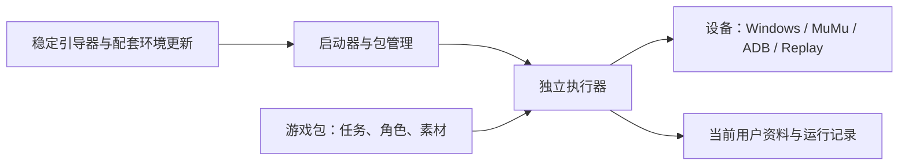

# GameFrame 框架、鸣潮迁移与研究交付

已采用独立 Python 核心、可安装游戏包和会话内执行器。现有鸣潮包复用魔改版生产任务和角色规则，保留 AGPL；核心按 MIT 分发。原神等第二游戏需要另写规则包，角色、地图、镜头和日常逻辑也属于游戏规则，换素材不足以获得完整适配。完整功能与验证边界见 [最终覆盖矩阵](2026-10-11-gameframe-final-coverage.md)。

截图、识别、规则和输入留在执行器内，启动器接收控制与状态。单次任务和后台辅助共用输入 owner；任务结束后恢复辅助，停止或暂停不删除保存的 enabled 意图。包管理、账号管理和配置进程有独立生命周期，代码替换等待 owner 自然结束。更新准备新环境，验证后保存 pending，下次正常启动再提交，用户资料不参与代码替换。

## 本机启动与安装资料

本机干净交付根为 `E:/AI work/GameFrame/Administrator`：Runtime 是独立 Python 基座，Managed 存版本化环境，LauncherData 是新的当前用户资料根。双击 [Start-GameFrame.cmd](<E:/AI work/GameFrame/Administrator/Start-GameFrame.cmd>) 打开启动器；首次正常启动提交已经离线准备的有效候选。该用户入口未在本轮执行，没有启动游戏或导入当前真实账号。完成安装记录见 `E:/AI work/okww-framework-backups/20261011-v1.97.76/delivery-installation.json`。原 AppData 位置实际被重定向至 Codex MSIX LocalCache，因此最终安装改在 E 盘，避免使用应用私有缓存作为长期安装根。

首次使用需选择游戏窗口/设备，再经管理页建立首账号或导入自己的配置包。不要将旧程序整目录覆盖到新包目录；旧账号资料有专门导入和预览流程。Windows 用户仍由人手动切换，其他用户应分别使用其用户资料根。账号序列不是 Windows SID，框架不会替换游戏本身仅显示十个账号的缓存限制。

开发、游戏包格式与完整配套安装命令见 [核心说明](../../gameframe/README.md)。发行物在 `E:/AI work/okww-framework-backups/20261011-v1.97.76/artifacts`，包括 core wheel、原生鸣潮 ZIP 和兼容 ZIP；`paired-release` 含完整 release.json 与 30 个依赖 wheel。core 和一个配套原生包的完整环境更新已经实施；多包发现/安装可用，其他游戏的配套自动更新须提供自己的依赖和发行契约。

## 后台和模拟器选择

| 需求 | 推荐路线 | 当前边界 |
| --- | --- | --- |
| PC 游戏不抢主桌面键鼠 | 当前身份的独立 Windows 交互会话，优先验证 Child Session；游戏和执行器处于同一子会话 | 已完成源码与公开资料研究，未实现系统会话创建器，未验证鸣潮兼容性。四组 Windows 用户仍手动串行交接。 |
| 同桌面窗口被遮挡 | WGC 捕获；显式 PostMessage 可作为游戏特定输入候选 | 后端已实现；WGC 能抓图不代表游戏接受后台输入，PostMessage 不保证目标游戏消费或支持相对视角。 |
| Android 动作游戏 | MuMu SDK 原始帧与持续多触点优先 | 接口已实施，未运行模拟器或测延迟；需用户已安装厂商组件，不捆绑未知重分发许可的 DLL。 |
| 雷电和通用 Android | 保留 ADB 后端；未来按实测再引入原生采集和 MaaTouch | 通用 ADB 已实施，雷电原生截图＋MaaTouch 仍属研究候选。鸣潮原生包不声明支持模拟器。 |

MuMu 的推荐依据是已核实的一体化截图与多触点接口，降低动作控制的整合成本；不是所有游戏更快的实测排名。低延迟优先减少帧积压、重复截图、全屏 OCR 与逐动作 ADB 进程；只处理所需 ROI、复用当前帧、输入持续连接。现有 WGC Python 路径仍有 CPU 整帧回读，未实现零拷贝 GPU ROI，不能报告不存在的性能数字。

研究报告保留固定源码、官方文档、GitHub 讨论与论坛来源：

- [ok 架构、自动战斗和后台方案](2026-10-10-okww-framework-and-background-feasibility.md)
- [多账号、四 Windows 用户、模拟器及低延迟](2026-10-10-multiaccount-emulator-lowlatency-feasibility.md)
- [补充来源与最终选型](2026-10-10-framework-followup-sources.md)
- [旧版功能和模块盘点](2026-10-10-framework-migration-inventory.md)

## 素材与公开发布

[逐项素材清单](2026-10-10-framework-asset-provenance.md) 和 [机器可读 SHA 清单](2026-10-10-framework-asset-provenance.json) 对照 295 项：67 项与原版相同、10 项原版修改、218 项自定义或来源未核实。其中运行 assets 为 37 项相同、10 项修改、118 项未核实；其余为离线测试资料。清单区分运行素材、模型、标注和离线测试截图。优先替换原版相同与派生素材，并继续核实未匹配文件，未匹配不能证明自有版权。

素材替换不能解除派生代码的 AGPL 义务。独立实现的核心和今后独立编写的游戏包，为闭源发布保留选择空间；现有鸣潮派生包仍需按实际许可分发。进程分离不能单独证明组合产品可闭源，商业 SDK、模型与依赖的授权应按实际发行版本核对。程序加密按用户要求暂缓。

## 复核、备份和使用边界

第一轮包括全部 Python 文件结构扫描、功能/API 盘点，以及执行器、战斗、账号、任务、角色和业务专项人工审查；迁移后进行了第二轮及每次消费者变更的独立复核。删除和修复针对有证据的根因，包括清理钩子终止共享执行、模型错误伪装空检测、输入 ownership 和更新竞态。没有为减少行数重写生产轮转或删除必要的账号事务。

当前记录支持真实离线安装、模块来源、工件索引与哈希、Replay 生产战斗轮转、显式停止及 enabled 保留，支持离屏 Qt 和合成账号的已列分支。29 项内置任务的生产规则与可见业务入口已迁移；不代表 29 项日常、挑战、登录与战斗均在真实游戏运行成功。具体证据及本轮更新问题见 [v76 验收](2026-10-11-gameframe-v76-acceptance.md)、[最终复核](2026-10-11-gameframe-v76-review.md) 和各模块报告。

备份根 `E:/AI work/okww-framework-backups/20261011-v1.97.76` 保存源码快照、逐文件 SHA、工作区补丁、完整 Git bundle、发行物与安装证据。原有无关文档修改和删除状态保留，不纳入本次版本。GitHub 发布记录写入该根 `release.json`；源码分支为 `codex/gamepack-framework-migration`，标签为 `v1.97.76`。

全程没有启动游戏或模拟器、访问 NAS、操作真实账号、发送通知或执行真实输入。真实游戏流程、后台会话隔离、登录与定时触发、硬件延迟及屏幕效果留待后续获准的实机验收。
