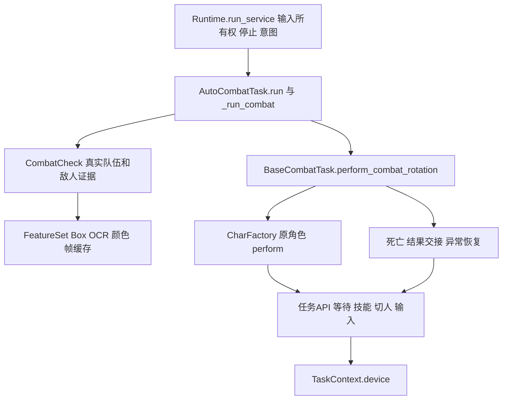

# 鸣潮原生战斗入口的最小实施边界

现有 `TaskContext` 还不足以直接执行生产 `AutoCombatTask`。可以保留角色算法，把旧任务 API 的实际实现接到新设备上；需要先完成帧/视觉、任务调度、配置与异常契约。现在增加 `native-combat` manifest 会把未实现的链路登记成可用功能，本轮没有创建该入口。

报告的边界分析只读源码和已安装框架 API，生成静态矩阵。随后按已确认的纯颜色边界实施迁移并做离线回归：生产类测试在导入前将 Config.config_folder 指向临时目录，类定义的校准写入也在临时目录中。没有读取真实账号配置、启动游戏/模拟器或发送真实输入。第二轮独立审查和兼容包/停止桥离线验证另见 `2026-10-11-gameframe-review-round2.md`。

## 153 种导入的归属已逐项登记

对 `main.py`、`config.py`、`src/**/*.py` 和 `custom_ok/**/*.py` 做 AST 枚举，纯颜色迁移前为 153 种 ok 导入符号。每种符号的具体文件和行号、归属，以及生产任务 API 签名写入 `2026-10-11-gameframe-api-matrix.json`。JSON 保留该迁移前快照，另记颜色迁移后的 148 种剩余符号。归属表示迁移时由谁负责该用途，不表示代码或许可已经迁移完成。

| 归属 | 符号数 | 真实模块范围与实施边界 |
|---|---:|---|
| core-replace | 48 | BaseTask/TriggerTask/BaseScene/FindFeature、Box/几何/颜色、Config/ConfigOption、Logger/Handler、任务异常及一般文件函数；可由通用运行时承担，须保留原方法参数、坐标和生命周期语义 |
| pack-retain | 9 | `OK`、`og`、`run_task`、以应用入口定位的路径与启动器配置名；这些是当前应用的装配/数据语义，兼容包暂留，原生包最终改显式依赖和包内路径 |
| UI | 66 | ok.gui 的页面、任务/配置控件、Communicate、编辑器、主题、翻译和模型下载交互；以及通知和 Icon；保留真实控件绑定，headless 核心不应为了获取任务 API 而加载这些 UI |
| platform | 30 | WinRT/D3D/WGC/BitBlt、旧 device/capture、窗口工具、模拟器发现、PostMessageInteraction、平台进程与文件夹操作；由具体 backend 或 launcher 实现 |

Config 是可替换基础设施，但热键、角色、月卡、协奏校准及自定义脚本的具体配置仍属鸣潮包。UI 色彩用到的 WinRT API 归 platform，调用它的页面归 UI。`og` 的 40 处导入包含 UI、device、YOLO 和业务；不能靠替换一个全局名字证明它们已解耦。

## 63 个方法名不是 63 个战斗底层接口

原盘点列出的 63 个名字覆盖全 src，混有与旧 `height/width` 属性同名的调用、业务重写、页面/导航、日志和等待。JSON 保留该 63 项原始清单。进一步限定迁移前战斗簇（src/char、src/combat、BaseWWTask、BaseCombatTask、AutoCombatTask、SoloCombatTask），收集 `self.*`、`task.*`、`*.task.*` 和 `super().*` 的调用，并与旧 `ok/task/task.py` 相交，得到 57 个候选名字。这仍含恢复/导航和父类调用，不是完整动态可达性证明，也不意味着需要实现 57 个独立函数。

真实链路如下，游戏算法所在部分可以保留：

`AutoCombatTask` 的 MRO 是 `AutoCombatTask → BaseCombatTask → CombatCheck → BaseWWTask → TriggerTask → BaseTask → OCR → FindFeature → ExecutorOperation`，须保留菱形继承中的 config/on_create 顺序。57 是角色源码文件数，包含 BaseChar、CharFactory、加载器和名字表，不等于 57 个独立角色轮转；Factory 也明确为部分角色使用通用 BaseChar。

## 可以最先实现的 headless 装配

最小候选是只运行一个生产 AutoCombatTask 的 pack-owned executor/interaction，保留旧 `ExecutorOperation`、FeatureSet/Box/OCR 作为包依赖，core 通过 `Runtime.run_service` 管理设备和意图。这个候选能避免启动完整 OK 应用，但仍依赖 ok-script/Qt 导入；应标明“原生 worker 内的生产战斗适配”，不能称为完全无旧框架。

它至少需要以下实质 API；这些来自已核对的生产调用与旧 API 实现：

| 面 | 最小必要行为 | 已有/缺口 |
|---|---|---|
| 当前帧 | executor.frame/nullable_frame、next_frame(time_out)、_frame、_last_frame_time、method.width/height、connected；一个时间点多次视觉读取共用帧 | TaskContext.frame 取新帧，必须加当前帧缓存，不能每次 getter 消耗一帧；resize 更新坐标，断流须抛真实 FrameUnavailable/CaptureException |
| 调度/停止 | current_task、check_enabled、sleep、wait_condition、reset_scene、exit_event、paused、sleep_check；所有等待与输入尊重停止 | 普通 Cancelled 继承 Exception，生产恢复循环会先当普通错误记录；adapter 要在进入生产方法前转 FinishedException/TaskDisabledException，包外再转 core Cancelled |
| 场景 | WWScene.reset/in_team/in_combat、cd_refreshed；新帧和输入后失效，保留每帧判定共享 | WWScene 可保留；不能用永久 True 的 scene 或不重置缓存替代 |
| 视觉 | COCO 标签读取、原 Box.scale/crop_frame/center/confidence、阈值/区域/灰度/Canny/mask/target_height/模板缩放、process_feature | core 当前 match_template 只有基础区域匹配，使用 SQDIFF_NORMED；生产默认 CCOEFF_NORMED、多标签/最高分及处理回调均未等价实现 |
| OCR | 区域/缩放结果映回原图、文本修正、gettext、regex、返回 Box、配置选择真实推理后端；不吞失败 | core 尚无 OCR。旧 OCR 需要 config['ocr']、ocr_lib、ocr_po_translation、text_fix，auto_simplify 还使用 locale |
| 输入 | send_key/down/up、button/down/up、click down_time、相对/绝对坐标、move、back、间隔抑制、原后端持键释放 | core 可提供原始 key/button/relative move/client click，1.97.64 已补 Windows 命名键如 space/lshift/tab/esc 并通过持键释放回归；点击时长和鼠标移动语义仍需 adapter/backend 实现 |
| 全局配置 | Game Hotkey、Character Config、Monthly Card Config；校准 con_full_size、任务 enabled、custom_chars 模式和源码 | BaseWWTask 构造立刻读取前三组；BaseCombatTask 类定义即建 Config 并可能写盘；必须在导入前明确包 data_dir，不能让 worker 的 argv 误决定配置根 |
| 装配与 identity | device_manager.hwnd_window/get_preferred_device/supported_ratio、hwnd_title、_combat_roster_context、_account_input_guard、app.tr；角色 cache 随设备/账号变更失效 | roster_context 直接访问 task.hwnd；core 目前只有 device，不含旧 window/manager，必须显式建立 pack 的 identity/geometry 契约 |
| 状态和证据 | info/log、screenshot/rotation tracking、错误记录，通知诊断失败不阻断执行 | 保留现有 production records；无 GUI 时截图需实际保存或事件消费者实际处理，不能用空 communicate 假装完成证据 |

保留旧 API 的候选还需要处理 `ok/task/task.py` 顶层 `QCoreApplication`、FluentIcon、Communicate(QObject) 和 Config 路径逻辑。单独 import 任务类并没有完整 OK 构造，但也不是只加载纯算法。主应用的账号预检/诊断/存储无需整套复制进纯后台战斗；只提取以上真实使用的服务，账号 guard 有调用时照常执行。

## 哪些不能为简化而丢掉

`combat_is_active` 与 `perform_combat_rotation` 对普通故障循环恢复，对 FinishedException/TaskDisabledException、CombatFlowInterrupt、死亡和配置完整性异常保留不同分支。适配不能把所有错误转 false，也不能为满足 run_service 自动成功而吞掉异常。

AutoCombatTask 在后台检测死亡后保留 CharDeadException 的实际含义并退出当前战斗，不调用前台任务的 `revive_action`。前台 `combat_once` 则区分原地复苏、塔点回血和结果交接；`revive_at_tower_and_heal` 真实使用 input_text 中文/英文首领名、map/guidebook、滚轮/移动、OCR 和页面等待。首阶段若只支持后台 AutoCombat，需要明示范围；以后共用到每日/挑战战斗时必须补全这些 API，不能说重用角色就已覆盖前台战斗。

`ensure_levitator` 中有直接 win32api Get/SetCursorPos 和 capture.get_abs_cords，但全仓当前只找到定义，注释也说明未使用。它是导入/platform 耦合和以后完整 API 的边界，不是当前后台轮转已观察到的输入路径；不能以此假定每次战斗都会绕过 device。

持久意图应由 core 的 RunStore 保存。后台任务 config['_enabled'] 不得形成第二个自动清除的权威；显式停止、global pause 和普通错误须按现有规则区别。一个 worker 保持一个输入 owner，不能同时创建独立 background executor 与前台任务去调用同一设备。日常/挑战需要同一个共享 battle loop，死亡/结果交接由正在运行的任务处理。

## 可执行的分阶段边界

1. **先完成视觉和数据装配**：在临时 data_dir 中创建 pack executor；加载生产 COCO、process_feature 和真实 OCR 依赖；对现有截图复用 in_team/has_target/health、角色头像和技能识别。逐项与旧结果比对，失败不得返回空结果掩盖。导入前设置配置根，验证开发仓库和共享 venv 均未写入。
2. **再完成输入与停止适配**：以 mock Device 运行真实 `AutoCombatTask.run/_run_combat` 和原 `BaseChar.perform`，覆盖普通战斗进入/离开、按住释放、named keys、角色切换、停止中断、抓图失效和连续错误。只能 mock 设备及外部推理边界，不能把 in_combat/current_char/rotation 全部改成固定成功后称链路已通过。
3. **满足上述条件才登记 native-combat service**：由 `core.run_service` 调该包，无 OK 应用创建；状态返回说明观测到的战斗结果。Replay fixture 与 mock 输入能证明算法接线和清理，真实游戏/UI/性能仍需另行授权实测。
4. **移除旧框架依赖时**：将 Box/FeatureSet、Task API、Config、logger、异常与 headless 状态事件迁入自有 runtime，生产游戏类引用这些实现。角色算法继续原样；UI 和 Windows backend 分开保留。不能用 sys.modules 塞一个假 ok 或仅复制方法名完成这一步。

这四步中的前两步已经有明确可实现内容，但当前代码尚未具备全部依赖，不适合在本轮把完整战斗适配压成薄代理。现有兼容包保留生产功能并已做离线构建/停止验证；原生核心自身的 probe 回放通过仍不能当作鸣潮 battle loop 验收。

## 本轮实际迁出了生产颜色边界

`src/vision/color.py` 已接管 color_range_to_bound、get_mask_in_color_range、mask_white、is_pure_black、calculate_color_percentage。它保留已有 NumPy/OpenCV 实现的 BGR 顺序、闭区间边界、mask/count、灰度/单通道白色遮罩、逐通道黑色判断、区域裁剪和非法 Box 返回 0 的契约，不增加新 fallback。Box 只需 x/y/width/height，不 import 旧 Box；模块没有 ok、GameFrame、Qt 或设备依赖。

BaseWWTask、BaseCombatTask、CombatCheck、FarmEchoTask 和 Camellya/Carlotta/Changli/Ciaccona/Lupa/Phoebe/Zani/Zhezhi 只改变导入。角色轮转与颜色常量没有变化。模块留在现有 AGPL 游戏包内，标注来自 ok-script 的生产契约；没有把派生实现置入 MIT 核心。旧程序仍可直接运行，不强制安装 gameframe。

离线验证：`TestPackColorVision` 四项通过，包含可预期的 BGR 边界/ROI/BGRA 语义、白色/黑色判定、禁用两个框架的隔离导入，以及 con_full/combat_has_cd/all_cd_1080p 三张现有截图与旧函数 AST reference 的逐像素及 crop 占比对照。Migration 六项通过，构建包含新模块。另以临时 Config 目录执行 production GameRuntimeErrors/BaseCombatTask/AutoCombatRecovery 共 52 项通过，保持死亡/交接/停止/持续恢复路径。

最终以 v1.97.63 为基线集成至 1.97.64：上述颜色/包 10 项再次通过，生产回归加入 CharacterIdentityRecovery 后共 76 项通过；既有 unknown 角色的 TrialGenericChar 恢复保留。manifest/包 README 同步为 1.97.64，source 中仍为 57 个角色相关文件、22 个一次任务和 7 个触发任务。JSON 的 verified_release 记录该最终基线、剩余导入引用及源码变化，153 项和 57 个候选方法的旧行号只属于此前静态快照。

这一步移除了五种 ok 导入符号，迁移后的实际集合为 148 种；来源、行号及 153 项迁移前快照保留在矩阵 JSON。它证明一条真实业务视觉边界已独立，并未完成 COCO FeatureSet、OCR、Task API、UI 或整个原生 battle loop。
