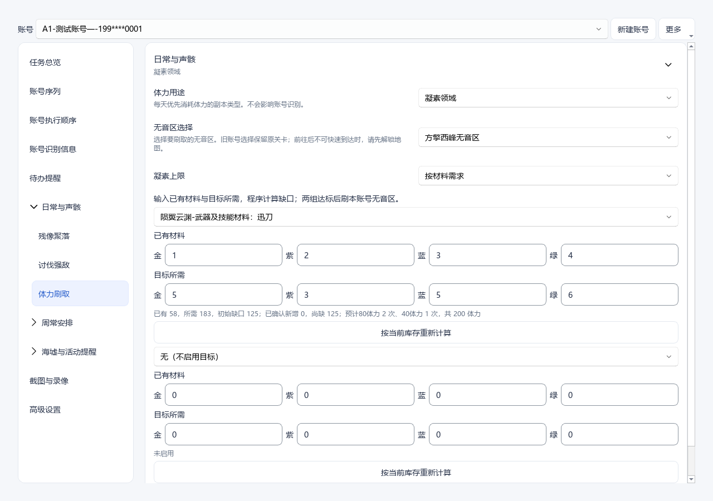
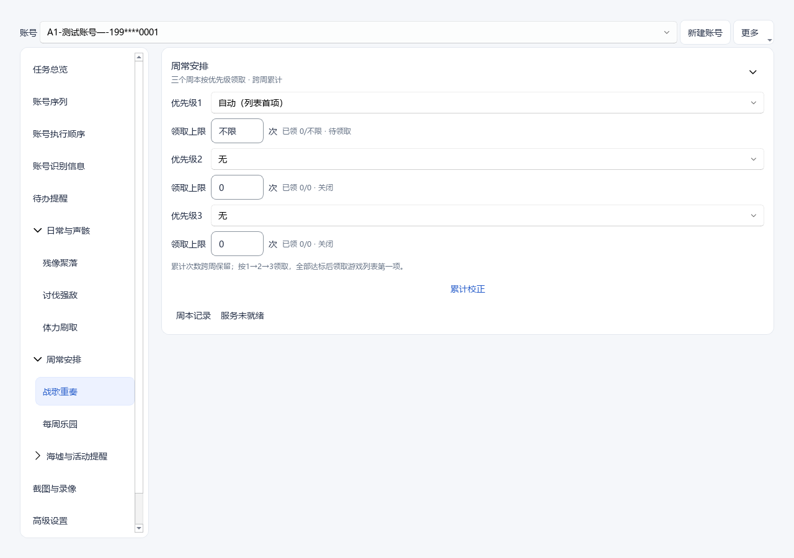
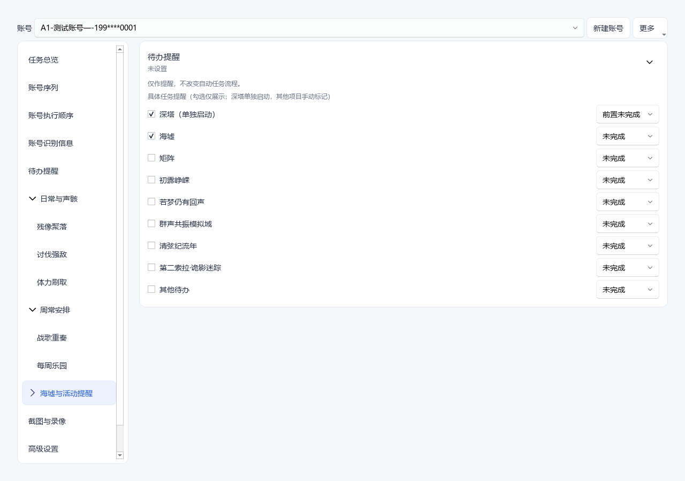
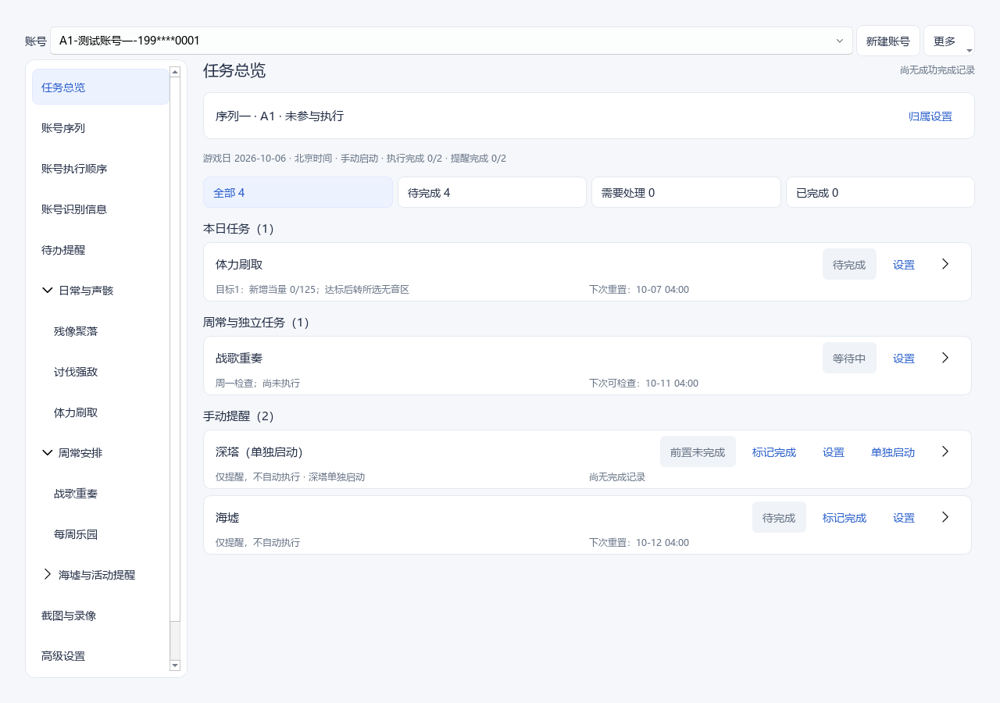

# 1.97.17 体力刷取与人工提醒实施验收

## 范围与结论

按已批准的[实施方案](../superpowers/plans/2026-10-06-stamina-farming-and-manual-reminders.md)完成本版改动。主工作区与本机打包版同步至 1.97.17，保留原书架风格、上方账号选择和左右两列结构。

- 凝素／无音区合并为体力刷取；模拟训练与不刷取继续保留。
- 凝素明确区分不限与按材料需求；有限目标依次完成后，转至该账号配置的无音区。
- 材料表单提供金、紫、蓝、绿的已有库存与目标所需输入，实时显示当量、缺口、确认新增、预计领取次数与体力。
- 活跃度和收尾入口与卡片隐藏，正常执行顺序继续保留；失败通过总览提示和日志报告。
- 声骸合成账号开关、全局保存值、导入、模板、调度和独立入口均停用。
- 战歌重奏使用统一 Fluent 控件，目标与领取上限分两行，累计校正按需展开。
- 深塔归入海墟与活动提醒，状态由用户手动选择完成、未完成或前置未完成；重置设置隐藏，到指定边界自动显示未完成。实际深塔执行与关卡账本独立保留。

## 材料计算与旧配置

`绿色当量 = 金×27 + 紫×9 + 蓝×3 + 绿`。

`尚缺 = max(0, 目标当量 - 库存当量 - 本基准下已确认新增当量)`。

例如已有 1 金、2 紫、3 蓝、4 绿，为 58 当量；目标 5 金、3 紫、5 蓝、6 绿，为 183 当量。缺口 125，估计 80 体力领取 2 次、40 体力领取 1 次，共 200 体力。实际当前仅有 40 时可降为一次 40；余量小于 50 时选择 40，跨日继续累计。

修改目标数量保留轮次和进度；重新输入库存后，需要点击“按当前库存重新计算”并保存账号，建立新基准，防止旧流水重复抵扣。旧目标继续保留原剩余需求语义，直到主动重新录入库存。同领域的新库存目标禁止重复分配，原有纯旧目标仍兼容。

## 验证与证据

16 组相关回归包含 223 个不同测试，均通过；界面 9 项测试分别在 100%、125%、150% 缩放运行通过，矩阵覆盖 1280×800、1440×900、1920×1080 的可用窗口空间。覆盖材料换算与降档、库存基准、流水保留、凝素到无音区衔接、每日执行顺序、提醒边界、深塔账本隔离、导入恢复、账号草稿和隐藏活跃度失败提示。

界面验收使用临时测试账号；以下图片不含真实账号数据：

| 材料设置 | 周本设置 |
| --- | --- |
|  |  |

| 人工提醒 | 合并后的总览 |
| --- | --- |
|  |  |

额外检查了打包版真实窗口中的账号总览和体力刷取设置。没有修改真实账号的任务选择或材料输入。

- `compileall -q src`、差异空白检查通过。
- 源码更新包基于 v1.97.16 临时检出应用，482 个发布文件逐项 SHA-256 校验通过。
- 更新包 SHA-256：`102b57048f040434976b470a310ae14bf11e2b6c8559ea35415c34dc3c9a1352`。
- `package_smoke` 检查 ZIP 通过；本次为源码更新包，没有生成 Windows 安装器。
- 本机程序正常关闭、备份配置后更新并重新启动，账号配置完整性通过。
- 只允许新增凝素模式、合成停用和缺失深塔手动状态初始化等批准迁移差异；账号 ID、特征码、槽位、序列成员、材料目标和消费／通关账本核验保留，自动战斗与角色偏好文件哈希一致。
- 配置备份位于 `E:/game/okww owener/backups/stamina-ui-1.97.17-20261006-115040` 和最终更新前的 `stamina-ui-1.97.17-20261006-115329`。

## 验证限制

没有启动真实游戏任务，战斗、OCR、当前服务器材料产出与实际奖励界面的完整运行仍需后续游戏验证。80／40 体力产出按用户确认的 50／25 绿色当量估计，流水只按核验成功的体力消费计入。没有新增或猜测深塔／活动的重置日期；沿用已保存规则，等待用户明确告知下一次时间。
