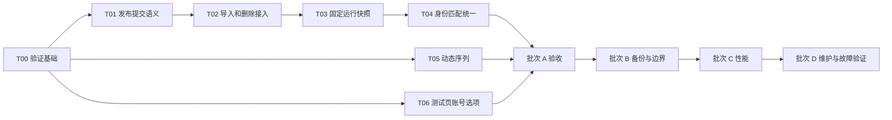

# OK-WW 全面审查整改实施计划（Implementation Plan）

> **执行者须知：** 按任务逐项实施、验证和复核，以 `- [ ]` 跟踪进度。本文是用户已授权执行的修改计划；执行时使用当前环境已有的工具，不依赖未安装的执行技能。

**Goal：** 修复审查确认的 11 项问题，使账号配置生效、执行顺序和恢复行为一致，再完成有测量依据的性能及维护改进。

**Architecture：** 保留 ok-script、现有任务类、schema-v1 总配置和 v3 配置包。把账号变更收敛到现有配置包事务与发布服务，以 active 指针切换作为配置提交点；整轮任务读取固定快照，运行状态继续使用现有主路径。性能修改以一次操作内复用数据、限制图像缓冲为主。

**Tech Stack：** Windows、Python 3.12、本地 `.venv`、ok-script 1.0.190、PySide6、unittest、PowerShell、JSON/文件系统。

**Spec：** [全面代码审查报告](../../reviews/2026-09-06全面代码审查.md)、[程序结构说明](../../程序结构说明.md)。基线为 `3fd591a5` / `1.31.15`，计划日期 2026-09-06。

**执行进展：** 批次 A（T00–T06）已发布为 `1.32.00`；批次 B（T07–T11）已实现并完成重点离线验证，版本 `1.32.01`，安装器实装验收仍归 T15；T12 操作内图复用已提前接入，规模测量待性能批次完成。具体实现调整、测试计数和验证边界见[整改执行记录](../../reviews/2026-09-06整改执行记录.md)。以下清单保留原始验收细目，完成结论以执行记录的实际证据为准。

## 1. 范围、设计选择和共同约束

本计划分成四个可独立验收的发布批次，另设贯穿各批次的故障验证。任务之间可以单独复核，但同一个发布批次的依赖任务必须全部通过，才形成可发布版本。

### 1.1 推荐方案

| 方案 | 影响 | 结论 |
| --- | --- | --- |
| 在现有服务中统一提交和运行读取 | 保留用户数据格式，集中修复 R01/R02/R03；测试可复用 | **采用** |
| 给导入、删除、任务分别增加补丁 | 改动起步较少，但会继续存在不同的回滚/生效规则 | 仅适用于独立小缺陷，不用于账号事务核心 |
| 全面重写为数据库或重新拆分全部任务 | 数据迁移、角色行为与打包验证范围明显扩大 | 本轮不安排 |

### 1.2 全局约束

- Python 命令优先使用 `.\.venv\Scripts\python.exe`；保持 Windows/Python 3.12 的已验证运行环境。
- 现有 `profile_id` 不变；保留 v1/v2 配置包读取、v3 导出及旧显示名投影的兼容性。
- `configs/published/active.json` 是存在发布图时的配置生效指针；`configs/accounts/` 是派生镜像。
- 主完成记录继续保存在 `configs/account_runtime_state.json`。本轮不强制迁移到 `运行状态/`，但删除、备份与恢复必须明确处理两个位置。
- 运行中的账号顺序、任务参数、起始/返回账号来自同一快照。普通配置编辑供下一轮使用；删除或身份重绑需阻止正在受影响的运行继续输入。
- `TestAccountSwitchTask` 必须复用生产选择、别名匹配、核对、重试、退登和登录方法；连续默认顺序保持 **A1、A3、A4**，按精确短名解析并覆盖备用名和掩码手机号。
- 先用合成账号、临时目录和可控假输入完成验证。真实登录、退登、战斗和消息发送不属于本次“写计划”的操作范围。
- 只为行为缺陷、事务边界和可观察性能约束补有意义的测试；不为纯删除无用导入编写镜像测试。
- 每次修改代码必须在同一发布中更新 `config.py`，版本为固定宽度 `X.YY.ZZ`，并同步产品展示和更新日志。通过验证后提交、创建匹配的注解标签并推送分支和标签；用户明确要求仅本地时遵从该要求。
- 发布号以实施时的实际本地/远端版本为准。下文版本是基于 `1.31.15` 的建议，不表示已经占用标签或完成发布。

### 1.3 两个必须提前确定的行为

**配置提交后的错误：** active 切换前失败，恢复本次改动的旧文件；active 已指向新版本后，镜像/清理失败应返回“配置已生效，维护待恢复”，保存可恢复记录，不向用户谎报“全部回滚”。必须保留可明确区分这两种情况的结果和测试。

**运行时发生编辑：** 修改副本选项、序列排序或新增账号不会改变当前轮次。若目标账号被删除、身份识别字段或备用名启用状态改变，GUI 阻止对正在执行账号的破坏性操作；其他入口绕过 GUI 时，生产输入前的身份检查终止该账号操作。已经创建的快照本身保持不变。

## 2. 批次、依赖和预计工作量

| 批次 | 任务 | 交付结果 | 建议版本 | 工作量估算 |
| --- | --- | --- | --- | --- |
| A：账号正确性 | T00–T06 | 提交/恢复一致，整轮固定配置，序列和测试页可用；覆盖 R01–R06 | `1.32.00`，中等变更 | 3–5 个开发日 |
| B：备份与功能边界 | T07–T11 | 外置备份可恢复、清理可结束、午夜合法、包检查完整、自定义角色更新可靠；覆盖 R07–R11 | `1.32.01`，兼容性修复 | 2–3 个开发日 |
| C：性能 | T12–T14 | 账号图单次加载、证据内存受控；按测量结果处理 GUI 写盘阻塞 | `1.33.00`，中等变更 | 1–3 个开发日 |
| D：维护与剩余验证 | T15–T16 | 依赖/版本说明/打包来源一致；把未确认风险归类为已修复、未复现或明确限制 | 有实际小修时 `1.33.01`；纯说明不升代码版本 | 1–3 个开发日 |

以上为熟悉项目的一名开发者的粗估，总计约 **7–14 个开发日**，不承诺自然日期；真实游戏观察和安装器环境准备可能增加等待时间。优先完成 A、B，C 中的 GUI 异步和 D 中的条件性修复不得拖住已通过验证的核心修复。



图中的独立分支表示依赖关系，不是本次自动委派多个 Agent 的安排。共享文件由同一实施者依次修改，避免账号服务与任务快照同时改动造成接口漂移。

## 3. 文件责任与新增接口

### 3.1 文件范围

| 范围 | 修改文件 | 责任 |
| --- | --- | --- |
| 事务 | `src/account_publish_service.py`、`src/account_config_bundle.py`、`src/account_repository.py` | 提交点、统一调用、删除、故障恢复 |
| 启动保护 | `src/runtime/account_runtime_bootstrap.py`、`src/config_integrity.py` | 先恢复未完事务再接受任务；损坏 active 不静默降级 |
| 快照与身份 | `src/sequence_repository.py`、`src/account_identity.py`、`src/runtime/sequence_snapshot_service.py`、`src/task/MultiAccountDailyTask.py`、`src/task/DailyTask.py` | 固定数据来源和输入前身份核对 |
| 界面 | `src/gui/AccountSettingsTab.py`、`src/gui/AccountConfigTab.py`、`src/gui/SequenceManagementTab.py`、`src/task/TestAccountSwitchTask.py`、`custom_ok/ok/gui/MainWindow.py`、`custom_ok/ok/gui/settings/SettingTab.py` | 编辑结果通知、运行保护、选项、备份位置 |
| 备份 | `src/config_backup.py`、`src/secure_backup.py`、`src/storage.py` | 两个目录边界、同卷恢复、清理进展 |
| 角色与证据 | `src/gui/CharacterCodeTab.py`、`src/char/CharFactory.py`、`src/account_switch_evidence.py` | 稳定角色匹配、图片复制和内存上限 |
| 测试/发布 | `run_tests.ps1`、`scripts/run_test_file.py`、`scripts/package_smoke.py`、`scripts/validate_release.py`、`.github/workflows/build.yml` | 超时、实际产物检查、版本检查 |
| 维护 | `setup.py`、`requirements*.txt`、`pyappify.yml`、`打包更新.py`、`custom_ok/ok/gui/about/AboutTab.py`、`更新日志.md`、相关 README | 环境与说明统一 |

优先扩展现有测试文件和 `tests/fixture_support.py`。T00 可新增 `tests/TestTestRunner.py`，T10 可新增 `tests/TestPackageSmoke.py`；它们需同步注册进 `run_tests.ps1`。本计划不要求新增生产“事务框架”或新的依赖包。

### 3.2 计划中的接口契约

下列为拟增加/扩展的接口，不代表基线代码已经具有这些参数。

| 接口 | 契约 |
| --- | --- |
| `PublishedRevision.maintenance_errors: tuple[str, ...] = ()` | active 提交后维护失败的可见结果；保持原三个构造参数兼容 |
| `AccountPublishService.prepare(*, profiles, index, sequences) -> PublishedRevision` | 写入、校验完整 bundle，不改变 active，不剪裁回滚所需版本 |
| `AccountPublishService.activate(prepared, *, expected_revision: str) -> PublishedRevision` | 在同一变更锁内比较 active 版本并切换；镜像错误写入结果，恢复责任另有持久记录 |
| `AccountPublishService.publish(...) -> PublishedRevision` | 保留现有入口，用 prepare/activate 实现，并统一后续维护 |
| `BundlePreflight.base_active_revision: str`、`base_master_fingerprint: str` | 预览时的生效版本和旧总配置指纹，防止用户审阅后又覆盖其他修改 |
| `BundlePreflight.published_revision: str`、`maintenance_errors: list[str]` | 导入结果包含实际生效版本与待修复项 |
| `AccountConfigBundleService.import_bundle(..., expected_active_revision: str | None = None, expected_master_fingerprint: str | None = None, preserve_runtime_and_preferences: bool = False)` | 保留已有确认/外部信任参数；仓库编辑传 True，在锁内保留最新动态状态和任务偏好，外部整包导入保留原替换语义；不同种类的版本不能混比 |
| `DailyTask.bind_verified_profile(profile_name, expected_profile_id=None, *, snapshot_profile=None)` | snapshot_profile 使用 `SequenceRunSnapshot.profiles` 中的 `profile_id/account/tasks` 结构；提供快照时不重新绑定实时参数 |
| `storage.resolve_config_backup_dir(root, *, warehouse_root='', legacy_backup_dir='') -> Path` | 纯路径解析：数据仓库优先，其次旧备份设置，最后 `root/configs_backup`；调用方负责读取设置 |

实现时保持公开旧接口可用。仅用于事务内部的锁、日志和校验方法留在现有模块中；不要为每一步再增加一个只有单个调用者的服务类。

## 4. 批次 A：账号正确性

### T00：建立可重复的修复验证入口

**文件：** `tests/fixture_support.py`、`scripts/run_test_file.py`、`run_tests.ps1`；新增 `tests/TestTestRunner.py`。

**消费：** 审查证据和现有 `synthetic_identity()`。**产出：** 可复用的真实 schema-v1 合成账号环境，以及有超时、明确退出状态的单文件测试入口。

- [ ] 保留基线 `3fd591a5`、现有 678 通过/8 跳过及一次退出挂起记录。执行 `git status --short`，把当前用户和文档改动与代码实施范围区分。
- [ ] 在 `fixture_support.py` 添加下面的 fixture，供真实发布链测试使用；不把 `test_out/code_review` 变成测试依赖。

```python
def make_account_environment(root):
    import copy
    import json
    from src.account_repository import AccountRepository
    from src.config_integrity import ConfigIntegrityService, fingerprint, normalize_master

    service = ConfigIntegrityService(root)
    service.paths.config_dir.mkdir(parents=True, exist_ok=True)
    tasks = {
        'Which to Farm': 'Tacet Suppression',
        'Which Tacet Suppression to Farm': 1,
        'Which Forgery Challenge to Farm': 1,
        'Material Selection': 'Shell Credit',
        'Farm Nightmare Nest for Daily Echo': False,
        'Nightmare Which to Farm': [], 'Tacet Discord Nests to Farm': [],
        'Auto Farm all Nightmare Nest': False,
        'Weekly Garden Check Day': '无', 'Merge Echo on Sunday': False,
        '备用识别名称': '无', '备用识别名称内容': '',
    }
    identities = {name: synthetic_identity(name) for name in ('A1', 'A3', 'A4')}
    ids = {name: identity['profile_id'] for name, identity in identities.items()}
    profiles = {
        ids[name]: {
            **identity, 'display_name': name, 'account_aliases': [name],
            'task_config': copy.deepcopy(tasks), 'schedule': {}, 'extensions': {},
        }
        for name, identity in identities.items()
    }
    master = {
        'schema_version': 1, 'config_id': 'review-fixture',
        'timezone': 'Asia/Shanghai', 'profiles': profiles,
        'sequences': {'序列1': [ids['A1'], ids['A3'], ids['A4']]}, 'extensions': {},
    }
    documents = {
        service.paths.master: master,
        service.paths.working: service._rebuild_working(master, {}),
        service.paths.runtime: {
            'accepted_master_fingerprint': fingerprint(normalize_master(master)),
            'completed_at': {}, 'progress': {},
        },
    }
    for path, value in documents.items():
        path.write_text(json.dumps(value, ensure_ascii=False), encoding='utf-8')
    repo = AccountRepository(root, integrity_service=service)
    repo._publish_master(master)
    return service, repo, ids
```

- [ ] 给官方单文件入口增加 `--timeout`，默认总入口传入 180 秒；保留不指定时的原用法。监督进程使用参数列表、`shell=False` 和隐藏窗口方式启动受控子进程；超时仅结束它创建的进程树，不能按全部 python.exe 名称结束进程。
- [ ] 为正常退出、断言失败、打印 OK 后仍不退出、子进程残留分别建立最小假测试。超时必须返回非零退出码，不能算作通过或自动静默复跑成功。
- [ ] 总入口保存每文件 elapsed/status/exit_code；发生失败时保留日志并停止发布链。缺少样本的 skip 独立统计，不补造图片。

**验证命令（增加参数后）：**

```powershell
.\.venv\Scripts\python.exe .\scripts\run_test_file.py .\tests\TestTestRunner.py --timeout 180
```

**验收：** 能重现并有界结束“输出 OK 后不退出”；测试进程之外的应用不受影响。新增 fixture 的初始 active、旧 master 与仓库读取一致。

### T01：明确发布提交点和提交后维护语义

**文件：** `src/account_publish_service.py`、`src/account_graph_store.py`；测试 `tests/TestAccountPublishService.py`、`tests/TestAccountGraphStore.py`。

**消费：** 现有 bundle/manifest/active 布局。**产出：** 第 3.2 节 prepare、activate、maintenance_errors 契约。

- [ ] 先修改现有“镜像失败”用例的期望：新版本已生效，返回维护错误，旧有效 bundle 仍存在；不再期待普通失败异常把已提交结果隐去。
- [ ] 从现有 `publish()` 提取 prepare/activate，沿用文件哈希、同版本复用、active 原子替换和现有异常类型。
- [ ] 变更锁的范围覆盖版本检查到提交完成；同进程统一锁顺序为“发布/变更锁 → 完整性服务锁”。避免某些调用以反顺序加锁。
- [ ] prepare 失败或 active 替换失败保留旧版本；active 替换成功后的镜像、旧版本剪裁失败写入 `maintenance_errors`，并保留可恢复标记。
- [ ] 在 `tests/TestAccountPublishService.py` 现有 fixture 中加入以下行为断言，并保留其余损坏/复用测试。

```python
def test_mirror_failure_reports_committed_revision(self):
    service = AccountPublishService(self.root)
    old = service.publish(expected_revision='', profiles=self.profiles,
                          index=self.index, sequences=self.sequences)
    changed = {self.a1: {'profile_id': self.a1, 'display_name': 'changed'}}
    with patch.object(service, '_mirror_projections', side_effect=OSError('locked')):
        result = service.publish(expected_revision=old.revision, profiles=changed,
                                 index=self.index, sequences=self.sequences)
    self.assertEqual(service.load_active().revision, result.revision)
    self.assertNotEqual(old.revision, result.revision)
    self.assertTrue(result.maintenance_errors)
    self.assertTrue(old.bundle_dir.exists())
```

**运行：** `.\.venv\Scripts\python.exe .\scripts\run_test_file.py .\tests\TestAccountPublishService.py`，以及同入口的 `TestAccountGraphStore.py`。

**验收：** 准备、激活、维护三个阶段的失败含义可以从返回值/异常明确区分；旧公共入口继续工作，维护失败不破坏 active 可读性。

### T02：导入、编辑和删除使用同一提交路径（R01、R02）

**文件：** `src/account_config_bundle.py`、`src/account_repository.py`、`src/runtime/account_runtime_bootstrap.py`、`src/config_integrity.py`；相关维护 UI；测试 `TestAccountConfigBundle.py`、`TestAccountDeletion.py`、`TestAccountRuntimeBootstrap.py`、`TestAccountRuntimeIntegration.py`。

**消费：** T01 的发布阶段。**产出：** 每个成功账号变更都带实际发布版本；删除、导入、编辑具有同一故障语义。

- [ ] 把 `_publish_master()` 中“import 后再发布”的后半段移入配置包统一提交路径。仓库继续调用这一入口，GUI 直接导入也经过相同路径；禁止形成“仓库调导入、导入又调仓库提交”的递归。
- [ ] 预览保存 `base_active_revision` 与 `base_master_fingerprint`，最终提交在锁内重新核对。仓库的 `_revision(raw)`、master 指纹和 active 内容摘要不是同一个值，各自只与同类值比较。
- [ ] 在写旧 master/runtime/preferences 前准备完整 bundle；使用现有事务快照保存所有将修改文件的旧内容和原本不存在的状态，纳入 `运行状态/账号/` 的相关删除项。
- [ ] 仓库编辑传 `preserve_runtime_and_preferences=True`，在锁内读取最新完成记录与偏好，仅清理已删除账号的引用；不能拿较早 export 的 runtime 覆盖刚完成的日常。外部整包导入/整体恢复在同一应用有任务运行时拒绝开始，普通任务参数编辑仍允许。运行状态的读改写与事务提交使用同一根目录写入保护，补测“编辑同时记完成”不丢记录。
- [ ] 删除的候选图先移除账号和全部序列引用；主运行状态和另一套逐账号状态的清理在 active 切换前完成并可回滚。移除 `delete_profile_cascade()` 现有提交后的独立 unlink/局部 rollback 分支，保留身份确认、至少一个账号和加密备份。
- [ ] 在既有事务快照旁记录 candidate revision、previous revision、写入清单和阶段。启动在完整性检查前恢复：active 仍旧则还原旧文件；active 已新则完成镜像/清理；active 不匹配任何一方或快照损坏则阻止任务并保留材料，不猜测。
- [ ] 不能只根据最后写入的阶段字符串判断是否提交，因为进程可能在切换 active 后、写阶段前退出；新旧 revision 不同时，恢复必须比较实际 active。若新旧配置 revision 相同，使用独立 transaction ID 和持久 COMMITTED 标记作为这次偏好/运行状态更新的提交点；标记前中断一律还原旧动态文件，标记后完成维护，不能仅凭相同 active 推断成功。
- [ ] 镜像按已提交图同步索引、序列和账号文件，并删除镜像中已经不存在的账号 UUID 文件；发生错误保留维护标记。只清理该镜像目录中属于旧发布清单的文件，保留未识别的文件供诊断。
- [ ] 发布后维护错误展示“配置已生效，维护待恢复”；提交前异常展示失败和恢复结果。正常读取发现损坏 active 时拒绝继续，不静默读旧 master 或缓存掩盖故障。
- [ ] 将以下用例加入 `TestAccountConfigBundle`，复现旧实现“import 成功但 active 没变”的缺陷；代码使用该类现有 fixture。

```python
def test_import_updates_existing_active_and_fresh_reader(self):
    from src.account_repository import AccountRepository
    repo = AccountRepository(self.root, integrity_service=self.service)
    repo._publish_master(self.master)
    bundles = AccountConfigBundleService(self.root, integrity_service=self.service)
    candidate = bundles.export_bundle()
    candidate['master_config']['profiles'][PROFILE_A]['task_config'][
        'Which Tacet Suppression to Farm'] = 2
    result = bundles.import_bundle(candidate, confirm=True, trust_external=True)
    self.assertTrue(result.ok)
    for reader in (repo, AccountRepository(self.root, integrity_service=self.service)):
        self.assertEqual(reader.load_profile(PROFILE_A).tasks[
            'Which Tacet Suppression to Farm'], 2)
```

- [ ] 删除测试改用 T00 的真实 schema-v1 环境，分别在 bundle 准备、旧文件替换、状态清理、active 写入、镜像同步处注入异常。提交前失败断言所有旧文件/active 恢复；提交后失败断言新图仍生效、错误可见、重启后镜像修复。不得继续以替换 `_publish_master` 为单文件写入的测试充当完整事务证明。
- [ ] 增加子进程强制退出的恢复测试：prepared、legacy 写完、active 切换前、active 切换后。至少两个进程并发提交同一预览版本的测试也归入此任务；若能同时通过，使用 Windows 标准文件锁覆盖整个变更区间，并与进程内可重入锁共同使用。

**验证集合：** `TestAccountPublishService`、`TestAccountConfigBundle`、`TestAccountDeletion`、`TestConfigIntegrity`、`TestAccountRuntimeBootstrap`、`TestAccountRuntimeIntegration`、`TestAccountManagementTabs`。

**验收：** 导入后同进程/新仓库/重启读取一致；删除失败不再出现“旧文件有账号、active 没账号”；所有恢复都保留完整性检查与已有确认/信任规则。

### T03：让快照真正驱动整轮执行（R03）

**文件：** `src/task/MultiAccountDailyTask.py`、`src/task/DailyTask.py`、`src/sequence_repository.py`、`src/runtime/sequence_snapshot_service.py`；测试 `TestMultiAccountDailyTask.py`、`TestDailyTaskStatus.py`、`TestAccountRuntimeIntegration.py`、`TestSequenceRepository.py`。

**消费：** T02 的已发布图与现有 SequenceRunSnapshot。**产出：** 固定账号顺序、身份、参数、起点和回登目标的运行链；兼容旧的 Daily 独立启动。

- [ ] 开始新一轮时清除上一次的运行绑定，创建一次快照，并将起始 UUID、返回 UUID、轮转后的有序 UUID 元组保存在本轮上下文。
- [ ] `_next_target_account()` 使用本轮顺序和按 UUID 的完成/失败记录，不调用实时序列选择，也不重新读取 `CURRENT_ACCOUNT` 改变起点。
- [ ] `_load_profiles()`、账号核对和 `_require_daily_profile()` 的运行分支使用快照；界面展示在非运行分支继续读取最新仓库。对所有引用 `_active_run_snapshot` 的路径逐一确认生命周期。
- [ ] 扩展 `bind_verified_profile(..., snapshot_profile=...)`：检查稳定 ID，复制 account/tasks；`_profile_get()` 与 `_readonly_profile_config()` 在运行期从该副本取值。`ensure_daily_profiles()` 不得随后把副本替换为实时配置。
- [ ] 快照绑定只更新运行信息，不把旧快照的参数或旧显示名重新覆盖回用户已保存配置。Daily 独立运行也在入口创建本次配置副本，在 finally 释放绑定。
- [ ] 输入前保留独立的账号存在性/身份核验：删除或身份重绑则中断；普通任务参数变化不终止已合法开始的一轮。运行保护检查最新身份，执行参数仍使用快照，这两类读取必须明确区分。
- [ ] 将下面用例加入 `TestMultiAccountDailyTask`，使用假输入但执行真实 `_next_target_account()`。

```python
def test_next_target_uses_frozen_rotation(self):
    from types import SimpleNamespace
    from tests.fixture_support import synthetic_identity
    profile_id = synthetic_identity('A1')['profile_id']
    task = object.__new__(MultiAccountDailyTask)
    task.config = {CURRENT_ACCOUNT: ''}
    task._active_run_snapshot = SimpleNamespace(
        profile_ids=(profile_id,),
        profiles=({'profile_id': profile_id,
                   'account': {'display_name': 'A1'}, 'tasks': {}},),
    )
    task._run_profile_order = (profile_id,)
    task._run_start_profile_id = profile_id
    task._run_return_profile_id = profile_id
    task.get_sequence_accounts = lambda: ['A3']
    task._is_done = lambda _account: False
    task._is_failed = lambda _account: False
    self.assertEqual(task._next_target_account(), 'A1')
```

- [ ] 用真实仓库补充：运行后将 A1 参数 1 改为 2，并把序列改为 A3；本轮仍执行 A1/参数 1，下一轮使用 A3/新配置。再覆盖当前账号改名、删除、别名停用、异常退出、停止后重启，不允许遗留上轮快照。旧按显示名保存的进度只在读取兼容时解析到 UUID，保持同日跨序列跳过已完成账号的行为。
- [ ] 与 `TestAccountSwitchTask` 的生产转发测试一起运行，确认专项测试没有另一份快照或切换算法。

**验收：** 不只验证“快照不能改”，还验证实际选人、Daily 取参、返回账号都保持固定；身份失效后的下一次输入被阻止。

### T04：统一身份候选与停用规则（R05）

**文件：** `src/account_identity.py`、`src/runtime/account_selection_service.py`、`src/runtime/account_verification_service.py`、`src/task/MultiAccountDailyTask.py`；测试 `TestAccountIdentity.py`、`TestMultiAccountDailyTask.py`、`TestAccountSwitch.py`。

- [ ] 让 `_profile_identities()` 使用共享 `extract_account_identity`/身份候选入口；将扁平旧投影中的备用名设置转为共享入口使用的 `task_config`，避免两个输入结构产生不同停用结果。
- [ ] 移除生产兜底中直接加入停用备用名的逻辑。现有 OCR 大小写、全角、`.con/.com` 等兼容规则只在统一候选比较处使用，并保持多匹配拒绝；不扩大模糊匹配到任意相似文本。
- [ ] 使用 `synthetic_identity('A1')` 创建有备用名但停用的配置，既测试共享匹配，也测试真实生产入口。测试核心断言为：

```python
identity = synthetic_identity('A1')
profile = {**identity, 'display_name': 'A1',
           'task_config': {'备用识别名称': '无',
                           '备用识别名称内容': identity['alternate_login_name']}}
task = object.__new__(MultiAccountDailyTask)
task._load_profiles = lambda: {'A1': profile}
task.get_profile_names = lambda: ['A1']
self.assertIsNone(task.match_profile_from_login(identity['alternate_login_name']))
self.assertEqual(task.match_profile_from_login(identity['masked_phone']), 'A1')
```

- [ ] 另测重新启用、旧扁平配置、A1/A10 精确区分、两个账号冲突、全角 OCR、A1/A3/A4 默认连续解析和临登录前校验。

**验收：** 停用项在所有生产匹配阶段均不参与；保留手机号等其他合法识别途径，含歧义的候选不会自动选第一个。

### T05：去掉运行界面的十个固定序列槽位（R04）

**文件：** `src/task/MultiAccountDailyTask.py`、`src/gui/SequenceManagementTab.py`、`src/gui/LabelAndAccountSequence.py`；测试 `TestMultiAccountDailyTask.py`、`TestAccountRuntimeIntegration.py`、`TestAccountManagementTabs.py`。

**设计：** 任意有效序列由 SequenceRepository 管理；任务页保留“当前序列”选择和一个当前成员只读展示。旧 `序列 N 账号` 键仅用于迁移，不再决定序列数量。

- [ ] 用 11 个已存在序列运行真实任务构造函数，保留该失败用例，再修改下列配置结构。

```python
CURRENT_SEQUENCE_MEMBERS = '当前序列账号'
self.config_type[CURRENT_SEQUENCE] = {
    'type': 'drop_down', 'options': seq_names,
    'sub_configs': {name: [CURRENT_SEQUENCE_MEMBERS] for name in seq_names},
}
self.config_type[CURRENT_SEQUENCE_MEMBERS] = {
    'type': 'label', 'options': self.get_profile_names(),
    'last_completed_provider': self.get_profile_last_completed,
}
```

- [ ] 同步构造、`get_readonly_config_value()`、`refresh_account_options()`、配置更改回调和旧管理对话框，不只修复首个越界点。旧槽位读取使用实际键匹配，不按固定数组截断新序列。
- [ ] 空序列列表可以正常打开界面，启动时提示没有可执行账号；删除当前序列后更新选中项；重命名和排序不串到另一个序列的成员。
- [ ] 验证 0、1、10、11、50 个序列；第 11 个序列可选择、展示、保存、导入导出和创建运行快照；旧十槽配置仍能迁移。

**验收：** 合法序列数量不导致构造/刷新失败，旧数据不丢失，序列源仍只有仓库一处。

### T06：修复账号切换测试的账号下拉框（R06）

**文件：** `src/task/TestAccountSwitchTask.py`；测试 `tests/TestAccountSwitch.py`、`tests/TestAccountRuntimeIntegration.py`。

- [ ] `_get_profile_names()` 优先复用 `get_default_repository()` 的投影，完整性服务读取只用于明确的旧格式兼容；补齐使用到的导入。
- [ ] 无账号返回空选项；读取失败记录可见错误并由运行预检拒绝开始，不以 `except Exception: pass` 把依赖错误伪装成“用户没有账号”。
- [ ] 在现有 unittest 中加入下面用例；它在基线会返回空列表。

```python
from types import SimpleNamespace
repository = SimpleNamespace(get_detached_projection=lambda: {
    'profiles': {'A1': {}, 'A3': {}, 'A4': {}}, 'sequences': {}})
task = object.__new__(TestAccountSwitchTask)
with patch('src.task.TestAccountSwitchTask.get_default_repository',
           return_value=repository, create=True):
    self.assertEqual(task._get_profile_names(), ['A1', 'A3', 'A4'])
```

- [ ] 覆盖账号编辑后刷新、运行中延迟刷新、空仓库、损坏 active；确认单目标模式和连续模式均仍复用生产切换方法。

**批次 A 总体验收：** 运行 unit/integration/ui 与必要 fault_injection 组；最后总入口全量一次正常退出。新增缺陷用例不得跳过，已有缺图跳过保留明细。合成完整流程验证 A1→A3→A4、运行期编辑、返回起始账号及中断恢复。

## 5. 批次 B：备份与功能边界

### T07：统一备份位置并支持外置目录恢复（R07）

**文件：** `src/storage.py`、`src/config_backup.py`、`src/secure_backup.py`、`src/task/DailyTask.py`、`custom_ok/ok/gui/MainWindow.py`、`custom_ok/ok/gui/settings/SettingTab.py`；测试 `TestConfigBackup.py`、`TestSecureBackup.py`、`TestUsabilityUI.py`。

- [x] 实现第 3.2 节的纯路径解析函数；启动备份、查看备份、手工备份、Daily 恢复全部通过它得到相同路径。
- [x] 恢复分别检查 source 位于选定 backup_dir、target 是 service.config_dir；继续拒绝源/目标互相包含、路径穿越、符号链接和适用的 Windows junction。不能再要求两个合法目录拥有同一个业务根目录。
- [x] staging 创建在目标配置目录的父目录，跨卷只做文件复制，最后的两次目录替换均在目标卷；暂存文件沿用备份权限保护。

```python
staging = Path(tempfile.mkdtemp(
    prefix='.restore-', dir=str(self.config_dir.parent)))
```

- [x] 保留源文件清单验证、复制后再次验证、restore journal、中断恢复与回滚副本。目录替换成功后用 T02 的恢复入口重新加载账号服务，校验 active 与旧投影一致。
- [x] 在 `TestConfigBackup` 加入可独立运行的外置目录用例：

```python
def test_restore_from_separate_warehouse(self):
    with tempfile.TemporaryDirectory() as temp:
        root = Path(temp)
        config = root / 'application' / 'configs'
        config.mkdir(parents=True)
        path = config / 'value.json'
        path.write_text('{"value": 1}', encoding='utf-8')
        service = ConfigBackupService(config, root / 'warehouse' / 'backups')
        snapshot = service.create_transaction_snapshot()
        path.write_text('{"value": 2}', encoding='utf-8')
        service.restore(snapshot.path, confirmed=True)
        self.assertEqual(path.read_text(encoding='utf-8'), '{"value": 1}')
```

- [x] 用受控文件替换检查断言 staging 与 target 同卷；在可用的两个测试卷上追加实盘往返。中途源文件变化、复制失败、目标被占用、替换后校验失败均保持原配置可恢复。

**验收：** 默认目录、独立目录、自定义仓库和跨卷四条路径均能完成往返；不削弱原恢复路径安全检查。没有第二测试卷时明确记录未实测，不能用 mock 结果代替实盘结论。

### T08：备份删除失败时清理有界结束（R08）

**文件：** `src/config_backup.py`；测试 `tests/TestConfigBackup.py`。

- [x] 容量循环使用可见的删除错误；本轮选中的目录删除失败或删除后仍存在，记录原因并退出清理。数量清理也记录失败，不无限重试。

```python
candidate = candidates[0]
try:
    shutil.rmtree(candidate)
except OSError as error:
    logger.warning(f'backup cleanup stopped: {error}')
    break
if candidate.exists():
    logger.warning('backup cleanup stopped: directory still exists')
    break
```

- [x] 测试删除成功、PermissionError、删除函数正常返回但目录未消失、容量仍超限、没有候选目录；logger 使用项目已有日志方式，不引入清理线程或重试框架。
- [x] 用 no-op rmtree 复现无进展，但测试不能真的无限等待；在第二次重复调用时主动抛异常，修复后断言只尝试一次即可返回。

**验收：** 无进展清理快速返回，日志能解释残留原因，下一次正常定时清理仍可重试；不误删有效配置目录。

### T09：统一月卡小时范围并兼容旧值 24（R09）

**文件：** `config.py`、`src/task/BaseWWTask.py`、相关 `.po/.mo`；测试 `tests/TestConfig.py`。

- [x] UI 和帮助文字改为本机时间 0–23，0 表示午夜。为已有配置的 24 提供显式兼容归一化，沿用现有“当天检查时点已过则安排下一天”的规则。
- [x] 添加小型纯函数并由 `set_check_monthly_card()` 使用：

```python
def normalize_monthly_hour(value):
    if type(value) is not int:
        raise ValueError('Monthly Card Time 必须是整数 0–23')
    if value == 24:
        return 0
    if not 0 <= value <= 23:
        raise ValueError('Monthly Card Time 必须在 0–23 范围内')
    return value
```

- [x] 验证 0、23、旧 24、-1、25、布尔值、非数字；时间冻结在检查点前后验证日期推进，不只断言函数不抛错。
- [x] 更新翻译目录并编译 .mo；非法外部配置得到明确可定位的配置错误。

**验收：** 旧的 24 配置可运行，午夜含义明确，设置说明与实际执行一致。

### T10：修复分发包中的嵌套配置检查（R10）

**文件：** `scripts/package_smoke.py`、`.github/workflows/build.yml`、`run_tests.ps1`；新增 `tests/TestPackageSmoke.py`，并更新 `tests/TestReleaseReadiness.py`。

- [x] 对每个 ZIP 条目先统一分隔符和大小写，按完整路径片段识别受保护目录。任意层级的 configs 都检查，不只看第一段；拒绝穿越和绝对路径条目。
- [x] 保留的 `configs/notification.json` 特例必须对应清理过的构建模板并验证内容；不自动放行嵌套副本。将已知账号运行状态、备份、事故、截图/录像输出目录加入运行数据规则。
- [x] 对照实际安装包目录清单校验规则，避免把合法的打包依赖静态数据当运行配置。若需要例外，精确限定路径和内容，并加入正反用例；不能使用“整个 site-packages 都放行”规则。
- [x] 用标准库构造最小 ZIP，加入以下完整复现测试。

```python
def test_nested_account_configuration_is_rejected(self):
    import tempfile
    import zipfile
    from pathlib import Path
    from scripts.package_smoke import inspect_distribution
    with tempfile.TemporaryDirectory() as temp:
        dist = Path(temp)
        with zipfile.ZipFile(dist / 'candidate.zip', 'w') as archive:
            archive.writestr('app/configs/account_master_config.json', '{}')
        with self.assertRaises(ValueError):
            inspect_distribution(dist)
```

- [x] 参数化根级、二层、深层、大写、反斜杠、合法源码/素材以及空目录场景；将新文件加入官方组。
- [ ] 将现有检查名称明确为产物内容检查。EXE/MSI 增加解包清单检查或隔离安装验证；两者没有完成前不声称“已验证安装和启动”。实际候选安装包验证纳入 T15。

**验收：** 合成的嵌套账号文件一定被拒绝，正常候选产物能通过明确规则；检查失败阻断 Release。

### T11：用稳定角色注册信息替换自定义实例（R11）

**文件：** `src/gui/CharacterCodeTab.py`、必要时 `src/char/CharFactory.py`；测试 `TestCharacterCodeTab.py`、`TestCustomCharLoader.py`。

- [x] 保持该编辑页当前未挂载的状态。只修复保留模块，不借此新增产品导航。
- [x] 将 `isinstance(char, builtin_cls)` 条件改为通过角色特征名查询注册表，判断该实例所属的内置注册角色。不要只比较动态 Python 类名。

```python
info = char_dict.get(char.char_name)
if info is None or info['cls'] is not self.current_char_cls:
    continue
```

- [x] 沿用已有状态字段迁移，核对当前角色、变奏状态、上次切换和技能/增益计时。正在执行动作的任务不在 GUI 线程直接替换对象，保存结果明确显示将在下次队伍重建或任务重启生效。
- [x] 增加直接继承 BaseChar 的 custom v1/custom v2 两个最小类，连续验证“内置→v1→v2→内置”；同时保留继承内置类的用例。
- [x] 断言实际对象类型改变、无关角色未替换、时间状态保留；语法错误或类名/继承不合法时回退内置且错误可见。

**批次 B 总体验收：** R07–R11 的新增用例通过；外置备份往返不丢账号和进度；运行总测试入口一次正常结束；构建候选的文件清单检查通过。

## 6. 批次 C：性能改进

### T12：一次业务操作只加载和验证一次账号图

**文件：** `src/account_repository.py`、`src/sequence_repository.py`、`src/account_graph_store.py`；测试 `TestAccountRepositoryRuntime.py`、`TestAccountRuntimeIntegration.py`、`TestSequenceRepository.py`。

**基线：** 两个账号生成一次投影需要 7 次完整 bundle 校验；当前随账号数量约按 `2N+3` 增长。

- [ ] `list_profiles()` 从一次 `_load_index()` 得到 raw/accounts/sequences，直接构造全部 ProfileRecord。`legacy_profile_projection()` 在同一组数据上同时生成 profiles、显示名映射和 sequences。
- [ ] `get_detached_projection` 保持旧别名/调用方式兼容；每个返回值都是独立副本，调用方修改不会污染仓库或同轮其他账号。
- [ ] 快照创建使用一次已校验图，避免先列账号再按账号单独重读。需要复用的内部构造逻辑留在仓库模块，不新增永久缓存服务。
- [ ] 先实现操作内复用；跨操作缓存只有在后续测量仍显示必要时才考虑。不同操作仍发现 active 改变或 bundle 损坏，不能以缓存提升速度为由跳过完整性检查。
- [ ] 用 T00 的真实发布环境统计校验调用，基线测试先失败，修复后每次投影不超过一次完整校验。

```python
original = AccountPublishService._validate_bundle_dir
calls = []
def counted(service, *args, **kwargs):
    calls.append(1)
    return original(service, *args, **kwargs)
with patch.object(AccountPublishService, '_validate_bundle_dir', counted):
    projection = repo.get_detached_projection()
self.assertEqual(len(calls), 1)
self.assertEqual(len(projection['profiles']), 3)
```

- [ ] 用 2、10、50 个合成账号记录 wall time 和校验次数，检查次数不随 N 增长；用例不以某台机器的绝对毫秒作为通过门槛。
- [ ] 在两次调用之间修改 active、损坏文件、修改返回对象，分别验证新版本可见、损坏被拒绝、结果互不污染。

**验收：** 一次投影/快照构造只读一份完整图；保持版本冲突与完整性行为；测量记录能说明收益。

### T13：证据采样先过滤，再复制，并限制帧缓冲字节数

**文件：** `src/account_switch_evidence.py`；测试 `tests/TestAccountSwitchEvidence.py`。

**设计：** 保留 60 秒、30 帧、约 2 秒采样的现有行为，增加内部默认 **128 MiB** 原始帧缓冲上限。保留帧的原始分辨率和坐标；超限淘汰最旧帧，不新增用户配置项。

- [ ] 在 `frame.copy()` 前检查会话结束、空图像、采样时间和单帧大小；普通被丢弃采样不发生复制。
- [ ] 显式维护缓冲总字节数；时间淘汰、数量淘汰、容量淘汰和 finish 都同步减账。不能继续依靠 deque 自动弹出却不知道弹出了多少字节。
- [ ] 强制关键帧可以绕过时间间隔，不能绕过总内存上限。单帧超过上限则只记录事件和“帧超限未保留”的元信息，避免为记录失败现场本身耗尽内存。
- [ ] 用可计数图像对象验证跳过采样不复制：

```python
class CountedFrame:
    nbytes = 12
    def __init__(self):
        self.copies = 0
    def copy(self):
        self.copies += 1
        return self

frame = CountedFrame()
session = AccountSwitchEvidenceSession('A1', clock=lambda: 100.0)
self.assertTrue(session.record_frame(frame))
self.assertFalse(session.record_frame(frame))
self.assertEqual(frame.copies, 1)
```

- [ ] 测试中把字节上限调小，用 NumPy 小数组验证普通帧、强制帧、过期帧的字节上限；重复 finish 不产生负计数。再用 4K 合成帧测量峰值，报告同时说明临时输入帧和编码副本不在该缓冲上限内。

**验收：** 跳过采样没有复制成本，帧缓冲不超过 128 MiB，失败/停止仍有可用事件和最新关键帧；成功结束清空缓冲。

### T14：按测量结果将账号写盘移出 GUI 线程

**文件：** `src/gui/AccountConfigTab.py`、`src/gui/SequenceManagementTab.py`、`src/gui/AccountSettingsTab.py`、`custom_ok/ok/gui/settings/SettingTab.py`、`custom_ok/ok/gui/MainWindow.py`；测试 `TestAccountManagementTabs.py`、`TestFiveSectionMainWindow.py`、`TestUsabilityUI.py`。

**进入条件：** T12 完成后，在真实普通磁盘和注入慢 I/O 的环境测量保存/导入/备份造成的 GUI 主线程连续占用；仍出现超过约 200ms 的明显停顿，才实施异步改动。测量正常则关闭此任务并记录数据。

- [ ] 测量账号数量 2/10/50 时保存、创建、序列更新的耗时；将校验、备份、ACL、写盘分别计时，不猜测 OCR 是原因。
- [ ] 使用现有 Qt 工作者机制或 PySide6 自带 QThreadPool/QRunnable 执行非 UI 工作。提交前在 GUI 线程抓取不可变草稿和预期版本；工作者不能读取/修改 QWidget。
- [ ] 单次提交期间禁用对应保存/导入按钮，显示进度；结果通过 Qt signal 回到 GUI 线程。保留用户草稿，版本冲突明确显示，不能自动覆盖别人的更改。
- [ ] 延迟返回的结果以请求序号和当前账号 ID 核对；用户切换选中账号后，旧保存结果不得写到新面板。窗口关闭后工作者结果不得访问已销毁控件。
- [ ] 测试注入 500ms 写盘时仍能处理界面事件；断言工作线程不是 GUI 线程、完成通知回到 GUI 线程、连续点击只提交一次、失败保留草稿。

```python
from PySide6.QtCore import QThread
from PySide6.QtWidgets import QApplication
gui_thread = QApplication.instance().thread()
# 此断言放在测试注入的仓库保存函数内。
self.assertIsNot(QThread.currentThread(), gui_thread)
```

**验收：** 界面在慢磁盘期间可以响应，账号提交语义仍由 T02 保证；不增加两份业务保存逻辑，也不改变运行快照规则。

## 7. 批次 D：维护和未确认事项

### T15：统一依赖、版本说明和打包来源

**文件：** `setup.py`、`requirements.txt`、`requirements.in`、`requirements-dev.txt`、`pyappify.yml`、`.github/workflows/build.yml`、`打包更新.py`、`custom_ok/ok/gui/about/AboutTab.py`、`scripts/validate_release.py`、`更新日志.md`、相关 README；测试 `TestReleaseReadiness.py`、`TestMainWindowStartup.py`。

- [ ] 将源码支持说明和 `setup.py` 的 Python 下界统一为 3.12；CI/安装器继续明确使用 3.12，其他版本不声称已经实测。
- [ ] 在干净的隔离环境安装运行/开发依赖并执行 pip check，定位 PySide6 元包记录和残留 `~k-script` 的来源。若只是本机损坏，修复环境记录并说明，不把本机残留当成所有用户依赖错误；不删除未经确认的包目录。
- [ ] 固定已经验证的直接依赖版本或构建约束，保持 requirements 输入、打包实际锁定结果一致；升级框架和大批 OCR 依赖分开实施，避免与账号修复混为一次变更。
- [ ] `更新日志.md` 作为界面和发布说明的共同内容源。About 通过已有路径解析读取随包文件，使用 Qt 的 Markdown/文本显示；删除内嵌的重复长文本和无条件 return 后的死代码。
- [ ] 更新 `validate_release.py`：验证 config 版本对应更新日志的明确版本条目，验证界面从共同来源读取；不再要求 About 源码包含某个 `Vx` 字面量。
- [ ] 把 `更新日志.md`、完整 `custom_ok/` 和对应 framework 固定版本纳入两条打包清单。手工增量包使用受版本控制的覆盖文件，不直接从本机 `.venv` 取修改过的框架文件。
- [ ] 增量包从上一支持版本更新后，与同版本全新安装比较关键源码/覆盖文件 SHA256；缺文件或不一致时不能发布该更新包。
- [ ] 构建一个候选安装包，在隔离 Windows 环境完成安装、第一次打开、正常退出，再次打开、从旧配置副本迁移和卸载检查；不连接真实账号、不发送消息。记录安装器产物、文件清单和校验值。

**环境/版本验证命令：**

```powershell
.\.venv\Scripts\python.exe -m pip check
.\.venv\Scripts\python.exe .\scripts\validate_release.py --tag v1.33.01
.\.venv\Scripts\python.exe .\scripts\run_test_file.py .\tests\TestReleaseReadiness.py
```

示例 tag 在实施时替换为当批实际版本；隔离环境命令必须针对其自己的解释器，不能误向日常环境安装另一套依赖。

**验收：** 已验证环境可从声明文件重建；同版本的 About、日志、安装器和增量包一致；不存在只有本机环境才有的必要补丁。

### T16：对剩余风险建立明确结论

本任务不把审查中的“尚需验证”自动算作确定漏洞。每行按规定构造验证，结果记录为“复现并修复 / 未复现并注明范围 / 明确不支持”。若得到新缺陷，按该行的修复方向补生产用例后再改代码。

| 事项与文件 | 具体验证 | 确认后的处理和关闭条件 |
| --- | --- | --- |
| 启动器退出归属：`main.py` | 两个测试目录放置同名惰性假启动器，退出一份应用，观察另一份 PID | 仅结束本实例启动/明确归属的 PID 和进程树；没有归属证据的同名进程保留。用假进程验证不误关其他安装 |
| 跨实例写入：账号事务模块 | 两个受控进程从相同预览版本同时提交不同候选 | 合并到 T02 的变更锁与恢复契约；最多一个成功，另一个得到版本冲突，不允许覆盖成功提交 |
| 损坏 active 的任务回退：Daily/Multi | 损坏一个已发布 profile/manifest 后调用真实任务读取入口 | 纳入 T02：任务停止并显示错误；只有 active 从未存在的旧格式才兼容读取旧 master |
| 停止状态：`task_run_coordinator.py`、Multi/LoginFlow | 在选择、登录、等待世界三个阶段请求停止；用输入 spy 统计停止后的投递 | 通过框架停止路径传播 TaskDisabledException；只在执行循环完成退出后标 stopped；输入计数不再增加，证据和鼠标状态恢复 |
| 证据隐私：`account_switch_evidence.py`、`observability.py`、`diagnose.py` | 合成身份写入嵌套事件、日志及合成截图，检查当前实际分享/导出入口 | 复用现有脱敏处理可分享输出；本地排错原件与可分享版本说明清楚。没有分享功能时不新增一整套分享系统 |
| 两套完成记录：`account_repository.py`、`config_integrity.py`、备份调用方 | 用调用点检索与 spy 确认每条生产写入位置，再执行 configs 备份往返 | 当前主路径统一说明为 configs 运行状态；仍有生产调用的独立 API 纳入适配或显式备份范围。纯遗留 API 保留并注明 configs 快照不覆盖它，不静默合并/丢弃记录 |
| 战斗时间边界：`BaseCombatTask.py` | 用假场景调用 wait_combat_time 为 0、负数和正常正数；核对所有现有调用 | 非正值显式 ValueError，保持现有正数行为；避免未初始化变量，新增用例不实际按键 |
| 替代后端与非方形输入：`OnnxYolo8Detect.py`、`OpenVinoYolo8Detect.py`、`globals.py` | 合成 640×384/384×640 图和已知框，验证坐标还原；选用缺失后端时验证错误 | 修正已复现的比例错误；可选依赖在选择后端时明确检查，未安装时提供可操作的错误，默认 OpenVINO 不受影响 |
| 视觉热点：`BaseWWTask.py` 的旋转匹配 | 在同一组现有小地图图像上记录调用频次、耗时、命中角度 | 只有热点确认后缓存不随帧改变的旋转模板；若尝试粗细搜索，必须先保持所有已知样本角度和阈值结果一致 |
| 真实游戏边界：截图/输入/角色基类 | 在另行安排的受控实机场景验证失焦、DPI、多显示器、断线、长动作停止和按键释放 | 记录实际环境与输入结果；离线测试不能替代这张实机矩阵，不因缺少环境虚报通过 |

**回归入口：** 优先扩展现有 `TestMainWindowStartup`、`TestRuntimeServices`、`TestWin32LoginInput`、`TestLogoutCapture`、`TestAccountSwitchEvidence`、`TestBaseCombatTask`、`TestGameRuntimeErrors`，避免为每个假设另建大型测试框架。

## 8. 测试矩阵与完成标准

### 8.1 必须覆盖的关键矩阵

| 维度 | 必须覆盖的取值 |
| --- | --- |
| 账号配置状态 | 无 active 的旧格式、有合法 active、损坏 active、损坏旧投影、同版本重导入 |
| 变更来源 | 账号编辑、序列编辑、导入包、新建、删除、身份重绑、备份恢复 |
| 失败位置 | 准备 bundle、备份、写旧 master、写运行状态、active 替换、镜像维护、恢复时第二次失败 |
| 生命周期 | 同进程新读取、独立仓库实例、重启、提交中强制退出、两进程同时写 |
| 运行期间编辑 | 改普通参数、改顺序、改起点、重命名、停用别名、删除目标；当轮与下一轮分别核对 |
| 登录身份 | A1/A10、A1/A3/A4 顺序、启用/停用备用名、掩码手机号、全角、歧义 |
| 序列数量 | 0、1、10、11、50 |
| 备份位置 | 默认、旧自定义目录、数据仓库、独立目录、跨盘；目录被占用和删除失败 |
| 自定义角色 | 内置、直接继承 BaseChar 的 v1/v2、继承内置类、恢复内置、无效源码 |
| 产物 | 根/嵌套配置、混合大小写/分隔符、有效源码素材、干净安装、增量更新 |

### 8.2 每个任务的执行节奏

1. 写能通过实际生产入口复现问题的断言，先确认旧实现失败；对纯文档/无用代码删除，不增加无意义测试。
2. 实现该任务约定的最小变更，跑对应测试文件。
3. 检查公共调用方、异常和恢复分支；新接口与第 3.2 节保持一致。
4. 形成可独立复核的提交，并记录问题编号、改动目的、测试和未覆盖边界。
5. 一个发布批次完成后跑总测试、版本验证和对应产物验证，再按第 9 节发布。

已有审查探针断言“缺陷存在”，不能原样复制进修复后的回归测试。新的断言必须要求正确结果；补丁通过条件不依赖被 Git 忽略的 test_out 文件。

### 8.3 不允许用于宣布完成的替代证据

- 只检查快照对象不可修改，却没有执行真实下一账号选择和 Daily 绑定。
- 删除回滚测试仅替换 `_publish_master` 为单文件写入。
- 仅看 GUI 刷新通知，没有检查仓库实际读到的生效版本。
- 只验证备份 manifest，没有执行恢复并读取主任务进度。
- 测试打印 OK 但 Python 进程未退出。
- 包检查通过就声称 EXE/MSI 已实际安装、启动。
- 图像测试缺少样本被跳过，却把它们计为实机验证通过。

## 9. 版本、发布和回退

### 9.1 每个批次的发布步骤

- [ ] 开始该批次代码实施时核对工作区、分支和实际最新版本；如新建分支，使用 `codex/` 前缀。保留用户已有修改，不把无关文件混入发布。
- [ ] 按当批实际范围确定版本；A/C 为中等变更，B 的兼容性修复使用补丁版本，D 根据实际代码范围判断，不做未经用户要求的主版本变更。
- [ ] 同步 `config.py`、About 的展示来源和 `更新日志.md`；更新结构说明里因代码修复而变化的数据流。审查报告保留原证据，新增“在哪个版本修复”的状态，不删掉历史结论。
- [ ] 单项测试通过后执行 `run_tests.ps1 -Group all`，再执行匹配 tag 的 `validate_release.py`。新增缺陷用例全部执行；缺图跳过与未实机项独立列出。
- [ ] 对涉及打包、依赖、随包日志/覆盖文件的版本完成候选产物验证，生成明确内容的提交与更新说明。
- [ ] 提交已验证变更、创建匹配注解标签、推送发布分支和标签到实际发布远端，核实远端提交与标签一致。执行时先核对 remote/目标分支，不凭文档猜测远端名。
- [ ] 若远端同名标签已存在，重新核对版本，不覆盖已有发布标签、不强推改写历史。

### 9.2 数据与代码分别回退

**提交前失败：** 使用事务前副本恢复修改过的文件，原本不存在的文件恢复为不存在；字节核验不通过时阻止任务，保留所有恢复材料。

**提交后维护失败：** 保持已生效配置，恢复镜像和清理；不能单独把旧 master 盖回来。若用户确实需要撤销已提交业务变更，走一次新的受检配置提交。

**发布后代码回退：** 使用历史已验证版本，必要时发布新的修复版本或 revert 提交；不改写旧标签。回退程序前先确认它能读取当前配置，禁止为了让旧代码启动而丢弃用户新数据。

**备份保留：** 通过回滚与重启验收前保留旧 active bundle、事务记录和配置快照；清理不得删除 pending transaction 引用的文件，也不得越过已核对的备份目录。

## 10. 问题到任务的完整映射

| 审查项 | 计划任务 | 关闭时必须得到的结果 |
| --- | --- | --- |
| R01 导入未生效 | T01、T02 | 同进程/重启均读取导入的新配置 |
| R02 删除回滚不完整 | T01、T02 | 提交前完整回退，提交后明确生效与维护状态 |
| R03 快照未驱动执行 | T03 | 本轮顺序、任务参数、起点和回登不受普通编辑影响 |
| R04 第 11 个序列越界 | T05 | 11/50 个序列可构造、刷新、选择和运行 |
| R05 停用别名仍命中 | T04 | 所有生产识别阶段遵守同一停用/歧义规则 |
| R06 测试页空账号列表 | T06 | 真实读取入口显示当前账号，错误有原因 |
| R07 外置备份不能恢复 | T07 | 独立目录往返通过，跨盘有明确验证记录 |
| R08 清理无进展循环 | T08 | 删除失败有界退出并保留日志 |
| R09 月卡小时 24 | T09 | UI 0–23，旧 24 兼容，日期推进正确 |
| R10 嵌套配置漏检 | T10、T15 | 嵌套运行配置被拒绝，实际候选包有清单/安装记录 |
| R11 二次自定义热替换 | T11 | 稳定角色匹配，v1/v2/内置切换和时机正确 |
| 重复账号图校验 | T12 | 一次操作一次完整图校验 |
| 图像复制与证据内存 | T13 | 未采样不复制，帧缓冲上限受控 |
| GUI 保存阻塞 | T14 | 先测量，必要时异步；草稿和版本冲突不丢失 |
| 测试退出挂起 | T00 | 超时可见、准确退出码、无残留受控子进程 |
| 版本/依赖/框架覆盖维护 | T15 | 可重建环境与产物一致，更新说明单一来源 |
| 未确认风险和实机边界 | T16 | 每项有明确证据、状态与验证范围 |

本计划交付的是执行顺序、接口规则和验收办法；其中的代码片段是拟实施内容，并未在本次写计划过程中写入生产模块或执行修复测试。
