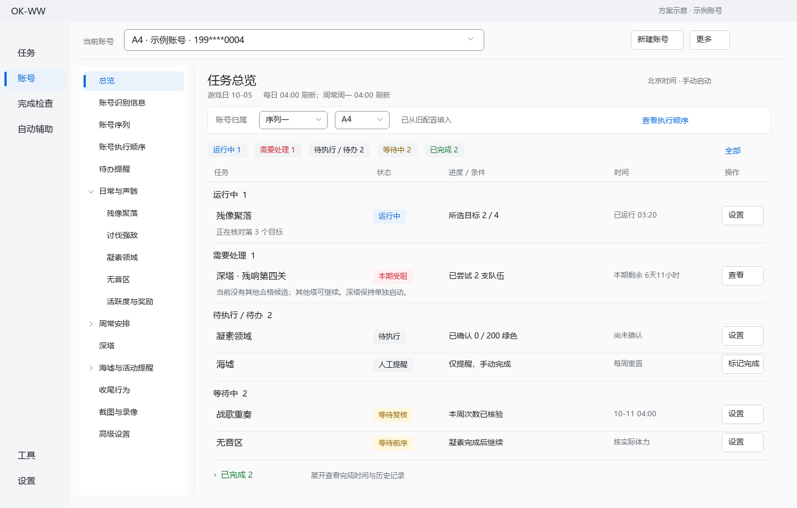

# 账号 UI 进一步优化方案

状态：已获用户授权并实施，目标版本 1.97.13。设计基线：1.97.12；验证结果见 2026-10-06 实施验收报告。

## 1. 依据与目标

依据当前打包版窗口截图、账号页面与总览实现、用户对 ALAS 的偏好，以及最新确认的固定账号槽位规则。

本方案使用 UI UX Pro Max 的信息密度、表单反馈、键盘焦点与视觉一致性指导，使用 Frontend Design 做具体布局和文案设计。技能检索中，整套设计系统返回了宣传页布局、绿色配色和在线字体，与此桌面工具不匹配，未采用；采用核实匹配的紧凑数据列表、行内错误和可见焦点建议。现有技术为 PySide6 + qfluentwidgets，技能未提供 Qt 专用栈，本方案的控件实现依据本项目已有组件。

设计目标：用户打开一个账号后，能够快速看清账号归属、当前需处理的任务、实际完成情况和下一次重置时间，直接进入对应设置。任务启动继续使用既有入口。

## 2. 现状问题

| 位置 | 当前问题 | 优化方向 |
|---|---|---|
| 顶部 | 账号下拉下方重复身份信息、长 UUID、草稿与操作提示，挤占任务区域 | 保留账号选择，缩短为账号工具栏，详细身份放入识别页 |
| 左侧 | 分类与任务项目较多，底部项目需滚动；序列入口较靠后，执行顺序缺少独立入口 | 账号管理入口前置，控制展开层级，选中项始终可见 |
| 右侧总览 | 任务行约占 100 像素以上，大面积空白；名称和操作距离过远 | 名称、状态、进度、时间按列对齐，常规任务行约 56–64 逻辑像素 |
| 状态分组 | 空的“运行中／等待中”等各占一段空间，出现多条“无任务” | 顶部紧凑计数，内容只显示非空分组 |
| 操作按钮 | 每个任务都展示两枚较大按钮；提醒、深塔又叠加按钮 | 高频操作保留在行内，低频操作进入详情或菜单 |
| 时间 | “未记录”重复出现；最近完成、最近运行与下次检查含义不够清晰 | 区分事实完成、尝试结果与可检查时间，缺失数据明确写“尚未确认” |
| 账号序列 | 旧界面仍支持任意新建和上下移动，与固定 A/B 槽位规则不符 | 固定槽位、数字排序、显示空槽和账号绑定 |
| 刷新 | 总览重新创建分组和任务控件，即使记录未变 | 按任务 ID 更新已有行，保持焦点、展开和滚动位置 |

## 3. 推荐设计方向

推荐“ALAS 式紧凑任务列表”：延续白／浅灰底与蓝色选中态，使用少量分隔线和文字层级表达关系。列宽与操作区对齐，重点显示任务状态。

另一种可选方案是保留现有大任务块、仅缩小间距。这种改动较小，但不同长度的描述仍使操作和时间难以比较，因此不作为推荐方案。

本次优化以账号页为核心，同步共用样式与术语到任务、完成检查、工具和设置页。业务流程、自动战斗偏好、手动启动及凌晨刷新规则按既有确认执行。

## 4. 页面骨架

```text
全局导航 │ 当前账号 [A4 · 示例账号 · 199****0004 ▼]   新建账号   更多
         ├────────────────────────────────────────────────────────
         │ 左侧分类          │ 右侧：任务总览 / 当前分类设置
         │ 总览              │ 标题、游戏日和刷新说明
         │ 账号识别信息      │ 当前归属：序列一 [▼]   A4 [▼]
         │ 账号序列          │ 运行中 1  需处理 1  待执行 2  等待 1  已完成 3
         │ 账号执行顺序      │
         │ 待办提醒          │ 任务名称   状态   进度   最近完成   下次检查   操作
         │ 日常与声骸 ›      │ 战歌重奏   ……
         │ 周常安排 ›        │ 残像聚落   ……
         │ 深塔 ›            │ 讨伐强敌   ……
         │ 海墟与活动提醒 ›  │ 凝素领域   ……
         │ 收尾行为          │ 无音区     ……
         │ 截图与录像        │ ……
         │ 高级设置          │
         └───────────────────┴──────────────────────────────────────
                    有草稿更改时出现：已修改，尚未保存   预览差异  丢弃  保存更改
```

保持两列账号页面；全局导航继续是应用现有导航。任务详情在右侧当前区域或任务行下展开，页面不增加常驻第三列。

### 顶部账号工具栏

- 账号下拉保持原有位置、内容、切换语义，增加按短名、昵称或手机号搜索能力。
- 下拉不默认自动改写为槽位编号；展示账号身份与所属槽位之间的明确对应。
- “新建账号”保持可见。模板、导入导出／JSON等低频入口按现有全局／账号职责放入“更多”或高级设置。
- UUID 放入“账号识别信息”，提供复制；总览不重复显示长编号。
- 平时不显示“已载入独立草稿／等待操作”占位句。编辑后显示明确的未保存状态。
- 切账号沿用现有草稿保护；本轮 UI 优化不改变保存前的身份校验与修订冲突处理。

### 左侧分类

- 顺序如上，账号序列和执行顺序在图示分类区域靠前且分别有入口。
- 只使用“分类 → 任务”两层。默认折叠任务大类；直接跳转到任务时展开对应分类。
- 刷新保留用户展开状态、当前选中项和导航滚动位置。
- 选中项使用浅蓝背景、蓝色文字与左侧细标记；键盘焦点与选中态各有可辨识反馈。
- 分类图标采用现有 Fluent 图标，同一层统一尺寸与线条风格；具体任务以文字为主。

## 5. 总览设计

### 5.1 账号归属

总览上方放一条紧凑设置行：归属序列、账号槽位及保存状态。选择“序列一”时展示 A1–A10，选择“序列二”时展示 B1–B10。

- 每槽绑定一个稳定 profile_id，账号的手机号、特征码、材料账本和完成记录继续关联原 profile_id。
- 槽位是执行位置。改变槽位不复制账号、不重新建号、不清空历史，也不重写游戏身份。
- 同一账号默认一个固定槽位；槽位被占用时显示占用账号的脱敏摘要和行内错误，禁止静默替换。
- 如旧数据存在多重归属或短名冲突，保留原数据并展示待核对，不自动猜测归属。
- 旧配置可以唯一匹配的 A/B 短名自动填入；填入归属和“参与序列执行”分别保留，升级不自动扩大执行账号范围。
- 空槽位合法，自动执行时跳过。既有序列一 A4、A3 应整理为 A3、A4。
- 此设置使用现有草稿保存与原子账号图发布机制；不能直接在总览独立写文件造成任务配置与序列不同步。

### 5.2 状态与列表

- 顶部使用一行状态计数，点击后筛选对应状态。没有数字统计图、大进度仪表或五个巨大统计面板。
- 默认显示所有非空状态组，建议排序：运行中、需要处理、待执行／待办、等待中、已完成。
- 已完成分组默认收起，保留完成时间；用户展开后刷新保持展开。
- 空状态组隐藏。全部未配置时给出“尚未选择任务”和“前往任务设置”。活跃度核验项按照现有每日流程展示。
- 日常、周常、跨天材料目标、深塔和人工提醒分别标明周期／执行方式，避免把不同周期的完成数当成“今天完成率”。
- 分组内每日任务遵循战歌重奏、残像聚落、讨伐强敌、凝素领域、无音区的用户顺序，已完成与未完成按状态分组后的顺序不承诺自动调度。

常规任务列：名称、状态、进度摘要、最近完成／确认时间、下次检查／重置、操作。空间不足时把两类时间并入行内第二行；操作保持可见。

### 5.3 状态文案

| 状态 | 展示示例 | 行为 |
|---|---|---|
| 运行中 | 残像聚落：正在核对第 2 个目标，已运行 03:20 | 显示当前阶段、耗时；任务控制复用现有入口 |
| 待执行 | 所选聚落本游戏日尚未核验 | 设置入口，不根据“程序没打”推断活跃度低 |
| 等待中 | 周日复核：10-11 04:00 后可检查；体力不足：下次手动启动继续 | 区分时间条件和资源条件 |
| 需要处理 | 活跃度实测 80；奖励未领满；本轮结束需处理 | 直接展示原因与对应记录／配置入口 |
| 已完成 | 本游戏日所有已选聚落完成，确认时间 10-05 20:18 | 下一游戏日恢复未完成，历史时间保留 |
| 人工提醒 | 海墟：待手动完成 | 行内“标记完成”，完成后“撤销” |
| 深塔受阻 | 残响第四关：已尝试 2 支队伍，当前无其他合格候选 | 展示本期受阻，不列入已完成；允许停止运行后重新评估 |

时间字段只展示有对应事实的含义：上次执行失败的时间写“最近尝试”，不能写“最近完成”。“已完成”要求既有生产核验／人工标记依据，不由 UI 自行推断。

### 5.4 操作与详情

- 普通任务常驻紧凑“设置”按钮；“记录”与更多操作通过一枚明确标注的详情／菜单入口访问，键盘可操作。
- 人工提醒常驻“标记完成／撤销”，配置入口作为次要操作。
- 深塔常驻“打开深塔任务”，表示跳转到独立任务页，保持用户手动启动语义。
- 故障行展开显示原因、最近尝试、核验信息与处理入口；界面用通俗文案，原始技术错误放入记录详情。
- 运行控制不在当前未绑定安全回调的总览里另造一套。

## 6. 账号序列与执行顺序

### “账号序列”页面

右侧选择序列一／序列二，显示固定 10 行槽位，每行包含槽位、当前绑定账号、是否参与执行、任务摘要和账号设置入口。

- A1–A10、B1–B10 按数字排序，A10 位于 A9 后。
- 空位显示“未绑定”，给出绑定账号入口，不能被理解成运行失败。
- 旧配置选中哪些账号就保留哪些账号；仅槽位排序按新规则整理。
- 多余的旧自定义序列作为兼容数据保留，列入高级迁移提示，不自动删除。

### “账号执行顺序”页面

展示同一套固定顺序及实际参与账号，用表格表达，不使用可拖拽列表。提供序列一／序列二切换，标出空槽、未参与执行、本轮已完成、运行中和下个账号。

- 取消手动上移、下移和拖动排序。
- 固定顺序不是新的后台自动执行功能；开始按钮仍走既有多账号任务入口。
- 运行中显示被冻结的本轮序列快照。设置变更在下一轮运行生效，当前账号切换路径不能被界面编辑改变。
- 更新后的排序须从 UI、保存层、生产运行快照共同遵守，不能只改表格视觉排序。

## 7. 各设置页面优化

| 页面 | 建议 |
|---|---|
| 账号识别信息 | 登录身份、脱敏手机号、昵称、特征码核验与绑定、UUID 分区；序列槽位归属引用总览同一草稿状态 |
| 残像聚落 | 显示两个选择区、已选数量；选择列表控制实际执行，旧开关配置保留 |
| 战歌重奏 | 清楚写周一执行、周日复核、本周真实领取情况；目标与记录相邻 |
| 讨伐强敌 | 展示本轮目标次数、已确认次数、剩余次数和完成后自动关闭说明 |
| 凝素领域 | 两个目标按先后排列；金／紫／蓝／绿对齐输入；即时展示绿色当量、预计次数、已确认累计与待核验消费 |
| 无音区 | 展示账号配置目标与持续刷取说明；凝素完成后会转入此目标的关系明确显示 |
| 深塔 | 所选塔、挑战顺序、真实赛期、逐关状态；受阻和结果待核验有不同文字；独立启动说明保持可见 |
| 海墟与活动提醒 | 任务名、是否提醒、重置规则；选自定义时才显示日期控件；完成标记在总览完成 |
| 高级设置 | 原始 JSON、模板、重新绑定、删除等低频设置；危险操作独立区域 |

凝素计算示例只作为用户理解：需求 100 绿色当量约 2 次 80 体力领取；实际领取选择还须按剩余体力、当量余量及每日优先策略决定。界面显示估算，不制造已获得材料。

表单标签可见，单位紧邻输入；字段无效时在该字段显示原因，保存失败给出可定位的错误摘要。普通刷新不抢输入焦点。

## 8. 视觉规格

以下为 Qt 逻辑像素建议，需在实机缩放复核后定稿。

| 项目 | 建议值 |
|---|---|
| 主题 | 固定浅色，延续当前产品，不引入主题切换 |
| 窗口／面板 | `#FAFAFA`／`#FFFFFF` |
| 主文字／次文字 | `#1F2328`／`#656D76` |
| 主色／选中背景 | `#0969DA`／`#EAF2FC` |
| 成功／错误／等待 | `#1A7F37`／`#CF222E`／`#8A6100`，每种状态同时有文字 |
| 字体 | 使用现有系统中文字体，优先 Microsoft YaHei UI，回退系统字体；无需在线字体 |
| 字号 | 页面 20，区块 15，正文 14，辅助 12；重要状态不使用辅助字号 |
| 间距 | 基础 4／8，行内 8–12，区块 16，页面 16–24 |
| 圆角 | 输入／按钮 6，信息容器 8；任务列表以行分隔为主 |
| 分类宽度 | 约 192–208；窄窗口收至 176，保留文本与箭头 |
| 导航行／控件 | 导航 36–40；常用按钮和输入约 32–36；键盘与触控命中范围按平台适配 |
| 任务行 | 常规 56–64；错误／运行中可增加一行；详情按需展开 |
| 动效 | 仅点击、选中、展开的轻量反馈，约 120–160ms；时间变化不闪烁 |

正常文字对比度至少 4.5:1；有意义控件边界与焦点至少 3:1。弱分隔线不承担交互识别。状态不能只靠颜色。

## 9. 窗口与刷新策略

- 验收窗口：1280×800、1440×900、1920×1080；缩放 100%、125%、150%。重点检查 1280×800 + 150% 的可用逻辑空间，必要时采用紧凑布局。
- 窗口较窄时，任务行收为“任务＋状态＋操作”和“进度＋时间”两行，字段自动换行，不产生横向滚动。
- 顶部账号栏固定；右侧内容独立滚动；左侧长导航独立滚动；整个账号页面避免套多层同方向内容滚动。
- 普通设置页选中具体任务后直接显示字段，避免重复套“分类 → 区块 → 同名折叠区”。保留原配置控件、草稿与必要的展开状态。
- 按 profile_id 与 task_id 对已有任务行做差异更新；内容没变化不重建。耗时仅更新文字，后台记录读取继续异步。
- 每日／周常到期改变状态；自定义提醒到期也更新；整行移动只在状态实际改变时发生。保留用户当前阅读的行与滚动锚点。
- 读失败时保留带“数据已过期”的最后快照和明确错误，不让旧完成状态看起来仍有效；切换账号时清空旧账号画面后显示载入状态。

## 10. 实施边界与步骤

| 阶段 | 主要改动 | 验收 |
|---|---|---|
| 1：槽位与兼容 | 账号归属草稿、序列固定槽位、唯一性、旧短名和执行勾选迁移；运行快照数字顺序 | 旧 A4 示例归属正确；A3 在 A4 前；空位跳过；记录不迁错账号 |
| 2：账号页骨架 | 顶部压缩、导航入口前置、账号执行顺序入口、右侧统一标题、草稿操作条 | 常用入口可见；总览可用高度增加；切分类与账号不丢草稿 |
| 3：总览 | 紧凑任务行、状态计数、空分组隐藏、时间语义、故障详情、差异更新 | 同窗口显示更多任务；焦点不丢；错误不被误写成完成 |
| 4：设置与共用样式 | 统一表单、材料目标、提醒列表、字号与状态标签；同步其他页共用视觉 | 控件尺寸与按钮层级一致，无全局主题回归 |
| 5：验证与发布 | 配置迁移往返、生产快照、键盘、窗口缩放、打包版实机核验 | 备份后安装，旧账号任务和材料账本、自动战斗偏好核对 |

预计涉及：`src/gui/AccountSettingsTab.py`、`AccountConfigTab.py`、`AccountTaskOverview.py`、`SequenceManagementTab.py`、`AccountReminderPanel.py`、`FlatSettingRow.py`、`CodexTheme.py`；槽位数据与运行顺序需在 `src/account_repository.py`、`src/sequence_repository.py` 及必要的配置图迁移层共同实现。具体新增模块应在实施时确认现有 schema 与事务路径后决定，复用已有备份、CAS 和原子发布。

测试围绕真实剩余风险：带旧配置的槽位迁移、占用冲突、A10 数字排序、执行名单保持、运行快照冻结、错误时间语义、真实外层页面尺寸、焦点与草稿保持。不为颜色常量写镜像测试。

实施版本按 AGENTS.md 递增第三段至 1.97.13，发布前已核对远端标签。以下验收目标由实施报告记录证据与验证边界。

## 11. 交付验收目标

1. 打开账号页即可看见当前账号、所属序列与槽位、当前需处理事项。
2. 在 1440×900、100% 缩放的常见布局下，目标是首屏容纳至少 6 条常规任务行；随真实文字与错误详情调整，不能为数量目标截断内容。
3. 账号序列和执行顺序通过左侧入口直接访问；所有 A/B 槽位按固定数字顺序展示与执行。
4. 更新自动填入旧归属，并保留原执行名单、任务选项、历史记录及材料累计。
5. 未保存更改有持续可见反馈；切分类与状态刷新不丢失编辑内容。
6. 到凌晨刷新只改变状态；独立任务、人工提醒及每日任务启动语义保持已确认规则。
7. 真实外层页面在窗口尺寸、缩放、长昵称、错误长文本、空列表和滚动后均复核；不只检查内部子页面截图。

附图为设计示意，账号、状态和时间为示例，不表示本机真实执行结果。


