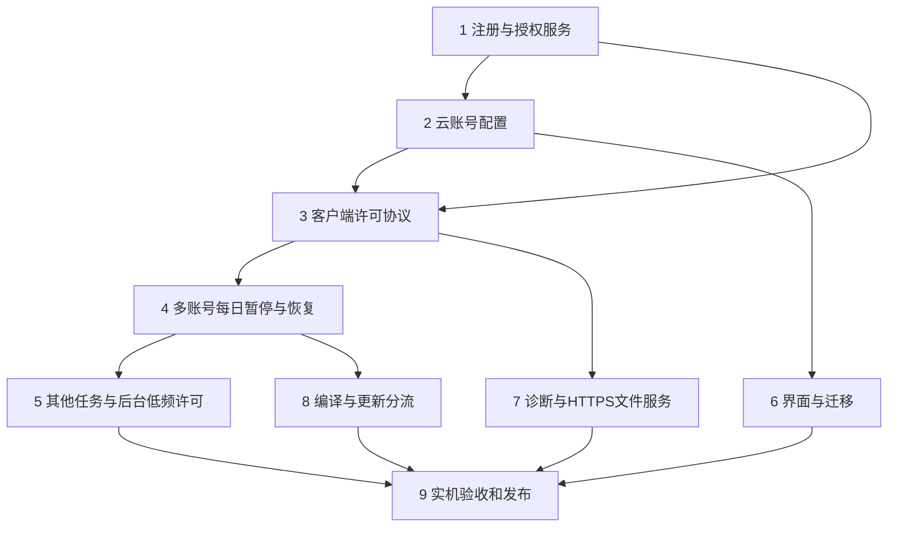

# OKWW 官方收费发行版与云端许可实施计划

**目标：**以多账号每日任务为主要持续验证对象，为官方发行版加入注册、人工开通、按序列授权和云端账号配置，同时降低自动战斗、每周乐园等功能的验证频率。

**架构：**游戏截图、识别、操作和战斗留在本机；服务器保存软件用户、序列许可、游戏账号配置及当前运行许可。官方客户端使用 HTTPS、随机挑战和服务器签名取得许可，并编译关键执行模块，提高直接修改官方包绕过服务器的成本。

**技术选型建议：**客户端沿用 Python 3.12、现有 Qt/OCR/pyappify 环境；关键模块先试 Cython。服务端使用独立 Python 环境、FastAPI、单 Uvicorn 进程、SQLite WAL、Nginx、Argon2 和 Ed25519。这些是实施建议，尚未安装或实测。

**需求来源：**本文件第二至第五节记录本次对话已经确认的规则；标有“建议”的技术与验证参数属于实施选型。实施时以确认规则和之后的用户修订为准。按阶段用现有协作工具实施，不依赖未安装的技能。

**代码基线：**`E:/AI work/okww-a6-activity-20261008`，分支 `codex/a6-activity-20261008`，提交 `fa11d226f86eb03362467a517c235565e11bc0da`，版本 `1.97.59`。计划日期：2026-10-09。

**本次交付：**研究结论与实施计划。尚未实现商业许可、编译收费包或部署服务器。

## 一、执行结论

建议先完成一条可验收的链路：注册 → 人工开通一个序列 → 导入账号 → 开始多账号每日 → 在线续验 → 在账号结束边界暂停 → 恢复后继续剩余账号。通过后再接其他任务、客户诊断和正式更新。

用户最后明确：**官方程序整体收费，未购买许可不能使用。**自动战斗、每周乐园不另设收费项，对这些功能减少验证。此前关于“后台辅助免费”的表述，现解释为不单独收费；不能解释为未购买任何许可也能使用官方发行版。

软件购买规则与源码修改权分别说明。源码继续按 AGPL 提供，允许他人自行构建或修改；官方编译包的目标是增加绕过成本。完整本地程序无法获得“绝对不能破解”的保证，云配置和编译也不能改变这一点。


## 二、全局约束

- 不修改既有游戏任务的操作顺序、战斗策略、首次执行与补跑策略。新增许可只决定能否开始、继续或在已约定边界暂停。
- 不改变每日耗时记录的口径；保留首次、补跑、单账号累计和批次总耗时。
- 许可问题只暂停相应前台队列。全局手动暂停、用户停止和退出仍保持现有行为。
- 后台辅助开启偏好必须保留。到期、撤权或连接问题不得保存 `_enabled=False`。
- 前台与后台仍只有一个键鼠输入所有者；收尾、松键和释放鼠标不受许可等待阻挡。
- 不新增机器码封禁、TPM、实名验证、频繁增删监控、账号交换限制以外的告警、破坏代码的“炸弹”或固定错误答案挑战。
- 新增检查仅针对本计划要求的安全边界：远程输入、数据归属、签名、许可状态、容量、不可变特征码与避免数据丢失。
- 客户发行包不含管理员 NAS 地址、SMB 凭据、服务器私钥或管理员口令。
- 管理员 NAS 只使用 `\\192.168.3.173\羲火君 共享给我\AI诊断`。此次未审阅诊断 ZIP，不执行诊断包审阅保留命令。
- 代码发布按当时最新版本递增末位，同步 `config.py`、版本说明、对应源码、GitHub 提交与 annotated tag，再发布 NAS 更新。本计划不预占版本，不自动改为 `2.00.00`。

## 三、购买、序列与账号规则

### 3.1 软件账号和购买

| 项目 | 已确认规则 |
|---|---|
| 软件身份 | 用户注册一个软件账号；初期不接在线支付 |
| 开通方式 | 用户联系管理员付款，管理员在后台开通或续期 |
| 首个序列 | 长期 30 元／30 天 |
| 其他序列 | 48 元／30 天／序列 |
| 续费 | 未到期则接原到期时间；已到期则从开通时起计算 |
| 成员容量 | 每个序列最多 10 个完整游戏特征码 |
| 今日不执行 | 可排除某个账号今日参与，仍占成员名额 |
| 到期序列 | 配置保留；其成员不能开始需要有效序列的任务 |
| 未购买许可 | 可进入注册、登录、购买说明和配置管理；不能启动官方版自动化服务 |

服务端以 UTC 记录时刻，客户端显示本地时间。30 天使用固定天数，不按自然月或“30 个游戏日”。续期计算式：

```python
new_expires_at = max(server_now, old_expires_at) + timedelta(days=30)
```

首个序列的优惠身份随这个序列保存，后续序列到期不会自动变成首个序列。人工后台明确展示开通序列、价格档和新到期时间，不依据客户端上报的价格开通。

### 3.2 特征码与配置

1. 使用完整游戏特征码；A1、A2 等只是昵称，不能用于云端身份判断。
2. 用户创建账号绑定后不可编辑特征码；更换游戏账号需删除旧配置、另建新配置。
3. 每次账号任务使用已有游戏身份识别结果，按 `软件用户 + 完整特征码` 获取配置并确认当前成员关系。
4. 服务器保存序列关系、任务配置和特征码。本地长期保存昵称、必要登录状态和本地执行进度；云端账号任务配置在内存中形成运行快照。
5. 当前运行使用已经批准的配置版本。正常配置编辑在下个单元或下次启动生效，不在战斗中途换一套配置。
6. 获取云配置并不等于永久获准执行；每个新账号单元仍需服务器批准。

账号切换依赖的现有登录名称、别名、手机号匹配与账号确认数据，属于账号云配置的一部分。通过内存适配供现有切号方法使用，不能为了云端化重新实现切号链。游戏客户端自身保存的登录记录仍由游戏管理。

### 3.3 游离、移动、删除和恢复

| 行为 | 规则 |
|---|---|
| 游离账号 | 保存配置，不执行每日、海墟、深塔等要求有效序列成员身份的任务 |
| 1 个有效序列 | 用户游离账号总上限 3 |
| 2 个及以上有效序列 | 用户游离账号总上限 5 |
| 有效序列数下降 | 超额配置保留，禁止新增；不自动删除 |
| 0 个有效序列 | 保留已有配置，禁止新增游离账号；购买后按有效序列数恢复新增额度 |
| 加入序列 | 有空位才允许游离账号加入；满员时不能替换现有成员 |
| 排序 | 允许调整显示和执行顺序 |
| 跨序列移动 | 允许，目标序列必须有空位；同一事务完成移出和移入 |
| 移出为游离 | 不允许将已有序列成员直接移成自由账号 |
| 删除 | 必须二次确认；保留 24 小时供恢复 |
| 恢复频率 | 同一软件用户、同一完整特征码，每 7 天最多成功恢复一次 |
| 恢复容量 | 恢复至原归属且必须满足其容量；失败不能覆盖现有同码配置 |

游离数量指整个软件用户的总量，不是每序列额度。软删除配置不参与执行；恢复也不能产生第 11 个成员。删除保留期内若建立同码新配置，不允许旧配置覆盖它。删除后 24 小时清除配置内容，最低恢复历史保留足够 7 天，删除重建不能清空这项记录。

删除暂时释放成员名额；恢复时重新检查名额。恢复被容量阻止时明确显示原因，不把账号擅自放入游离池。已经到期的原序列仍可保存恢复后的配置，但不能执行任务。

取消所有频繁新增／删除的监控、阈值和提醒。不在本期加入代肝到期窗口告警。

### 3.4 不同用户出现相同特征码

- 账号配置按用户隔离，不合并，不实行先到先得占码。
- 建立跨用户重复特征码索引，仅供管理员核查。
- 对相关在线实例下发一次有编号的游戏截图请求，采集指定游戏区域；离线实例显示待响应。
- 没有游戏帧就报告未采到，不截图桌面或其他程序。
- 截图属于人工分析材料，可以被修改或重放，不能用作程序未破解的证明。

## 四、验证频率与停止边界

### 4.1 建议使用两种验证强度

下面的分钟数是初始工程参数，集中写在协议中，首次服务器测试后按实际请求量调整；不增加一页用户可调的授权参数。

| 对象 | 开始前 | 运行过程中 | 正常停止边界 |
|---|---|---|---|
| 官方版整体使用许可 | 登录并首次启用自动化时真实验证 | 建议每 30 分钟核实软件会话和至少一个有效序列；续费、撤权、接管通知及时更新 | 最后一个序列到期时，按当前功能边界收尾 |
| 多账号每日 | 批次开始和每个账号开始都验证完整特征码、序列与配置 | 建议每 5 分钟；请求同时返回软件会话与当前序列状态 | 当前账号完成，切下一账号之前 |
| 多账号每周乐园 | 每个账号开始验证并取配置 | 不另开 5 分钟许可循环；共用低频整体许可验证 | 当前账号完成，切下一账号之前 |
| 每周乐园 | 本次任务开始验证 | 共用低频整体验证 | 本次乐园任务完成 |
| 单账号每日、海墟、深塔 | 本次任务开始按当前完整特征码验证所属有效序列 | 保留此前要求的持续验证，建议每 5 分钟 | 本次整项任务完成；海墟和深塔不擅改为每层停止 |
| 自动战斗、单人自动战斗、群声共振 | 功能启用时检查整体使用许可，不另收费用 | 不在截图／技能／按键循环联网；共用低频整体许可 | 最后一个有效序列到期，完成当前一场战斗再停；不在战斗时直接等待许可 |

多账号任务已包含的每日子任务共用当前账号的运行许可，不再嵌套申请另一份独立任务许可。5 分钟请求已核实整体状态时，延后下一次 30 分钟整体请求，避免重复联网。

其他已注册任务和自动拾取等辅助继承官方版整体使用许可，本期不给它们各加一套5分钟验证循环，也不增加按功能收费的产品项。注册、购买说明与管理员诊断获取不能被“尚未付费”阻断，否则用户无法完成购买或提交故障。

“减少验证”不等于允许过期后无限运行。签名回复包含服务器确认的实际订阅到期时刻；程序用服务器时间基准与单调计时器判断到期，避免仅修改本机日期延长。提前续费可通过正常验证或推送更新到期时间。

### 4.2 必须区分的结果

| 结果 | 前台账号／任务 | 后台辅助 | 恢复方式 |
|---|---|---|---|
| 有效许可 | 正常执行 | 正常执行 | 不需要处理 |
| 第 1／2 次连接失败 | 当前单元继续，按原周期再验证 | 不因这条队列的故障停下 | 下次成功清零连续失败数 |
| 连续 3 次连接失败 | 标记待暂停；本单元结束后暂停相应任务队列 | 不连带暂停；仍遵守自身整体许可到期规则 | 用户点击继续，服务器重新批准后恢复 |
| 当前序列到期 | 当前账号／整项任务收尾后暂停；禁止开始下一单元 | 若还有其他有效序列则继续；最后一个到期按当前战斗收尾 | 续费后重新验证 |
| 明确无权限／撤销 | 立即终止被拒绝的执行路径，释放输入 | 整体使用权被撤销则立即停止；仅某个序列被拒绝不误停其他有效许可 | 管理员恢复权限后重新验证 |
| 新电脑接管软件登录 | 旧电脑该软件用户全部实例注销并停止活动 | 同样立即停止，保留开启偏好 | 旧电脑再次登录会成为新的接管 |
| 签名不符／nonce不符 | 不接受响应，不开始新单元；当前单元按待暂停收尾，显示“许可响应校验失败” | 不将失败响应解释为有效许可 | 修复服务或客户端后真实重新验证 |

三次故障触发的待暂停标记保留到边界；之后偶尔成功不悄悄取消已经显示的暂停安排。网络错误不记为游戏账号日常失败，不新增游戏补跑次数。连接失败计数属于本次任务许可连接，不将另一条成功下载请求当成验证成功。

整体许可租约也有期限。后台辅助不能把首次验证后的缓存解释为永久许可：整体租约无法续期时，当前战斗可收尾，下一场等待重新验证。这与“多账号每日的三次连接失败不连带暂停自动战斗”分别处理，不能用前台队列的失败计数代替后台自身许可状态。

服务器返回的到期是可以收尾的状态；成员不属于用户、特征码不匹配、许可撤销、会话被接管是拒绝状态，不能统一转换成“稍后停止”。

### 4.3 已开始单元的收尾不使用过期令牌

服务端登记 `run_id`、`unit_id`、软件用户、序列、特征码、配置版本和批准时间。运行验证分两部分：

1. **有效租约：**在期限内允许当前许可范围的正常运行，并可申请下一单元。
2. **当前单元批准记录：**证明这个单元在有效许可下开始；连接故障或订阅到期时，仅允许该单元完成，不允许据此领取下一账号配置或开始新任务。

到期时返回 `finish_current`；明确撤销返回 `deny_now`。不忽略 JWT 或短期令牌的过期字段。连接中断时，客户端只使用内存中的当前单元批准记录收尾；程序重新启动必须重新联网，不持久化一份可永久复用的离线许可。

服务端可以约束领取配置与批准新单元。客户端是否真实抵达游戏完成边界仍是本地事实，不能把服务端收到“完成”当成未被修改的证明，也不添加未经要求的强制任务最长时限。

## 五、会话、签名与加固的作用

### 5.1 随机挑战与签名协议

每次许可请求使用新随机 `nonce`。服务器返回独立签名封装，客户端对封装内原始字节验签，避免两端重新编码 JSON 的差异。

```json
{
  "key_id": "release-2026-01",
  "payload_b64": "base64(UTF-8 payload bytes)",
  "signature_b64": "base64(Ed25519 signature of payload bytes)"
}
```

`payload` 字段契约：

```text
protocol_version, nonce, server_time, user_id, session_generation,
instance_id, task_code, sequence_id, game_feature_code,
run_id, unit_id, config_version, config_sha256,
status = allow | finish_current | deny_now,
reason, subscription_expires_at, lease_until
```

整体许可请求不携带任务单元字段；账号任务响应必须绑定完整单元字段。账号配置随批准单元响应返回，哈希纳入签名。签名仅证明来源与完整性，不是配置内容加密。HTTPS 负责传输保密。

验证顺序：HTTPS服务器身份 → Ed25519签名 → 本次nonce → 当前用户／会话代次／任务／特征码绑定 → 状态与时限 → 使用配置。任一步失败，不能调用执行入口。

服务器私钥只在服务端。客户端内置公钥，GitHub公开公钥不会帮助伪造签名。使用成熟密码库，不自制数学挑战或密码算法。服务端密码用 Argon2 哈希；登录凭据用高熵随机会话令牌，数据库保存令牌哈希，不存可直接复用的明文令牌。

客户端使用 Windows 现有凭据保护机制保存登录状态，用户无需操作证书或密钥；许可到期时间和价格始终由服务端决定。

### 5.2 接管与同机不同 Windows 用户

安装时自动生成普通设备组标识，存于机器共享的安装数据目录；每个 Windows 用户有自己的实例和登录凭据。服务器记录软件账号当前设备组与会话代次。

- 同设备组的不同 Windows 用户登录同一软件账号，不互踢，可各运行已购序列。
- 另一设备组登录允许接管：增加会话代次，通知旧组全部实例退出，后续续验和取配置拒绝旧代次。
- 设备组仅用于归并会话，不采硬件序列号作强绑定，不宣称它防伪装。
- 轻量 WebSocket 用于接管、撤权和截图指令；连接成功或 ping 成功不等于有效购买许可。
- 网络不通时旧机无法瞬间收到指令；在线实例收到后立即停止，离线实例在检测失败或下一次有效验证时处理。不能承诺零延迟停机。

初期不增加复杂设备列表、机器码申诉、硬件更换次数或物理设备可信证明。

### 5.3 每项加固能做到什么

| 措施 | 作用 | 局限 |
|---|---|---|
| 云端权威配置和成员关系 | 本地改文件不能让真实服务器增加名额或授权另一特征码 | 修改后的客户端可自己实现配置和执行逻辑 |
| 每单元在线批准 | 防止官方逻辑下载一次配置后永久启动新账号 | 完全改造的本地程序可删除这套依赖 |
| nonce与Ed25519签名 | 拒绝假服务器响应、篡改与旧响应直接复用 | 客户端验签路径仍可能被破解者修改 |
| 编译实际许可与任务入口 | 增加删除检查、替换核心路径的成本 | Cython仍运行于Python环境，不能保证免注入或不可逆向 |
| 关闭官方版任意Python脚本导入 | 关闭已有的同进程任意脚本执行入口 | 不能阻止系统管理员使用外部调试或修改整个安装 |
| 官方二进制更新签名 | 防止正常更新路径装入被篡改或不匹配的模块 | 用户可以另外运行自己构建的软件 |
| 安全版本最低要求 | 停止已知失效的官方版本获得服务器许可 | 上报版本号本身不是程序完整性的证明 |

强制更新建议只用于授权安全修复或协议不兼容。普通游戏适配提示升级。服务器拒绝旧安全版本开始新单元，当前已批准单元按既定边界结束；不擅自终止游戏进程，也不在战斗中替换正在加载的 `.pyd`。

## 六、轻量服务器与文件服务

### 6.1 首期部署

- 一个云主机运行 Nginx、单API进程和本地SQLite数据库；单独服务环境不安装 Qt、OCR、OpenVINO 或游戏资源。
- SQLite使用WAL与短事务。容量检查、成员新增、移动、恢复放在同一 `BEGIN IMMEDIATE` 事务，不能先读名额再各自提交。
- 登录、人工授权、配置、运行许可和诊断归属用同一数据库；文件保存到独立目录，上传过程不持有数据库写事务。
- 数据库放云主机本地磁盘；不能放 NAS 共享目录。备份使用 SQLite 在线备份API，再由管理员设备传回 NAS。
- 下载文件由Nginx发送；客户端上传以流式写文件处理，不把大ZIP读入API进程内存。
- 对上传限制包大小、路径和归属，拒绝客户端提供任意磁盘路径。这是外部文件输入边界，不增加与需求无关的检查。

2核2GB可以作为验证机型；现阶段没有购买凭据、域名、SSH或承载量实测，不能据此保证用户数量。公网服务的域名、备案和接入条件按运营方式与服务商要求办理，未接在线支付并不自动免除这些要求。

### 6.2 最小数据表

| 表 | 关键内容与约束 |
|---|---|
| users | 软件用户、Argon2密码哈希、整体状态、当前设备组、会话代次 |
| sessions | 用户、实例、设备组、令牌哈希、代次、失效时间 |
| sequences | 用户归属、名称、价格档、实际到期时刻 |
| profiles | 用户、完整特征码、昵称、云配置、配置版本、序列归属或游离、删除保留时刻 |
| restore_history | 用户＋特征码＋最近成功恢复时刻，独立于可删除配置 |
| runs / units | 当前任务、批准账号单元、配置版本、状态、结束记录 |
| diagnostics | 用户、实例、请求编号、特征码、文件归属、上传状态 |

有效配置的 `user_id + game_feature_code` 唯一；跨用户同码允许保存，通过查询索引发现。没有额外的频繁增删审计表或收费设备码数据库。

### 6.3 请求量估算与下载成本

1000个同时执行5分钟续验的客户端：`1000 / 300 ≈ 3.33`次／秒；若每个响应约2KB并全天执行，约17GB／30天。1000个仅30分钟续验的实例约0.56次／秒。它们是协议量级估算，未计请求头、推送保活和文件流量，也不是实测承载能力。

下载和截图通常更影响流量与磁盘。若安装包为1GB、每天20次完整下载，30天约600GB下载流量。首期先用云主机文件服务；实际下载量触及套餐资源后再选择对象存储或CDN，不预先增加Redis、容器集群或消息队列。

管理员设备主动拉取上传材料到规定NAS。客户无需连接家中NAS，云端API也不依赖NAS在线才能核实许可。

## 七、代码接点与阶段实施

下面的新文件是本计划建议的职责划分。实施前重新确认最新HEAD与在途修改，按文件分配所有权；不能覆盖其他任务的修改。行号仅用于定位当前基线。

### 阶段1：可运行的注册与人工授权服务

**新增：**`server/requirements.txt`、`server/app.py`、`server/storage.py`、`server/auth.py`、`server/runs.py`。

职责：`app.py`放路由与数据契约；`storage.py`负责表、短事务和备份；`auth.py`处理密码、会话、签名；`runs.py`负责整体许可、序列许可和单元状态。服务启动创建必需表，不引入通用插件系统或微服务。

**接口：**

```text
POST /v1/register                  -> 软件用户
POST /v1/login                     -> 会话、代次、整体许可摘要
POST /v1/session/validate          -> 签名整体状态
POST /v1/admin/sequences/grant      -> 人工开通／续期结果
POST /v1/runs/start                -> run_id
POST /v1/runs/{run_id}/units/start -> 签名批准记录与当前账号配置
POST /v1/runs/{run_id}/validate    -> allow / finish_current / deny_now
POST /v1/runs/{run_id}/units/end   -> 单元结束记录
GET  /v1/events                   -> 认证WebSocket
```

管理员入口初期使用管理命令调用同一授权函数，不先制作商城；管理接口仅绑定本机或管理员通道，不向客户暴露开通权限。

- [ ] 建立隔离服务环境，安装锁定的最小依赖；客户端和服务端依赖分开。
- [ ] 注册和登录真实执行密码哈希、会话归属和设备组接管。
- [ ] 人工开通计算30天期限，提前续费接原到期时刻。
- [ ] 实现签名封装；同一方法签名整体状态与单元状态。
- [ ] 接管更新会话代次，事件通知和后续API都拒绝旧会话。
- [ ] 实现允许、收尾、拒绝三种运行状态，禁止用已过期租约开始新单元。

**最小验收：**两个软件用户相互不能读配置；未付费开始被拒；有效序列可开始；到期单元返回收尾，下一单元被拒；撤权返回立即拒绝；新设备组接管后旧组请求被拒，同组不同实例不互踢。

建议新增 `tests/license/test_server_license.py`，以服务内测试客户端和临时SQLite数据库验证上述真实API，不先连接游戏。

实施时服务端测试使用其独立环境，并为这些契约测试加入pytest和HTTP测试客户端。示例命令从项目根目录执行：

```powershell
.\server\.venv\Scripts\python.exe -m pytest tests/license/test_server_license.py -q
```

### 阶段2：云端账号与序列配置

**新增：**`server/accounts.py`。

**接口：**

```text
GET    /v1/accounts                    -> 用户的昵称与配置摘要
POST   /v1/accounts                    -> 绑定完整特征码的新配置
PATCH  /v1/accounts/{id}/config         -> 新配置版本；不接收特征码变更
POST   /v1/accounts/{id}/move           -> 移到另一序列
POST   /v1/sequences/{id}/order         -> 成员顺序
DELETE /v1/accounts/{id}               -> 24小时恢复截止时刻
POST   /v1/accounts/{id}/restore        -> 恢复结果
```

GUI二次确认发生在客户端；服务器每次删除请求仍检查用户归属。所有写接口执行归属、不可变特征码和容量规则，不能仅靠界面隐藏按钮。

- [ ] 新建序列成员、游离加入、跨序列移动和恢复使用同一事务完成容量检查与写入。
- [ ] 云配置保留现有任务键和切号身份字段，不改游戏任务对配置的含义。
- [ ] 软删除保存24小时，清理配置内容时保留最小7天恢复历史。
- [ ] 拒绝第11个成员、满员直接互换、序列成员直接移出成为游离账号。
- [ ] 有效序列数下降仅禁止新增，不删除超额游离配置。
- [ ] 支持排序、今日排除和重复特征码的跨用户索引。

**最小验收：**两个并发新增不能突破10名额；移动失败不丢原归属；恢复不覆盖同码新配置；恢复频率不能通过删除重建清空；另一用户不能读取或修改这些配置。建议 `tests/license/test_server_accounts.py` 覆盖这些接口契约。

### 阶段3：客户端许可与运行快照

**新增：**`src/license/client.py`、`src/license/state.py`、`src/license/cloud_accounts.py`。

**修改：**`main.py`、`config.py`、`src/task/BaseWWTask.py:57`、`src/task/account_feature_verification.py:151`，以及现有账号仓库的加载接点。

客户端协议入口固定为：

```python
class LicenseClient:
    def validate_session(self) -> SignedSession: ...
    def start_unit(self, task_code, sequence_id, game_feature_code) -> AuthorizedUnit: ...
    def validate_unit(self, authorized_unit) -> SignedUnitStatus: ...
    def finish_unit(self, authorized_unit, outcome) -> None: ...

class LicenseState:
    def apply_session(self, signed_session) -> None: ...
    def apply_unit_status(self, signed_unit_status) -> None: ...
    def record_connection_failure(self, scope) -> None: ...
    def require_new_unit(self, task_code, sequence_id, game_feature_code) -> None: ...
    def require_unit_boundary(self, authorized_unit) -> None: ...
```

`SignedSession`保存验签后的软件用户、会话代次、服务器时间基准、许可到期与状态；`AuthorizedUnit`保存已经批准的run/unit身份、特征码、序列、配置版本、当前配置和收尾批准记录；`SignedUnitStatus`保存同一单元的续验结果。状态方法只读内存，不在每次输入时联网。

- [ ] 登录状态自动保存；首次启用自动化必须取得真实整体许可，未购买不能绕过GUI直接调用任务入口。
- [ ] 前台before_run取得本次配置与许可；多账号内部子任务共用当前单元，避免重复开单元。
- [ ] 每个新账号单元调用start_unit；确认返回完整特征码等于已有游戏身份确认结果。
- [ ] 云配置转为内存中的既有账号记录和固定快照；不默认调用会永久落盘整份配置的发布路径。
- [ ] 5分钟和30分钟验证在一条授权工作线程调度；线程只更新状态、不发送游戏输入。避免为每个任务各建一个网络线程。
- [ ] 事件通道与续验使用同一会话代次；失效回应不能将旧状态更新为允许。
- [ ] 开始新单元和明确撤权的检查覆盖实际执行入口；已有直接Win32输入路径必须遵守本地停止状态，松键路径始终放行。

**最小验收：**有效签名可使用；修改字段、重复nonce、用户／特征码不匹配、过期租约均不能启动下一单元。使用本地测试服务，不把仅有GUI按钮禁用视为通过。建议 `tests/license/test_client_protocol.py`。

### 阶段4：多账号每日队列暂停与恢复

**修改：**`custom_ok/ok/task/TaskExecutor.py:577`、`:583`、`:704`、`:723`，`src/task/MultiAccountDailyTask.py:904`、`:1210`、`:2157`、`:2966`，`src/daily_timing.py:118`、`:175`，`src/task/TestAccountSwitchTask.py`。

这是首期的关键验证阶段。现有全局pause会停后台，task.pause会占住唯一执行线程，普通return会发成功信号并可能触发完成后退出，因此都不能直接代表许可暂停。

- [ ] TaskExecutor显式队列选取和enabled前台扫描都跳过被许可暂停的任务；队列项保留原位置，后台轮询继续。
- [ ] 使用明确的许可暂停状态与受控异常分支。可继承现有TaskDisabledException，但Executor必须显示“等待许可恢复”，不发游戏失败或任务成功，不触发完成后退出。
- [ ] A1完成结果落定后，在 `_advance_after_account` 进入下一账号handoff之前检查待暂停。不调用切号，不开始A2耗时。
- [ ] 退回调度循环前经现有finally释放前台输入；后台自动战斗随后获得原有输入所有权。
- [ ] 保留暂停上下文中的固定快照、已完成／剩余目标、`_account_attempts`、`_retry_phase`、`_weekly_attempted`、`_weekly_pending`和run/unit记录。不把暂停恢复当成新轮并清空补跑次数。
- [ ] 计时器先关闭已完成A1记录，再暂停；不能让 `DailyTiming.finish(error)` 把completed改成stopped。恢复同轮时复用计时记录，批次墙钟总耗时含暂停，与已有口径一致；不为A1或A2生成假补跑。
- [ ] `record_daily_duration` 对许可暂停保留尚未结束的计时对象，同时释放executor上的计时owner；恢复时接回这个对象，最终结束才调用finish。普通成功、游戏失败和用户停止仍走原有计时结束路径。
- [ ] 用户点击继续先真实验证；成功后恢复剩余单元并复用生产切号方法。不能直接恢复原Python调用栈。
- [ ] 进程退出后内存许可作废。重新启动按现有持久完成记录重新开始，并真实取许可；本期不新增跨进程保存运行栈的机制。
- [ ] 同步TestAccountSwitchTask对许可边界的检查；保留A1→A3→A4，覆盖原有别名和掩码手机号匹配。

**最小验收脚本场景：**

```text
有效许可开始A1
续验依次超时、超时、超时
A1照既有流程完成，结果与耗时仍是完成
到达账号边界：队列显示等待许可；A2切号与计时均未开始
后台自动战斗仍轮询；没有第二个输入所有者
恢复网络、点击继续：服务器批准后继续A2
补跑预算、首次/补跑记录、固定目标顺序没有重置
```

建议 `tests/license/test_paid_queue_hold.py` 用真实调度选取方法和可控制的许可服务测试；最终使用生产TestAccountSwitchTask完成代表性游戏验收，不能将模拟测试通过称为实机全程成功。

客户端检查使用项目本地环境：

```powershell
.\.venv\Scripts\python.exe -m pytest tests/license/test_client_protocol.py tests/license/test_paid_queue_hold.py -q
```

### 阶段5：其他任务与后台低频许可

**修改：**`src/task/MultiAccountWeeklyGardenTask.py:127`、`src/task/GardenTask.py`、`src/task/DailyTask.py:398`、`src/task/AutoSeaRuinsTask.py:688`、`src/task/AutoAbyssTask.py:677`、`src/task/AutoCombatTask.py`、`src/task/SoloCombatTask.py`、`src/task/ResonanceSimulationTask.py`。

- [ ] 多账号乐园复用阶段4的账号边界与暂停上下文，仅账号开始和整体低频验证；不新增5分钟乐园验证循环。
- [ ] 单账号每日、海墟、深塔启动时要求当前完整特征码属于有效序列。
- [ ] 海墟和深塔以本次整项任务返回为到期／三连失败边界，保留现有挑战与结算过程。
- [ ] 辅助启用检查整体许可，后台循环读取本地状态；最后一个序列到期时完成当前战斗，禁止新战斗。
- [ ] 整体许可明确撤销或登录被接管时立即停止输入；保持开启意图，重新取得许可后允许恢复。
- [ ] 多账号每日的连接故障仅暂停它的队列，不将自动战斗偏好或整体许可写成禁用。

**最小验收：**分别检查账号边界、整项任务边界、战斗边界；验证普通前台故障不关闭后台，最后一个序列到期和明确撤权确实生效。沿用阶段4调度测试，不为每个普通角色重写战斗测试。

### 阶段6：账号界面与一次性迁移

**修改：**`src/gui/AccountConfigTab.py:1111`、`:1155`、`:1181`、`:1210`、`:1267`，`src/gui/SequenceManagementTab.py:324`、`:344`、`:352`，`src/account_repository.py`、`src/account_rebind_service.py:130`、`src/account_config_bundle.py:558`。

- [ ] 加入注册／登录、许可状态、序列到期和等待许可恢复提示，沿用现有Qt界面风格。
- [ ] 账号编辑通过云API写入；现有rebind入口在官方版不能改已绑定特征码，源码版继续保留现有功能。
- [ ] 删除二次确认显示24小时恢复期限；恢复显示容量或7天限制的具体原因。
- [ ] 成员、游离池、排序、今日排除复用既有账号UI，容量由服务器判定。
- [ ] 使用原导入读取器读取现有配置，再经云API核对特征码与容量；不以导入文件内的序列数或订阅字段开通许可。
- [ ] 迁移前备份当前本地账号配置到管理员本机；云端写入确认成功后才清理官方版长期任务配置副本。部分失败要列出尚未迁移账号，不能标成全部完成。
- [ ] 本地保留昵称、登录状态、执行进度与计时；不把云配置完整写入日志或错误ZIP。

**最小验收：**以真实现有账号数据的副本演练导入、改昵称、排序、删除、恢复；迁移失败不丢源数据；官方版不可通过现有rebind或导入绕过服务规则。

### 阶段7：客户诊断、下载与管理员NAS回收

**新增：**`server/diagnostics.py`。

**修改：**`src/runtime/diagnostic_lifecycle.py`、`src/runtime/diagnostic_archive.py`、`src/runtime/diagnostic_uploader.py`、`src/runtime/diagnostic_export.py`、`src/update/lan_service.py`、`src/update/lan_transport.py`。

- [ ] 保留现有日志／截图归档结构，通过认证HTTPS上传并绑定用户、实例和任务单元。
- [ ] 重复特征码指令包含请求编号和指定游戏区域，客户端通过现有游戏帧采样，不新增桌面采集。
- [ ] 上传请求不夹带服务器会话令牌、完整云配置或管理员凭据；响应只返回上传归属与结果。
- [ ] 不为了本计划把所有截图改为“全程仅内存”；继续复用已有诊断落盘和归档。用户此前只讨论过无本地硬盘上传，未要求本期实施。
- [ ] 客户下载通过HTTPS；管理员主动拉取材料至唯一NAS目录，沿用已有诊断审阅与保留流程。
- [ ] 提供管理员开通、续费、撤权、重复码查看和诊断获取命令；不制作支付或大型管理网站。

**最小验收：**另一用户不能读上传材料；没有游戏帧时不生成桌面截图；实际上传ZIP和一次更新下载成功；云数据库备份可还原到独立测试目录。备份还原检查不操作生产数据。

### 阶段8：编译关键模块与官方更新分流

**新增：**`scripts/build_official.py`、`scripts/verify_official_package.py`。

**修改：**`pyappify.yml`、`src/char/CustomCharLoader.py:80`及任意脚本执行入口、`打包更新.py`、`scripts/verify_update_package.py`、`src/update/worker_process.py`、更新清单、`setup.py`许可元数据。

先在隔离构建目录编译许可解析和实际多账号执行入口，再决定扩大范围。不能仅编译一个返回bool的check_license函数，也不能先改变稳定的Qt/OCR版本试运气。

- [ ] 使用Python3.12/x64环境编译 `.pyd`；官方包收集生成的受控二进制并排除其同名开发源码。
- [ ] 编译覆盖请求配置、消耗运行批准记录、开始当前账号及进入下一账号的实际路径；检查保留的Python调用处是否能一行删除检查便继续原路径。
- [ ] 官方版关闭任意Python角色脚本导入、exec及自动加载入口；源码版保留用户已确认的入口。
- [ ] 检查 `inspect.getsourcefile` 读取内置角色源码的功能；编译哪些模块就明确适配哪些资源，不假定 `.pyd` 等于 `.py` 文件。
- [ ] 官方二进制更新清单显式收集 `.pyd`、模型、DLL和资源，绑定产品版本和签名。旧源码ZIP不能覆盖官方包的核心模块。
- [ ] 更新时先停止实际受影响的自动化、释放输入并关闭加载模块的进程，再原子替换；遵守用户已确认的自动更新停任务行为，不要求用户先手动逐个关任务。
- [ ] `sys.executable -c/-m` 不直接用于未来Nuitka主EXE；复用现有隔离Python环境或明确helper入口，避免递归启动。
- [ ] 单实例按当前Windows用户／会话判断，不能拦住同机其他用户运行已购序列。
- [ ] GitHub发布与官方包完全对应的AGPL源码、定制框架和构建安装脚本；纠正setup.py中MIT classifier与AGPL的不一致。服务器私钥、客户数据和运营配置不进入源码包。

**Cython最小验收：**确认确实加载 `.pyd`；窗口和字符串注册任务正常；真实OCR模型加载并识别固定图；未许可实际入口拒绝；应用一次二进制更新后版本一致、昵称和执行数据保留。

**Nuitka后续兼容性实验：**先standalone，验证PySide6信号、OpenCV处理、OpenVINO read_model/compile_model/固定图识别、动态注册和子进程退出。通过后再改完整main启动路径；首期不切onefile。

### 阶段9：小范围验收与正式发布

- [ ] 在云测试环境测代表性续验负载、单次大型下载与错误ZIP上传，记录CPU、内存、磁盘与请求延迟；确认所购套餐实际流量限制。
- [ ] 人工开通测试用户，在同机两个Windows用户运行不同序列，另一设备接管并观察旧实例停止。
- [ ] 在真实游戏验证A1完成边界暂停与恢复、一个海墟或深塔整项结束边界、后台战斗到期边界。
- [ ] 对正式对应源码和编译产物做最小检查；未验证的功能明确列入发布限制，不声称全面抗破解。
- [ ] 复查新增校验依据，删除与这些确认规则无关的保护、重试和兼容分支。
- [ ] 按最新基线升补丁版本，提交、创建匹配annotated tag并推送GitHub，发布管理员NAS更新；客户官方包走独立HTTPS更新源。
- [ ] 管理员维护30天许可和到期状态，不通过手动修改客户本地日期或配置续期。

## 八、依赖顺序与可并行工作



服务端、客户端协议、编译兼容性可以分人并行；账号GUI与账号仓库由同一负责人协调。TaskExecutor、MultiAccountDailyTask和daily_timing作为一组由同一负责人修改，避免暂停与计时分别实现产生冲突。

每阶段交付真实可运行成果与针对性检查。前几阶段属于内部测试，不把没有完整授权路径的开发包发给客户。发布前读取最新版本与并发修改；如有其他修复已推进版本，从那个版本继续，不覆盖本计划基线之后的工作。

## 九、GitHub与官方文档研究：采用的经验

| 来源 | 观察到的设计或教训 | 本计划采用方式 |
|---|---|---|
| [Keygen API](https://github.com/keygen-sh/keygen-api)；[验证控制器](https://github.com/keygen-sh/keygen-api/blob/master/app/controllers/api/v1/licenses/actions/validations_controller.rb)；[签名文档](https://keygen.sh/docs/api/signatures/) | 许可验证使用真实服务逻辑，可携带nonce；上报Origin可伪造 | 随机挑战与签名；不把版本、Origin、hash当可信完整性证明 |
| [Keygen心跳控制器](https://github.com/keygen-sh/keygen-api/blob/master/app/controllers/api/v1/machines/actions/heartbeats_controller.rb) | 在线心跳和付费验证是不同功能 | 长连接负责通知，续验真实查许可；不能以ping成功放行 |
| [Python心跳示例](https://github.com/keygen-sh/example-python-machine-heartbeats/blob/master/main.py) | 工作线程退出不保证主任务停止 | 网络线程更新共享状态，由实际执行器执行停止 |
| [RFC7519 §4.1.4](https://www.rfc-editor.org/rfc/rfc7519.html#section-4.1.4) | 到期令牌不可继续当有效令牌使用 | 当前单元批准记录与新单元租约分开，不忽略exp |
| [Auth0刷新令牌撤销说明](https://auth0.com/docs/secure/tokens/refresh-tokens/revoke-refresh-tokens)；[RFC7009 §5](https://www.rfc-editor.org/rfc/rfc7009.html#section-5) | 撤销refresh token不能保证现有access token立即失效 | 会话代次、推送和后续API拒绝结合处理接管 |
| [SQLite事务](https://www.sqlite.org/lang_transaction.html)；[WAL](https://www.sqlite.org/wal.html)；[备份](https://www.sqlite.org/backup.html) | 单writer；WAL要求同机；活跃库不能只复制单个主文件 | 云本地DB、短事务、在线备份，不用NAS跑库 |
| [FastAPI部署概念](https://fastapi.tiangolo.com/deployment/concepts/)；[workers](https://fastapi.tiangolo.com/deployment/server-workers/) | 多worker复制进程内存 | 初期单API进程，不默认堆worker和Redis |
| [FastAPI密码处理](https://fastapi.tiangolo.com/tutorial/security/oauth2-jwt/)；[Ed25519](https://cryptography.io/en/latest/hazmat/primitives/asymmetric/ed25519/) | 使用成熟密码哈希和签名库 | Argon2、Ed25519；不自制加密算法 |
| [Cython构建文档](https://docs.cython.org/en/latest/src/quickstart/build.html) | Python模块可编译为原生扩展并留在现有环境中 | 先做关键路径编译，减少对Qt/OCR的影响 |
| [Nuitka常见问题](https://nuitka.net/user-documentation/common-issue-solutions.html) | standalone先于onefile；资源、DLL、sys.executable需要分别处理 | 先兼容性实验，检查真实模型与子进程 |
| [Nuitka #3443](https://github.com/Nuitka/Nuitka/issues/3443)；[#2922](https://github.com/Nuitka/Nuitka/issues/2922)；[#3810](https://github.com/Nuitka/Nuitka/issues/3810)；[现有包规则](https://github.com/Nuitka/Nuitka/blob/develop/nuitka/plugins/standard/standard.nuitka-package.config.yml) | 历史Qt/OpenCV/OpenVINO问题提示实际产物风险；旧issue不等于当前环境仍有同一问题 | 当前Python3.12/PySide6/OpenVINO实际验收，不仅做import测试 |
| [AGPL-3.0正文](https://www.gnu.org/licenses/agpl-3.0.html) | 商业收费可与AGPL并存，但应提供对应源码与构建材料 | 官方包和源码同版本，不增加禁止修改源码的许可条款 |

Keygen当前版本的FCL及其Rails/Postgres/Redis/worker运行体系，既有许可注意事项，也比本项目首期服务需要的组件多。借鉴公开协议设计，不直接复制其受限代码，也不把它整套部署为默认方案。

## 十、实施前已有结论与验证限制

已读取当前项目启动、账号、任务、调度、计时、更新、诊断和打包接点；已查阅上面的GitHub与官方参考。当前项目没有注册购买和商业许可实现，现有发行形式也不是已经编译的收费核心包。

已定位三个必须解决的项目内问题：全局暂停会连带后台；移除显式队列后仍可能被enabled扫描重选；账号完成后受控退出可能覆盖耗时完成状态并重置补跑上下文。这些是计划中的实际代码依据。

尚未进行云负载、编译、接口契约测试或游戏实机许可验收。云主机、域名、证书与管理员接入信息将在生产部署阶段使用，当前计划不虚构这些信息。实施时先完成本地服务与客户端链路，再使用正式环境。

最终发布标准是：规则在服务端成立，官方客户端实际执行入口遵守许可，暂停不破坏既有游戏流程和计时，正式编译包能运行及更新。对本地程序破解的剩余风险应如实说明，不用增加服务器压力来换取无法证明的防破解承诺。
