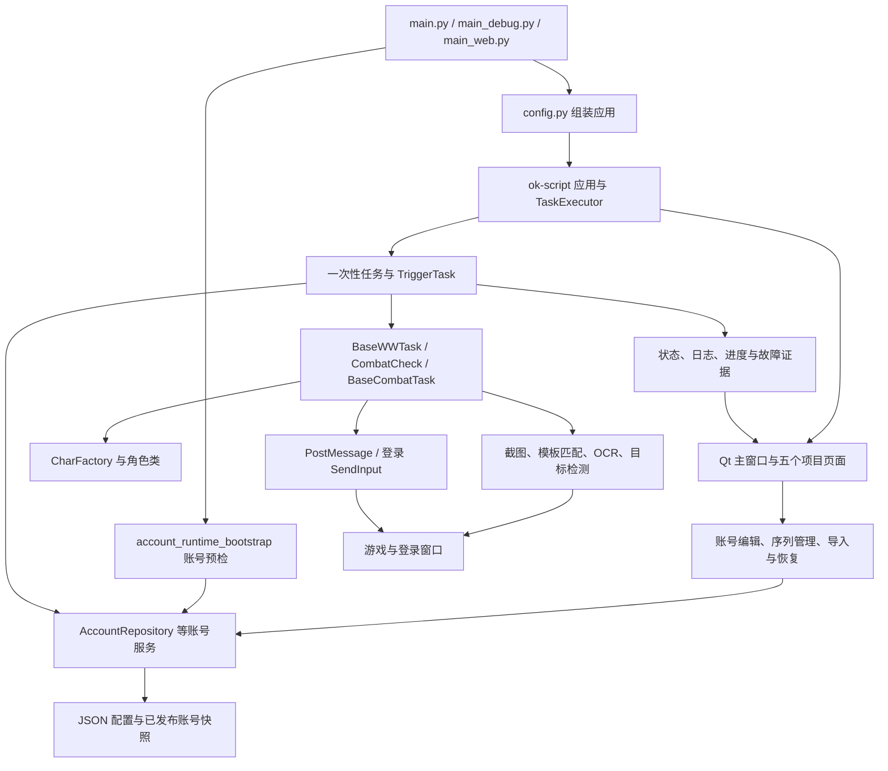
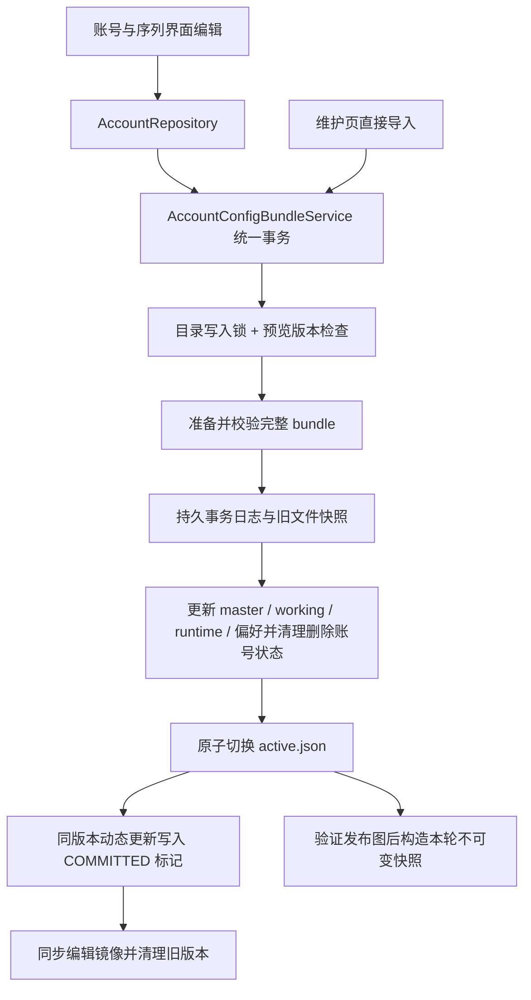
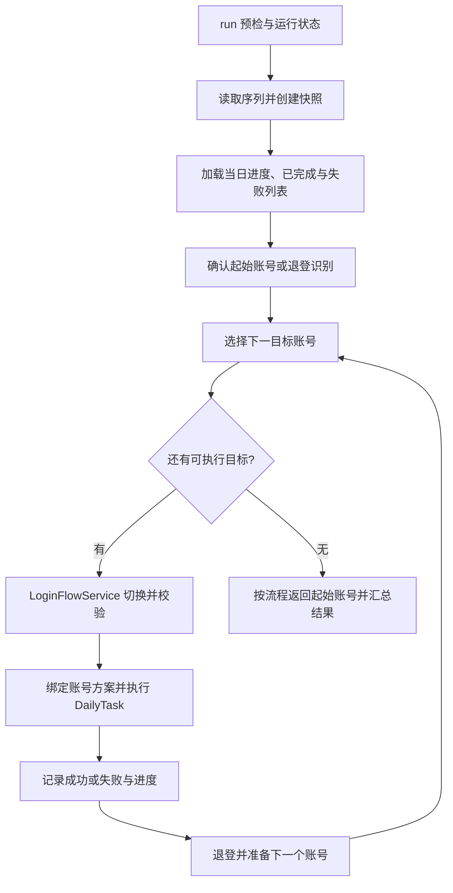

# OK-WW 程序结构说明

审查基线：`3fd591a5` / `1.31.15`；本文已同步整改批次 A/B/C（`1.33.00`），整理日期：2026-09-06。

本文描述当前代码实际实现的结构、调用关系和数据流。缺陷证据与修复优先级见配套的[全面代码审查报告](reviews/2026-09-06全面代码审查.md)。仓库中的历史设计方案可以解释演进过程；若与实现不一致，以这里注明的代码基线为准。

## 1. 程序定位与技术组成

OK-WW 是基于 Windows 图像识别和输入模拟的《鸣潮》自动化程序。它通过截图判断游戏状态，执行日常、副本、声骸收集、自动战斗、活动与多账号切换，再把执行进度、配置和诊断信息保存在本地文件中。

主体是一个 Python 桌面应用。Qt 界面、设备管理、任务执行器、配置控件和调度能力主要来自 `ok-script`；本仓库实现游戏规则、角色轮转、账号管理，并通过 `custom_ok/` 覆盖部分框架实现。没有独立数据库服务，也不是前后端分离的 Web 系统。

| 层面 | 当前实现 |
| --- | --- |
| 运行平台 | Windows；发布和 CI 使用 Python 3.12，本次本地验证为 3.12.13 |
| 自动化框架 | `ok-script==1.0.190`；对外以 `ok` 包导入 |
| 桌面界面 | PySide6、qfluentwidgets；主窗口、托盘、设置页和任务状态浮窗 |
| 图像与识别 | OpenCV、NumPy、COCO 模板标注、onnxocr；默认推理配置启用 OpenVINO/NPU |
| 目标检测 | `assets/echo_model/echo.onnx`，通过 OpenVINO 或可选 ONNX Runtime 适配器调用 |
| 游戏截图 | 默认优先 Windows Graphics Capture，回退 BitBlt；登录切换另有前台显示器截图路径 |
| 输入 | 常规游戏操作走 PostMessage；登录切换使用经过窗口校验的前台 SendInput |
| 持久化 | JSON 配置、按内容版本存储的账号快照、文件哈希、目录备份、Windows DPAPI/ACL |
| 测试与发布 | unittest、PowerShell 分组入口、GitHub Actions、pyappify；文档使用 MkDocs |

这里的 Python 3.12 是已经验证的项目运行基线。旧 README/setup 中“Python ≥3.9”的表述与源码使用的 `StrEnum` 等能力不一致，不应据此推断所有较旧解释器都受支持。

## 2. 目录与代码规模

以下是源代码布局；账号和日志等运行目录在第 10 节另列，避免把源码与本地运行数据混在一起。

```text
ok-wuthering-waves-master/
├── main.py                       正常桌面启动入口
├── main_debug.py                 调试入口
├── main_web.py                   可选 Web 入口
├── config.py                     版本、框架配置、任务注册、全局选项
├── src/
│   ├── task/                     一次性任务、触发任务、任务基类
│   ├── combat/CombatCheck.py      战斗状态判断
│   ├── char/                     角色行为、角色工厂、自定义角色加载
│   ├── scene/WWScene.py           同一帧内的场景结果复用
│   ├── gui/                      项目设置页、账号页、状态浮窗等
│   ├── runtime/                  账号运行初始化与小型运行服务
│   ├── account_*.py              账号身份、仓库、编辑、发布、配置包、证据
│   ├── sequence_repository.py    序列编辑与不可变运行快照
│   ├── config_integrity.py       总配置完整性、迁移、修复、启动保护
│   ├── config_backup.py          整体配置快照与恢复
│   ├── secure_backup.py          DPAPI、目录权限和恢复路径校验
│   ├── logout_capture.py         账号切换截图上下文
│   ├── win32_login_input.py      登录窗口前台激活与输入投递
│   ├── task_status.py            任务状态到界面的桥接
│   ├── observability.py          日志脱敏、关联上下文和安全调用结果
│   ├── diagnose.py               诊断摘要与保留策略
│   ├── storage.py                自定义“ok仓库”目录解析
│   ├── globals.py                全局模型懒加载等共享能力
│   ├── Labels.py                 图像特征名称枚举
│   ├── *Yolo8Detect.py           两种目标检测后端
│   └── upstream_check.py         上游更新提示
├── custom_ok/ok/                 启动时复制到已安装 ok 包的框架覆盖文件
├── assets/                      COCO 标注、模板图像、检测模型等
├── icons/                       图标
├── i18n/                        gettext 的 .po 源文件和 .mo 编译结果
├── tests/                       单元、集成、界面、图像和故障注入测试
├── scripts/                     测试入口、配置/版本/包检查、角色移植工具
├── .github/workflows/           测试、打包、签名、文档和仓库维护工作流
├── .agents/skills/              项目开发、翻译、角色和发布约定
├── docs/                        用户文档、开发说明、设计历史和审查结果
├── run_tests.ps1                官方分组测试入口
├── requirements*.txt / .in      运行、开发、文档依赖
├── pyappify.yml                 安装器构建配置
├── 打包更新.py                   另一条手工增量更新包路径
└── 更新日志.md                   产品更新记录
```

规模按审查时受 Git 管理的 Python 文件统计，不包含 `.venv` 和本地生成文件。文件行数用于定位维护重心，不作为质量评分。

| 范围 | Python 文件数 | 行数 | 说明 |
| --- | ---: | ---: | --- |
| 全仓库 | 255 | 55,231 | 包括测试、脚本和项目技能里的 Python 工具 |
| `src/` 与 `custom_ok/` | 155 | 37,131 | 项目主体实现 |
| `src/task/` | 31 | 15,043 | 含基类、辅助规划器和未注册任务 |
| `src/char/` | 53 | 7,602 | 50 个注册角色类，以及基类、工厂和加载器 |
| `src/gui/` | 22 | 2,678 | 包括未挂载到当前默认导航的保留模块 |
| `src/runtime/` | 9 | 438 | 小型运行服务，不是完整执行引擎 |
| `custom_ok/` | 11 | 3,297 | 框架覆盖代码 |
| `tests/` | 80 | 15,383 | 官方入口执行其中 79 个文件，另有测试辅助文件 |

体量最大的维护入口是 `MultiAccountDailyTask.py`（3,317 行）、`DailyTask.py`（1,830 行）、`AutoAbyssTask.py`（1,813 行）、`config_integrity.py`（1,635 行）、`BaseWWTask.py`（1,467 行）和 `BaseCombatTask.py`（1,212 行）。账号切换和完整性模块的复杂度主要来自兼容与状态恢复；不宜只按行数机械拆分。

## 3. 总体调用关系



需要同时理解两种扩展方式：`src/` 由配置或 Python 模块正常导入；`custom_ok/` 由 `main.py` 复制进环境里的 `ok` 包后生效。只修改 `.venv/Lib/site-packages/ok/` 容易被下一次启动覆盖，升级 `ok-script` 也可能改变覆盖文件依赖的内部接口。

## 4. 启动与退出

### 4.1 正常入口 `main.py`

主要顺序如下：

1. 处理允许列表内的 `.pth` 路径，完成 pywin32 等运行依赖的路径引导。
2. `_sync_custom_ok()` 将项目维护的 11 个框架文件复制到安装环境。
3. `_ensure_single_instance()` 按 Python 进程命令行中的 `main.py` 绝对路径检查同一入口是否已有实例。
4. `_setup_proxy()` 检查并修复打包仓库使用的 GitHub 代理配置；这一段属于同步启动步骤。
5. 注册 `_exit_cleanup()`，并以守护线程运行 `check_upstream()`，用于上游更新提示。
6. 调用 `initialize_account_runtime(root, version)`，恢复未完成的发布暂存目录、进行配置完整性检查、注册敏感信息脱敏，并安装任务启动保护。
7. 构造 `OK(config)`。框架建立任务对象、设备、界面和控制器，然后 `ok.start()` 进入应用生命周期。

账号预检在 `OK(config)` 构造任务前进行，避免任务或设备先开始工作。初始化采用进程内单例和 `RLock`；同一进程重复初始化不同根目录会被拒绝。

初始化账号保护失败、框架构造或启动失败时，入口会写启动错误日志并尝试显示 Windows 消息框。退出清理涉及启动器与 WebView 进程；它并不是按框架任务列表逐个完成业务收尾。进程归属边界是审查报告中保留的实机验证项。

### 4.2 其他入口

| 入口 | 用途 | 与正常启动的差异 |
| --- | --- | --- |
| `main_debug.py` | 调试配置下构造 `OK` | 同样初始化账号运行服务，但不包含正常入口的全部补丁同步、代理和退出处理步骤 |
| `main_web.py` | 可选的框架 Web/Uvicorn 入口 | 关闭 Qt GUI，默认监听 `127.0.0.1:8000`；调试通过环境变量显式开启，依赖框架可选 Web 能力 |

本次验证覆盖了项目离线测试，没有启动实际 Web 服务或用这些入口操控游戏。因此不能把桌面测试通过等同于 Web 入口已完成部署验证。

## 5. 界面结构与配置控件

`custom_ok/ok/gui/MainWindow.py` 负责主窗口组合。`src/gui/navigation_sections.py` 定义五个项目区及任务分类：优先使用任务的 `navigation_section`，再按 `group_name` 分类，否则归入普通任务。

| 项目页面 | 主要组合 | 责任 |
| --- | --- | --- |
| 通用设置 | `GeneralSettingsTab` → `StartTab`、`TriggerTaskTab`、全局配置控件 | 监控与启动、实时触发、游戏热键、全局行为；检查程序启停键与游戏键冲突 |
| 账号设置 | `AccountSettingsTab` → `AccountConfigTab`、`SequenceManagementTab`、账号维护版 `SettingTab` | 账号草稿、任务参数、序列顺序、导入导出、备份和完整性处理 |
| 任务 | `TaskHubTab` → 按 TASKS 过滤的 `OneTimeTaskTab` | 普通一次性任务的配置和执行入口 |
| 活动 | `ActivityHubTab` → 两个按活动类型过滤的 `OneTimeTaskTab` | 限时活动与常驻活动；当前 `EventTask` 显式归属常驻活动 |
| 测试功能 | `TestHubTab` → 按 TESTS 过滤的任务页 | 账号切换专项测试和自动深渊 |

此外还有“程序设置”“About”“重启程序”等辅助入口；调试模式增加 Debug/Run Code。五个项目区并不意味着主窗口总共只有五个导航项。

账号和序列编辑后，页面发送 `AccountChangeEvent`。`AccountSettingsTab` 刷新相关兄弟面板，再由 `MainWindow.refresh_account_consumers()` 更新任务消费者。刷新逻辑会考虑保留未保存草稿、运行中的任务延迟更新部分选项，但它本身不能保证执行代码不再读取新磁盘数据，见审查 R03。

配置控件分为三层：框架的通用类型控件、`custom_ok/ok/gui/tasks/ConfigItemFactory.py` 等覆盖实现、项目的 `LabelAndAccountSequence`/整数下拉/多选控件。`account_field_metadata.py` 提供账号字段的中文名称、帮助文字、输入类型以及显示值与存储值的转换；界面中文翻译不应顺带改变既有配置键。

`SectionPanel`、`FlatSettingRow`、`CodexTheme` 等负责公共外观。`DailyProfileDialog`、`ConfigIntegrityDialog` 等负责专项对话框。

`CharacterCodeTab.py` 保留了自定义角色代码编辑和即时替换实现，但当前 `config.py['custom_tabs']` 为空，五个默认页面也没有实例化它。不能把该模块存在描述成当前默认界面已经提供了角色编辑入口。`PermanentEventTab.py` 等保留模块也应与实际主窗口注册情况区分。

`TaskStatusWindow` 是单独的置顶、鼠标穿透状态浮窗，每 500ms 读取一次任务状态，并尝试从截图中排除自身。它使用 `src/task_status.py` 读取当前任务信息；任务执行并不依赖浮窗是否显示。

## 6. 框架任务生命周期与公共基类

`config.py` 通过“模块路径 + 类名”注册任务，框架负责实例化和配置保存。一次性任务由用户或调度器启动；触发任务由框架按启用状态和时间间隔调用。任务里的 `run()` 执行业务流程，`default_config`、`config_description`、`config_type`、`sub_configs` 等元数据参与界面生成。

主要继承链为：

```text
ok.BaseTask
  └── BaseWWTask               世界状态、窗口、OCR、移动、菜单、登录等通用动作
      └── CombatCheck         进入/退出战斗、目标丢失、死亡等判断
          └── BaseCombatTask  队伍加载、角色切换、技能调度、复活与战斗循环

WWOneTimeTask                 一次性任务 mixin，处理激活和鼠标复位配合
  + BaseCombatTask           Daily/Multi/FarmEcho/Nightmare/Tacet/AutoAbyss 等
  + BaseWWTask               Event/Garden 等非战斗主流程

DomainTask                   WWOneTimeTask + BaseCombatTask
  ├── ForgeryTask
  └── SimulationTask

SkipBaseTask                 BaseWWTask 的对话跳过辅助逻辑
  + TriggerTask              AutoDialogTask
```

这里 `WWOneTimeTask` 是多继承配合用的 mixin，不是独立执行器；某个任务是否属于一次性任务最终由注册列表决定。例如 `MergeEchoTask` 直接继承 `BaseWWTask`，同样注册在一次性任务列表中。

停止和暂停依赖框架执行器、任务可中断的 `sleep`/等待方法，以及 `TaskDisabledException` 传播。项目中的 `GameProcessLost`、`FrameUnavailable`、`NotInCombatException`、角色死亡/复活异常进一步区分恢复或退出原因。新增循环需要沿用这些机制，避免普通阻塞等待让用户停止操作失效。

`runtime/TaskRunCoordinator` 记录 idle、preflight、ready、running、stopping、stopped、failed 等状态；它没有取代 `TaskExecutor`，其 `request_stop()` 修改状态并不等于底层输入线程已经停止。实际 UI 状态桥接还使用另一套轻量的 `task_status.py`。

## 7. 当前注册的任务

### 7.1 一次性任务：12 个

下表“责任”是代码层概述，具体执行范围受账号配置和任务选项控制。

| 类/文件（均在 `src/task/`） | 责任 | 主要复用 |
| --- | --- | --- |
| `DailyTask.py` | 单账号日常、体力消耗、奖励领取、可选周常和完成记录 | BaseCombatTask、具体副本任务、账号完整性服务 |
| `MultiAccountDailyTask.py` | 按序列选择账号、登录、执行日常、退登、续跑和返回起始账号 | DailyTask、LoginFlowService、账号仓库 |
| `FarmEchoTask.py` | 选择目标、传送、战斗、吸收声骸并重复 | BaseCombatTask、模板与目标检测 |
| `NightmareNestTask.py` | 梦魇拔除/残象聚落等目标的遍历与刷取 | BaseCombatTask、NestTarget |
| `TacetTask.py` | 无音区刷取及奖励交互 | BaseCombatTask、BaseWWTask 公共菜单能力 |
| `ForgeryTask.py` | 凝素领域材料副本 | DomainTask |
| `SimulationTask.py` | 模拟领域经验/贝币等材料副本 | DomainTask |
| `MergeEchoTask.py` | 合成已丢弃声骸 | BaseWWTask |
| `GardenTask.py` | 周常乐园界面动作与奖励处理 | WWOneTimeTask、BaseWWTask |
| `EventTask.py` | 当前配置的“悲鸣行动：无音危机”常驻活动 | 状态识别、商店/选项、按键循环 |
| `TestAccountSwitchTask.py` | 单目标与连续账号切换专项验证 | 生产 MultiAccountDailyTask 的选取、匹配、校验、重试、退登、登录方法 |
| `AutoAbyssTask.py` | 深渊塔层扫描、角色识别、能量约束组队与挑战 | BaseCombatTask、abyss_team_planner |

`EventTask` 是具体活动流程，不是可描述任意活动的通用脚本引擎；活动规则发生变化仍需要修改代码和识别素材。

### 7.2 触发任务：6 个

默认启用值指代码默认配置，用户已保存的设置可以覆盖它。间隔是框架检查间隔，不代表每次执行能在该时长内结束。

| 类 | 默认启用 | 本类指定的间隔 | 责任 |
| --- | --- | --- | --- |
| `AutoCombatTask` | 是 | 0.1s | 在适用场景中进入自动战斗 |
| `AutoPickTask` | 是 | 继承框架默认值 | 按白名单/黑名单识别拾取与吸收提示 |
| `AutoLoginTask` | 否 | 5s | 游戏启动后的登录/进入世界辅助 |
| `AutoDialogTask` | 是 | 0.5s | 跳过对话、处理部分确认框；实现文件为 `SkipDialogTask.py` |
| `FastTravelTask` | 否 | 继承框架默认值 | 地图快速旅行按钮辅助 |
| `MouseResetTask` | 是 | 触发入口 10s；启动后的回调通常 20Hz | 在适用的后台窗口情形下纠正鼠标位置跳动 |

### 7.3 保留但未注册的代码

`EnhanceEchoTask`、`ChangeEchoTask` 在配置中被显式隐藏；`KRLauncherSwitchTask` 标记为废弃；`DiagnosisTask` 未启用；`FarmMapTask`、`FiveToOneTask` 没有列入当前任务注册。它们的文件存在、甚至有部分测试，不代表产品默认会构造和执行这些任务。

`process_feature.py` 是特征处理函数，`abyss_team_planner.py` 是组队计算模块，`DomainTask` 和 `SkipBaseTask` 是复用基类，同样不应计为独立用户功能。

## 8. 账号模型与服务分工

### 8.1 账号、身份、方案、序列

账号的稳定主键是 UUID `profile_id`。显示名和 A1/A3/A4 这类短名称用于选择与展示，不能替代主键。手机号、掩码手机号、昵称、备用识别名和游戏特征码属于不同的识别字段；账号的 `task_config` 保存日常和副本偏好。

序列保存有序的账号 UUID 引用。`SequenceRunSnapshot` 记录序列标识、版本、顺序、每个账号的身份与任务配置，以及独立 `run_id`；通过 tuple 和递归 `MappingProxyType` 冻结内容。

`account_identity.py` 负责 Unicode NFKC 归一化、短名称精确匹配、手机号/掩码手机号/别名匹配和冲突检查。A1 不应匹配 A10；同一识别文本对应多个账号时应报告歧义。游戏特征码有单独使用条件，不能默认当作所有登录页面的识别依据。当前生产兜底路径仍有停用别名被使用的问题，见 R05。

### 8.2 服务职责表

| 模块 | 当前责任 | 边界说明 |
| --- | --- | --- |
| `account_repository.py` | 账号/序列读取、配置编辑提交、模板、新建/删除、账号备份及另一套运行状态 API | 运行读取优先已发布账号图；没有 active 时兼容旧索引 |
| `account_config_editor.py` | 建立脱离原对象的编辑草稿、锁定身份字段、计算差异、校验编辑范围和版本 | 普通任务参数编辑与身份重绑是不同操作 |
| `account_rebind_service.py` | 显式更改账号身份，预览差异、碰撞校验、备份和版本检查 | 不应通过修改普通任务字段绕过身份保护 |
| `account_field_metadata.py` | 账号字段的展示、输入类型和中英文值映射 | 保留存储键的兼容性 |
| `account_directory_assessment.py` | 判断账号目录内容、提供可展示的目录评估结果 | 用于选取/维护时的预检 |
| `account_graph_store.py` | 包装整张已发布账号图的读写 | `ActiveAccountGraph` 返回独立数据副本；不是数据库连接 |
| `account_publish_service.py` | 写完整 bundle、建立清单、切换 active、同步编辑镜像、清理旧版 | active 更新是实际生效点；后续镜像可能失败 |
| `account_profile_store.py` | `configs/accounts/` 下逐账号 JSON 的编辑 API | 当前运行仓库并非直接从这些文件逐账号加载 |
| `sequence_repository.py` | 创建、复制、重命名、排序、启停、删除、引用校验、快照 | 对账号成员做精确解析；运行快照尚未贯穿生产执行，见 R03 |
| `account_config_bundle.py` | 配置包导入导出、预检、分区摘要、格式升级和旧文件事务回滚 | v3 为当前导出格式，兼容 v1 升级/v2；直接导入未接入 active 发布，见 R01 |
| `config_integrity.py` | schema 校验、受保护字段、master/working 对比、已接受指纹、事故目录、迁移与修复 | 主任务完成记录目前仍由它写入 configs 下的运行状态文件 |
| `runtime/account_runtime_bootstrap.py` | 初始化服务单例、恢复暂存、安装启动保护和脱敏 | GUI、其他入口与任务共享的预检入口 |

`ProfileRecord.revision` 当前反映整张账号图的摘要，即使界面只编辑一个账号，也可能因为另一处更新而发生版本冲突。版本比较类似“仅当读取版本仍是当前版本时才提交”的比较并交换机制；进程内锁和摘要不能自动替代跨进程事务锁。

### 8.3 运行侧小服务

| 模块 | 责任 |
| --- | --- |
| `account_selection_service.py` | 账号候选解析和选择逻辑 |
| `account_verification_service.py` | 根据观测身份核对目标账号 |
| `sequence_snapshot_service.py` | 通过仓库创建运行序列快照 |
| `login_flow_service.py` | 编排生产任务已经提供的截图、选取、重试、登录和证据方法 |
| `task_run_coordinator.py`、`task_status_model.py` | 运行元数据及状态描述 |
| `game_runtime_errors.py` | 游戏进程丢失、画面不可用等异常类型 |

这些服务目前规模较小。大量 OCR、下拉框定位和异常处理仍在 `MultiAccountDailyTask`，不能描述成账号自动化已经全部迁出任务类。

## 9. 配置发布与实际生效路径

旧总配置与工作投影继续兼容既有任务；发布图是存在 active 后的运行读取入口。`1.32.00` 已把仓库编辑、删除与整包导入收敛到同一提交路径。



`account_change_lock.py` 为同一 configs 目录提供共享可重入锁，并使用 Windows 命名互斥量协调不同进程。普通编辑在锁内读取最新运行数据和偏好；整包导入在同一应用有任务运行或暂停时拒绝开始。预览同时记录 active 版本和 master 指纹，提交前分别核对。

`prepare()` 安装已校验 bundle，`activate()` 原子切换 active。不同 revision 以实际 active 判断是否提交；同 revision 的偏好/运行数据更新，以独立事务的持久 COMMITTED 标记判断。启动首先恢复配置目录外 `.configs-restore/journal.json` 记录的完整目录替换，再恢复 `.import-transaction.json`，再恢复 `.maintenance.json` 并执行完整性检查。提交前失败还原旧文件及原本不存在的状态，提交后故障保留新图并报告“配置已生效，维护待恢复”；损坏或不匹配的恢复材料保留并阻止执行。

`configs/accounts/` 是编辑镜像，`daily_profiles.json` 是按显示名组织的兼容投影。维护失败不能重新宣称配置未生效，直接改镜像文件也不构成发布。成功维护后默认保留两个发布版本；未完成事务引用的版本不被提前清理。

R01–R03 已在批次 A 修复。`SequenceRunSnapshot` 固定 UUID 顺序及账号/任务值，并保留本轮身份映射；Daily 使用脱离 Config 的参数副本。界面普通编辑在下一轮生效；独立身份检查在输入前发现删除或身份变更时停止，嵌套副本任务共用该检查，释放按键不被阻止。每次投影/快照构造仅加载一份完整图，不使用跨操作缓存。

账号与序列编辑通过 `gui/BackgroundOperation.py` 的 QThreadPool 工作者提交捕获后的草稿和版本，结果通过排队 Qt signal 回到 GUI 线程；单个控件组只允许一个提交，销毁父窗口会断开结果接收。账号切换选中项后，旧结果仅发送变更事件，不覆盖新账号表单；失败和外部刷新保留草稿。维护页的预检/写盘由 Daily 公用流程调度，确认对话框仍位于 GUI 线程。整体恢复的预览还包含清单与当前账号版本摘要，避免后台等待期间数据变化被覆盖。实际测量见[性能整改记录](reviews/2026-09-06性能整改测量.md)。

## 10. 数据目录、备份与隐私边界

以下路径按程序根目录表示，`<uuid>`、`<revision>`、`<time>` 都是占位符，不是真实账号。部分目录按需创建，并不保证每次安装均存在。

| 路径 | 保存什么 | 当前读取/写入关系 |
| --- | --- | --- |
| `configs/account_master_config.json` | schema-v1 旧总配置、账号身份、任务参数、序列 | 完整性服务主要输入；无 active 时仓库兼容来源 |
| `configs/daily_profiles.json` | 以显示名为键的旧任务方案投影 | 兼容旧任务/UI，不是 active 存在后的优先数据源 |
| `configs/account_runtime_state.json` | 完成记录、每日进度等动态状态 | **Daily/Multi 当前主路径通过完整性服务读写** |
| `configs/DailyTask.json`、`MultiAccountDailyTask.json` | 框架任务偏好、选中项等 | 与逐账号 `task_config` 共同参与运行 |
| `configs/accounts/index.json`、`sequences.json`、`profiles/<uuid>.json` | 索引、序列和逐账号编辑镜像 | 发布后同步；有独立 ProfileStore API |
| `configs/published/active.json` | 当前账号图的版本和清单摘要 | 运行仓库的优先生效指针 |
| `configs/published/bundles/<revision>/` | `profiles/<uuid>.json`、index、sequences、master、working、manifest | 按内容版本保存的完整账号快照 |
| `configs/custom_chars/<Class>.py`、`configs/custom_chars/custom_chars.json` | 自定义角色 Python 源码及启用配置 | 由 CustomCharLoader 加载 |
| `运行状态/账号/<uuid>.json`、`运行状态/全局.json` | 仓库提供的逐账号完成记录/全局进度 | 是另一套 API，**不是上面的 account_runtime_state.json** |
| `账号备份/<uuid>/<time>.json` 及 `.json.dpapi` | 单账号事务备份的元数据与加密内容 | 默认使用当前 Windows 用户 DPAPI 加密负载 |
| `configs_backup/daily/`、`configs_backup/transactions/` | 全 configs 目录的每日/事务快照与 manifest | 默认目录；每日首次主窗口启动时尝试备份 |
| `config_bundle_transactions/` | 旧格式配置包事务前副本 | 用于导入等事务恢复，有权限与保留策略 |
| `config_integrity_incidents/` | 配置完整性异常的待处理材料 | 用于诊断、差异展示和恢复决策 |
| `screenshots/account_switch_failures/` | 切换失败/停止的帧、事件和上下文 | 按证据保留策略清理 |
| `logs/`、`cache/` | 日志、更新提示等缓存 | 排错和运行辅助数据 |
| `okww监控室/` | 可选的日常任务监控录像 | 可迁移到自定义仓库子目录 |

选择“数据仓库文件夹”后，`storage.py` 解析为 `<所选目录>/ok仓库/`，包含 `配置备份`、`账号数据`、`okww监控室`。`resolve_config_backup_dir()` 统一配置备份的优先级：数据仓库、旧备份目录设置、程序目录下 `configs_backup`；启动、清理、维护和 Daily 恢复共用设置适配器。指向 configs 内部的设置回退默认目录。

备份能力需要区分：

- `ConfigBackupService` 复制完整配置目录，记录文件数量/长度/哈希，支持预检、恢复暂存、目录替换与中断恢复。默认保留 30 个每日快照、20 个事务快照，总容量上限 2 GiB；数量和容量清理遇到删除失败或无进展会记录警告并结束；恢复期间保留所有快照。
- 整体恢复要求源在选定备份目录、目标为服务配置目录，拒绝路径穿越、符号链接和 Windows junction；在目标父目录创建暂存目录，跨盘复制后仅在目标盘改名。目标侧恢复日志位于 `.configs-restore/journal.json`，提交前中断回滚旧目录、持久 activated 后完成清理；旧备份目录中的 v1 日志仍可恢复。最终调用账号事务恢复入口并验证 active 与旧投影一致。
- `SecureBackupService` 使用当前用户 DPAPI 加密单账号备份负载。它不等于可跨电脑、跨 Windows 用户直接恢复的便携加密格式。
- 完整配置快照和部分事务副本主要依赖 Windows ACL 限制访问，内容不全是加密文件。不能把“存在 DPAPI”写成“所有配置、截图、导出都已加密”。

导出包、日志、截图各自有不同的脱敏处理。文件哈希用于一致性校验，不代表发布者签名或所有导出内容都已经去敏。可分享的排错材料需要按实际导出方式判断，不能只凭文件所在目录推断。

## 11. 单账号日常与多账号执行链

### 11.1 `DailyTask`

核心入口为 `run()`，主要阶段包括：

1. 通过账号运行预检，绑定已核验账号的方案，并确保进入游戏世界。
2. 读取活跃度、体力等状态；按配置判断是否需要梦魇声骸等日常条件。
3. 分派到无音区、凝素领域或模拟领域等体力任务。
4. 重新检测并领取日常奖励；未知/未完成的结果通过专门异常区分，避免将未完成误记成功。
5. 领取邮件和战令奖励，并按配置执行周常乐园、周日声骸合成等收尾。
6. 完成可选录像、退登等行为，并按稳定账号 ID 记录完成情况。

`bind_verified_profile(..., snapshot_profile=...)` 将预期账号 ID 与本轮参数副本关联；独立 Daily 在入口绑定并在 finally 释放，多账号调用传入固定快照，不把旧参数或名称写回用户偏好。`runtime_config_override()` 提供临时覆盖；多账号任务借此接管 Daily 的退登选项，避免修改用户保存的偏好。恢复和 UI 设置也集中在同一个较大的 `DailyTask.py` 中，阅读时可先看 `run()` 再按被调用方法展开。

### 11.2 `MultiAccountDailyTask`



多账号类拥有整轮执行控制：当日断点续跑、跳过已完成/已失败目标、确认起始账号、逐个登录运行、退登、返回原账号和汇总部分失败。关键阅读入口是 `run()`、`_run_inner()`、`_next_target_account()`、`switch_to_account()`、`_run_daily_account()`。

图中的“创建快照”是当前存在的步骤，但后续选择和配置绑定尚未完全使用它；运行期间修改实时序列可能改变下一目标。这个已复现问题需要修复，不能依靠 UI 延迟刷新推断其不存在。

### 11.3 登录切换与专项测试

`LoginFlowService.switch_to_account()` 的实际编排是：

```text
账号过渡保护
  → 开始故障证据会话
  → 暂停 MouseResetTask
  → 进入切换截图上下文
  → 若仍在游戏世界，先退登
  → 等待稳定登录画面（120s）
  → 选择目标账号并重试（默认最多 5 次）
  → 登录前再次核对目标并点击
  → 等待进入主界面（180s）
  → 成功清理证据；异常/停止保存证据
  → finally 恢复截图上下文与鼠标复位设置
```

具体的登录文字 OCR、下拉展开、原生 ComboBox/ComboLBox、选择结果核对仍由 `MultiAccountDailyTask` 的方法实现，服务主要控制步骤顺序和资源恢复。

`TestAccountSwitchTask` 是该路径的专项入口，复用生产选择、别名匹配、核对、重试、退登和登录方法。默认连续顺序为 **A1 → A3 → A4**，按精确短名称解析，并覆盖备用登录名与掩码手机号；它不应再维护另一份切换算法。当前单目标列表存在漏导入造成空选项的问题，见 R06。

## 12. 截图、识别和输入如何配合

| 模块/机制 | 作用 | 阅读时应注意 |
| --- | --- | --- |
| `config.py['windows']` | 指定目标进程 `Client-Win64-Shipping.exe`、UnrealWindow、登录弹窗类型 | `start_exe=False`，任务开始不会自动启动游戏本体 |
| `custom_ok/.../windows_graphics.py` | 项目定制的 WGC 截图实现 | 与安装环境的 Windows/框架接口有关 |
| `logout_capture.py` | `CaptureSample` 带图像、坐标原点、窗口、来源、时间；切换上下文管理捕获状态 | 登录弹窗可能不是游戏主窗口，必须保持坐标系与窗口归属一致 |
| `win32_login_input.py` | 前台激活、目标 PID/可见性/可用性/命中窗口检查，再投递 SendInput | 使用 `finally` 恢复线程输入附加关系；不能把登录切换称为始终后台操作 |
| `WWScene` | 同帧内复用队伍、战斗、冷却等场景结果 | 减少触发任务重复判断，不是跨任意时长缓存画面 |
| `Labels.py` + COCO 标注 | 将稳定特征名映射到模板和位置 | 本次核对 277 个枚举值均有对应类别，共 278 类 |
| `BaseWWTask` | 包装模板、颜色、OCR、窗口坐标、世界状态与菜单操作 | 多处使用相对屏幕比例和局部识别区域 |
| `Globals.yolo_model` | 首次使用时加载声骸检测模型 | 复用全局模型，依据 OpenVINO 配置选择后端 |

配置声明游戏画面为 16:9，最小 1280×720，并提供 1280×720 至 2560×1440 的调整目标。普通窗口、登录窗口和显示器截图的坐标不能相互混用；多显示器、DPI 缩放、遮挡和失去前台是需要实机覆盖的边界。

项目有多语言 UI 和部分中英文 OCR 规则，但具体任务仍存在中文专用识别与固定特征。翻译文件齐全不代表所有游戏语言、服务器界面和分辨率都已经实测等价。

证据采样在复制前检查间隔、空帧和单帧大小，保留原有 60 秒/30 帧/2 秒间隔，同时每个会话的原始帧缓冲最多 128 MiB。强制关键帧不能绕过容量上限；时间、数量和容量淘汰均扣减字节数。失败写入接管缓冲，写完释放；成功结束直接清空。该值不包括调用方图像、JPEG 临时副本或其他会话。

## 13. 战斗、角色轮转与深渊

### 13.1 战斗的三层分工

`CombatCheck` 判断是否进入/离开战斗、血条与目标是否可见、是否死亡，并处理目标短暂丢失等情况。目标丢失存在约 6 秒的宽限逻辑，因此不能只看某一帧没有血条就解释为已经退出战斗。

`BaseCombatTask` 负责队伍角色加载、冷却与协奏状态、增益计时、换人优先级、治疗与复活、战斗循环。它调用 `CharFactory` 按队伍头像定位并复用角色对象。

`BaseChar` 负责角色共有行为：普通攻击/重击、共鸣技能、共鸣解放、声骸、变奏/延奏相关判断、动画冻结计时、增益与切换优先级。具体角色类实现各自轮转或资源条件；修改一个角色通常应在对应类内完成，只有多个角色共享的机制才进入基类。

### 13.2 注册、识别和自定义代码

`CharFactory._char_dict_raw` 建立特征名 → 类、角色类型、元素、增益时间等信息。多个头像/形态标签扩展为同一注册信息，`canonical_name` 提供统一角色标识。默认增益时间一般为 14 秒，治疗类默认为 28 秒，个别角色可以覆盖。

`get_char_by_pos()` 优先尝试复用高置信度旧角色，否则在头像区域匹配注册特征。找到角色后调用 `CustomCharLoader` 决定实际使用内置类还是自定义类；新旧类型不同时会构造新对象。完全无法识别且没有旧对象时回退为 `BaseChar`。

`CustomCharLoader.py` 读取 `configs/custom_chars/`，校验类名和 `BaseChar` 继承关系，按文件修改时间及大小缓存；导入失败时保留内置回退。它执行的是本地 Python 源码，不是限制能力的表达式配置。保留的 `CharacterCodeTab` 负责编辑/保存及即时替换，但默认导航没有挂载，通过 `char_name` 注册表识别角色以支持直接继承 BaseChar 的 v1/v2 连续替换，保留切换和技能计时；任务运行或暂停时延后到下次队伍重建/任务重启。加载器直接编译当前源码，避免同秒同长度编辑命中旧 .pyc。

### 13.3 深渊流程

`AutoAbyssTask` 在测试功能中提供较长的状态驱动流程：检查画面比例 → 扫描三个塔和塔层状态 → OCR 读取角色等级/能量并通过 ORB 等方法识别头像 → 调用 `abyss_team_planner` 生成队伍 → 核对 1/2/3 队伍槽位 → 挑战与战斗 → 根据成功/失败和剩余能量继续或重组。

塔层区分 completed、available、locked、unknown。未知状态会跳过，不应将它等同于可挑战或已完成。`abyss_team_planner.py` 把角色定位、预设和能量约束从点击流程分离出来，适合离线测试；画面识别、切队、时间限制仍需要实机验证。

## 14. 观测、诊断和通知

`observability.py` 在配置导入、启动和测试入口较早安装脱敏，维护敏感值注册表，并提供关联上下文和安全调用结果。手机号等模式与已注册身份字段经过日志处理；`diagnose.py` 输出可用于排查的状态摘要和保留记录。

`task_status.py` 将账号、阶段、详情写入当前执行任务的 `info`。当 Multi 调用 Daily 等子流程时，状态归属可以回到执行器的 `current_task`，让浮窗显示整轮任务的阶段。读取时综合 Error、Warning、暂停状态、运行时长和完成数量；浮窗错误被隔离，避免显示故障中断主任务。

`AccountSwitchEvidenceSession` 保存最近约 60 秒的上下文，默认按约 2 秒间隔采样，最多 30 帧；成功后丢弃，失败或停止时保存截图与事件。默认按 7 天、20 个事件、500 MB 等限制保留磁盘证据。这些磁盘上限不限制运行中原始帧的内存占用，审查报告提出了采样前判断间隔和按字节限制缓冲的优化。

`custom_ok/ok/notification/windows_messenger.py` 是 Windows 消息软件自动化适配；其输入操作属于额外外部行为，不是日志输出的另一种格式。本次审查没有运行它发送通知，也没有验证真实消息窗口。

`upstream_check.py` 提供上游提交更新提醒，不自动合并角色或替用户更新源码。代理修复、软件版本更新和角色代码移植是不同机制，维护时应分别排查。

## 15. 测试、构建与发布

### 15.1 测试组织

官方入口 `run_tests.ps1` 将文件分为 unit、integration、ui、image、fault_injection；`all` 会对重复文件去重，逐个启动 Python 进程。`scripts/run_test_file.py` 由父进程监督专属子进程树，在子进程安装脱敏并使用 unittest；默认超时 180 秒覆盖解释器退出阶段，每个文件生成通过/失败/超时及用例计数 JSON。未生成结果而直接退出不算通过。这种隔离也用于减小 Qt、框架全局对象和 monkey patch 在文件间残留的影响。

在仓库根目录常用的离线验证命令为：

```powershell
.\run_tests.ps1 -Group unit
.\run_tests.ps1 -Group integration
.\run_tests.ps1 -Group ui
.\run_tests.ps1 -Group all
.\.venv\Scripts\python.exe .\scripts\run_test_file.py .\tests\TestMultiAccountDailyTask.py
.\.venv\Scripts\python.exe .\scripts\validate_release.py --tag v1.33.00
```

本仓库应优先直接使用 `.venv/Scripts/python.exe`，不依赖 shell 激活。示例版本属于本文基线，未来发布时应替换为实际版本。

本轮 79 个测试文件最终均完成，共 686 项：678 通过、8 项因缺少图片样本跳过。首次总入口在一个已输出 OK 的 Qt 相关测试退出阶段挂起，单独复跑正常；完整过程见审查报告。该结果证明已覆盖用例的离线行为，没有证明所有真实账号、所有角色轮转或安装器都正确。

### 15.2 构建链

`requirements.txt` 固定框架版本并声明运行依赖；`.in` 更偏依赖来源声明，开发和文档另有 requirements 文件。`pyappify.yml` 配置 Python 3.12 和 `main.py`，提供 China/Global 安装器配置。

`.github/workflows/build.yml` 的主链为：版本元数据检查 → Windows 测试 → 标签或手动候选构建时打包 → 包内容检查 → SHA256 校验文件 → 标签发布到 GitHub Release。普通提交/PR 执行验证；手动候选构建不会直接等同于正式 Release。仓库另有独立测试、签名和文档发布工作流。

`scripts/package_smoke.py` 当前检查分发文件和部分 ZIP 内容，不会实际安装并启动 EXE/MSI。ZIP 检查覆盖任何目录层级的 configs、运行数据和越界路径；通知模板例外只接受已关闭通知且清空身份和密钥的默认值。输出单独列出未验证的安装器数量。`打包更新.py` 是独立的手工增量包路径，其中包含部分本机环境的框架文件；不能假定它与 CI 安装器覆盖完全相同的文件集合。

修改代码后的版本规则来自 `AGENTS.md`：固定宽度 `X.YY.ZZ`，小修增加第三段，中等变更新增第二段并归零第三段；只有用户明确要求时才做主版本变更。同步 `config.py`、产品版本展示与更新日志，验证后提交、创建同名注解 `vX.YY.ZZ` 标签并推送。本文与审查报告只新增文档，没有修改业务代码或发版。

## 16. 扩展与排错入口

| 需要做什么 | 首先阅读/修改 | 应同步核对 |
| --- | --- | --- |
| 新增普通任务 | 相似的 `src/task/` 类、`BaseWWTask`/`BaseCombatTask`、`config.py` | `run()` 可中断、配置元数据、导航归属、必要回归和翻译 |
| 新增后台触发 | 相似 TriggerTask、默认启用值、触发间隔 | 同帧场景复用、前台/后台限制、与一次性任务的输入冲突 |
| 新增或调整角色 | `src/char/<Char>.py`、`BaseChar`、`CharFactory` | Labels/COCO 特征名、角色元数据、冻结计时、代表性轮转与自定义加载 |
| 修改账号识别 | `account_identity.py`、选择/核对服务、Multi 的实际兜底方法 | 精确 A1/A10、备用名停用、掩码手机号、歧义拒绝，以及 TestAccountSwitchTask 同步 |
| 新增账号任务选项 | Daily 默认配置、`account_field_metadata.py`、编辑器和完整性规则 | 导出导入、逐账号保存、内存覆盖、旧配置迁移与身份字段隔离 |
| 修改账号保存/删除/导入 | AccountRepository、PublishService、BundleService | 已有 active 时的生效结果、每阶段故障回滚、重启读取、一轮执行快照 |
| 修改序列管理 | SequenceRepository、SequenceManagementTab、Multi 构造和运行 | 引用合法性、启停、顺序、超过十个序列的边界（R04） |
| 修改截图/点击 | WGC 覆盖、logout_capture、win32_login_input | HWND/PID、画面原点、DPI、遮挡、进程丢失、停止时资源释放 |
| 修改状态显示 | task_status.py、TaskStatusWindow、调用方 `publish_task_status()` | 父子任务归属、错误优先级、显示异常不阻断执行 |
| 修改备份/迁移 | config_backup、secure_backup、storage、config_integrity | 自定义仓库、跨卷恢复、目录权限、原子替换、删除失败与动态状态范围 |
| 升级框架 | requirements、全部 `custom_ok` 覆盖、main.py | 覆盖方法签名、实际安装环境、主窗口启动、打包清单 |
| 增加/修正翻译 | 任务英文存储键、gettext `.po`、编译 `.mo` | 不把识别所需 OCR 文本和面向用户的翻译随意互换 |

常见故障的阅读顺序：

1. **配置改了但任务没变**：先判断 active 指向和仓库读取来源，再查旧 master 与镜像；不要通过反复覆盖 `daily_profiles.json` 代替发布检查。
2. **选错账号或无法确认身份**：从失败证据的选择/核对阶段定位，依次检查候选解析、别名启用、实际观察文本和前台窗口，而不是先放宽匹配阈值。
3. **某角色不出手或不断换人**：先查头像对应的注册类，再看 CombatCheck 状态、技能可用性、协奏/增益和冻结计时，最后展开该角色轮转。
4. **程序退出或任务无法停止**：分别检查启动错误日志、框架异常传播和后台回调是否结束；单独修改状态字符串无法停止真实输入。
5. **备份看得见但恢复失败**：先区分单账号 DPAPI 备份与整体配置快照，再确认仓库路径、目标所在卷和恢复预检结果。

账号发布入口、整轮数据版本和操作内图复用已在批次 A 收敛；备份恢复和边界修复已在批次 B 完成，批次 C 已根据测量增加后台写盘和证据帧内存上限，后续处理依赖、打包来源及剩余验证事项。具体缺陷的复现与验收标准在配套审查报告中，后续修复可直接按问题编号拆分。

## 附录：50 个注册角色类

以下按 `CharFactory` 中的框架分类列出类名，便于定位源码；这是自动化调度元数据，不等同于所有玩家配队方式。每个类对应 `src/char/<类名>.py`。

| 分类 | 数量 | 类名 |
| --- | ---: | --- |
| MAIN_DPS | 22 | YangYangSp、HavocRover、Encore、Jinhsi、Changli、Chixia、Calcharo、Jiyan、Xiangliyao、Camellya、Carlotta、Zani、Cartethyia、Phrolova、Augusta、Galbrena、Aemeath、Xigelika、Luhesi、Hiyuki、Lucy、Qingxiao |
| SUB_DPS | 16 | Yinlin、Sanhua、Yuanwu、Danjin、Mortefi、Zhezhi、Roccia、Phoebe、Ciaccona、Lupa、Iuno、Qiuyuan、Denia、Linnai、Lucilla、Rebecca |
| HEALER | 12 | Verina、ShoreKeeper、Suisui、Taoqi、Jianxin、Baizhi、Youhu、Brant、Cantarella、Chisa、Douling、Mornye |

仓库 `i18n/` 包含简体中文、繁体中文、日语、韩语、西班牙语各一组 `.po/.mo`，英文源文本参与默认显示。角色注册完整性、本地翻译存在和真实战斗验证是不同层面的检查。
